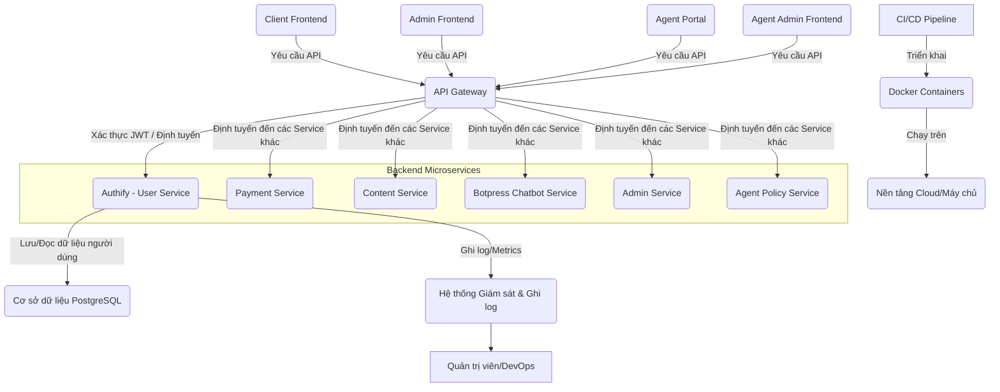

# ĐỀ BÀI DỰ ÁN: XÂY DỰNG HỆ THỐNG QUẢN LÝ NGƯỜI DÙNG ĐỘC LẬP (AUTHIFY) - PHIÊN BẢN NÂNG CAO VÀ TÍCH HỢP MICROSERVICE

**Tác giả:** Manus AI
**Ngày:** 19 tháng 8 năm 2025

---

## Mục lục

1.  [Giới thiệu Dự án](#1-giới-thiệu-dự-án)
    1.1. [Bối cảnh và Động lực](#11-bối-cảnh-và-động-lực)
    1.2. [Mục tiêu Dự án](#12-mục-tiêu-dự-án)
    1.3. [Phạm vi Dự án](#13-phạm-vi-dự-án)
2.  [Yêu cầu Kỹ thuật và Công nghệ](#2-yêu-cầu-kỹ-thuật-và-công-nghệ)
    2.1. [Yêu cầu Chức năng](#21-yêu-cầu-chức-năng)
    2.2. [Yêu cầu Phi chức năng](#22-yêu-cầu-phi-chức-năng)
    2.3. [Công nghệ Sử dụng](#23-công-nghệ-sử-dụng)
3.  [Kiến trúc và Thiết kế Hệ thống](#3-kiến-trúc-và-thiết-kế-hệ-thống)
    3.1. [Tổng quan Kiến trúc](#31-tổng-quan-kiến-trúc)
    3.2. [Thiết kế Backend (User Service)](#32-thiết-kế-backend-user-service)
    3.3. [Tích hợp qua API Gateway và phân tách với Admin Service](#33-tích-hợp-qua-api-gateway-và-phân-tách-với-admin-service)
4.  [Hạ tầng và DevOps](#4-hạ-tầng-và-devops)
    4.1. [Môi trường Phát triển](#41-môi-trường-phát-triển)
    4.2. [CI/CD Pipeline](#42-cicd-pipeline)
    4.3. [Giám sát và Ghi log](#43-giám-sát-và-ghi-log)
5.  [Phát triển Backend (User Service)](#5-phát-triển-backend-user-service)
    5.1. [Thiết kế Database](#51-thiết-kế-database)
    5.2. [Phát triển API Quản lý Người dùng](#52-phát-triển-api-quản-lý-người-dùng)
    5.3. [Xử lý Xác thực và Phân quyền](#53-xử-lý-xác-thực-và-phân-quyền)
6.  [Kiểm thử và Đảm bảo Chất lượng](#6-kiểm-thử-và-đảm-bảo-chất-lượng)
    6.1. [Unit Testing](#61-unit-testing)
    6.2. [Integration Testing](#62-integration-testing)
    6.3. [End-to-End Testing](#63-end-to-end-testing)
7.  [Triển khai và Vận hành](#7-triển-khai-và-vận-hành)
    7.1. [Triển khai Production](#71-triển-khai-production)
    7.2. [Mở rộng và Khả năng sẵn sàng cao](#72-mở-rộng-và-khả-năng-sẵn-sàng-cao)
    7.3. [Sao lưu và Phục hồi](#73-sao-lưu-và-phục-hồi)
8.  [Quản lý Dự án và Tài liệu hóa](#8-quản-lý-dự-án-và-tài-liệu-hóa)
    8.1. [Quản lý Phiên bản](#81-quản-lý-phiên-bản)
    8.2. [Quản lý Vấn đề](#82-quản-lý-vấn-đề)
    8.3. [Tài liệu Dự án](#83-tài-liệu-dự-án)

---

## 1. Giới thiệu Dự án

### 1.1. Bối cảnh và Động lực

Trong hệ sinh thái microservice, việc quản lý định danh và truy cập là nền tảng cho tất cả các dịch vụ khác. **Authify** đóng vai trò là hệ thống quản lý người dùng độc lập, cung cấp giải pháp toàn diện cho việc xác thực, phân quyền và quản lý hồ sơ người dùng. Với sự mở rộng của hệ thống bao gồm các dịch vụ chatbot, thanh toán, nội dung và đặc biệt là **hệ thống chính sách đại lý**, Authify cần được nâng cấp để đáp ứng các yêu cầu phức tạp hơn về quản lý vai trò và tích hợp liên dịch vụ.

Authify sẽ là một microservice backend, cung cấp các API cho việc quản lý người dùng và xác thực. Mọi tương tác từ các ứng dụng frontend (Client Frontend, Admin Frontend, Agent Portal) và các microservice khác sẽ được thực hiện thông qua **API Gateway chung**, đảm bảo tính bảo mật, khả năng mở rộng và quản lý tập trung các yêu cầu đến hệ thống.

### 1.2. Mục tiêu Dự án

Mục tiêu tổng thể là phát triển một dịch vụ backend độc lập và hoàn chỉnh mang tên "Authify", cung cấp giải pháp toàn diện cho việc quản lý người dùng trong hệ sinh thái MathService, bao gồm cả người dùng thông thường, đại lý và quản trị viên.

*   **Xây dựng Backend Service mạnh mẽ:** Phát triển một dịch vụ backend chuyên biệt, xử lý toàn bộ logic về đăng ký, đăng nhập, quản lý hồ sơ, và phân quyền, bao gồm cả các vai trò mới như `AGENT`.
*   **Cung cấp cơ chế xác thực an toàn và linh hoạt:** Hỗ trợ đăng ký/đăng nhập truyền thống (email/mật khẩu), tích hợp đăng nhập qua các nhà cung cấp OAuth2 phổ biến (Google, Facebook), và xác thực đa yếu tố (MFA) với nhiều phương thức. Authify sẽ cung cấp các API để API Gateway có thể thực hiện xác thực.
*   **Xây dựng hệ thống phân quyền rõ ràng và mở rộng:** Triển khai cơ chế Phân quyền Dựa trên Vai trò (Role-Based Access Control - RBAC) linh hoạt, hỗ trợ các vai trò như `USER`, `ADMIN`, `AGENT`, và khả năng mở rộng cho các vai trò trong tương lai.
*   **Đảm bảo khả năng mở rộng, bảo trì và tích hợp liên dịch vụ:** Áp dụng các nguyên tắc kiến trúc hiện đại, container hóa (Docker), và quy trình DevOps (CI/CD) để hệ thống có thể dễ dàng mở rộng và bảo trì. Đặc biệt chú trọng vào cơ chế ủy quyền giữa các dịch vụ và truyền thông bất đồng bộ.

### 1.3. Phạm vi Dự án

*   **Backend Service (Authify):**
    *   **Quản lý Người dùng:**
        *   API đăng ký người dùng mới (tạo tài khoản).
        *   API đăng nhập (cấp JWT sau khi xác thực thành công).
        *   API quản lý hồ sơ người dùng (xem, cập nhật thông tin cá nhân).
        *   API thay đổi mật khẩu.
        *   API đặt lại mật khẩu (quên mật khẩu).
        *   API quản lý vai trò người dùng (ví dụ: `user`, `admin`, `agent`).
        *   API kích hoạt/vô hiệu hóa tài khoản.
    *   **Xác thực và Phân quyền:**
        *   API xác thực JWT (kiểm tra tính hợp lệ, chữ ký, thời hạn) cho API Gateway và các microservice nội bộ.
        *   API để lấy thông tin người dùng dựa trên JWT hoặc ID (dành cho các microservice khác).
        *   Cơ chế phân quyền dựa trên vai trò (Role-Based Access Control - RBAC).
    *   **Tích hợp:**
        *   Cung cấp các API cho **API Gateway chung** để xử lý xác thực và định tuyến yêu cầu.
        *   Cung cấp các API nội bộ cho **Admin Service** để quản lý người dùng (ví dụ: xem danh sách người dùng, cập nhật vai trò).
        *   Cung cấp các API cho các microservice khác (Payment Service, Solver Services, Content Service, Agent Policy Service) để xác thực người dùng và lấy thông tin cần thiết.

*   **Infrastructure & DevOps:**
    *   Container hóa backend service bằng Docker.
    *   Thiết lập môi trường phát triển cục bộ bằng Docker Compose.
    *   Xây dựng quy trình CI/CD cơ bản (ví dụ: GitHub Actions) cho việc kiểm thử và đóng gói ứng dụng.
    *   Thiết lập giám sát (Prometheus, Grafana) và ghi log tập trung cho service.

**Các tính năng nằm ngoài phạm vi của dự án này (nhưng có thể là các giai đoạn phát triển tiếp theo):**

*   Hệ thống xác thực đa yếu tố (MFA).
*   Tích hợp với các nhà cung cấp định danh bên thứ ba (OAuth, OpenID Connect).
*   Hệ thống thông báo (email, SMS) cho các sự kiện liên quan đến tài khoản.
*   Quản lý phiên nâng cao (ví dụ: thu hồi phiên).

---

## 2. Yêu cầu Kỹ thuật và Công nghệ

### 2.1. Yêu cầu Chức năng

Các yêu cầu chức năng mô tả những gì Authify phải làm để đáp ứng mục tiêu của dự án:

*   **Xác thực người dùng (Cơ bản):**
    *   Cung cấp API cho phép người dùng đăng ký tài khoản mới bằng email và mật khẩu (có xác thực email).
    *   Cung cấp API cho phép người dùng đăng nhập bằng email/mật khẩu và qua tài khoản Google/Facebook.
    *   Cấp phát JSON Web Token (JWT) sau khi đăng nhập thành công.
    *   Cung cấp API chức năng "Quên mật khẩu" để đặt lại mật khẩu qua email.
*   **Xác thực Đa yếu tố (Multi-Factor Authentication - MFA):**
    *   Cung cấp API để người dùng có thể tự bật/tắt MFA cho tài khoản của mình.
    *   Hỗ trợ nhiều phương thức MFA thông qua API:
        *   **Ứng dụng xác thực (TOTP):** Hỗ trợ các ứng dụng như Google Authenticator, Authy. Hệ thống phải sinh secret key và mã QR để người dùng quét và cung cấp mã khôi phục (recovery codes).
        *   **Xác thực qua Email:** Gửi mã một lần (OTP) đến email đã đăng ký của người dùng.
    *   Cung cấp API để xác thực mã MFA trong luồng đăng nhập.
*   **Quản lý tài khoản (Người dùng cuối):**
    *   Cung cấp API để xem và cập nhật thông tin hồ sơ cá nhân (tên, ảnh đại diện).
    *   Cung cấp API để thay đổi mật khẩu hiện tại.
    *   Cung cấp API để quản lý các phương thức MFA đã đăng ký.
*   **Quản lý hệ thống (Quản trị viên):**
    *   Cung cấp API để xem danh sách tất cả người dùng với phân trang, tìm kiếm và bộ lọc.
    *   Cung cấp API để xem chi tiết một tài khoản người dùng, bao gồm trạng thái MFA và vai trò của họ.
    *   Cung cấp API để thực hiện các hành động: Khóa/Mở khóa tài khoản, thay đổi vai trò (ví dụ: gán vai trò `AGENT` cho người dùng), reset MFA cho người dùng (trong trường hợp người dùng mất thiết bị xác thực).
*   **Báo cáo và thống kê (do Admin Service đảm nhiệm):**
    *   Các báo cáo tổng hợp về sử dụng dịch vụ, doanh thu, hoa hồng đại lý... sẽ được cung cấp bởi Admin Service hoặc một Reporting Service chuyên biệt. Authify không thực hiện tổng hợp dữ liệu từ các dịch vụ nghiệp vụ.
    *   Authify chỉ cung cấp dữ liệu định danh, vai trò, trạng thái tài khoản và nhật ký sự kiện (audit) cần thiết để Admin Service thực hiện báo cáo thông qua API Gateway.
*   **Quản lý Vai trò và Phân quyền:**
    *   Hỗ trợ các vai trò `USER`, `ADMIN`, `AGENT`.
    *   Cơ chế kiểm tra quyền truy cập dựa trên vai trò (RBAC) cho các API nội bộ.
    *   Cung cấp API để quản lý vai trò người dùng (chỉ dành cho Super Admin).

**Lưu ý:** Tất cả các API này sẽ được cung cấp bởi Authify Backend Service và được truy cập thông qua API Gateway chung.
### 2.2. Yêu cầu Phi chức năng

Các yêu cầu phi chức năng mô tả cách Authify hoạt động, bao gồm các khía cạnh về chất lượng, hiệu suất, bảo mật, và khả năng bảo trì:

*   **Bảo mật:**
    *   Mật khẩu phải được hash mạnh mẽ (ví dụ: Argon2/bcrypt).
    *   Tất cả các giao tiếp API phải được mã hóa bằng HTTPS/SSL.
    *   Authify phải được bảo vệ chống lại các tấn công phổ biến như SQL Injection, XSS, CSRF.
    *   Triển khai Rate Limiting cho các API nhạy cảm như đăng nhập, đăng ký, đặt lại mật khẩu.
    *   **Cơ chế ủy quyền (Authorization) liên dịch vụ:** Authify sẽ cung cấp các API để các dịch vụ backend khác có thể xác minh quyền của người dùng thông qua JWT được chuyển tiếp từ API Gateway. Authify cũng sẽ xác minh quyền của các dịch vụ gọi API nội bộ của nó.
*   **Hiệu suất:**
    *   Thời gian phản hồi của các API xác thực và quản lý người dùng phải dưới 150ms.
    *   Có khả năng xử lý đồng thời một lượng lớn yêu cầu xác thực.
*   **Khả năng sử dụng (Usability):**
    *   API phải rõ ràng, dễ hiểu và dễ sử dụng cho các nhà phát triển tích hợp.
    *   Thông báo lỗi từ API phải rõ ràng, thân thiện và cung cấp đủ thông tin để khắc phục.
*   **Khả năng tương thích:**
    *   Authify API phải tương thích với các chuẩn RESTful và OpenAPI.
*   **Xử lý lỗi và khả năng chịu lỗi:**
    *   Triển khai cơ chế xử lý lỗi toàn diện cho các API, bao gồm việc trả về các mã trạng thái HTTP phù hợp và thông báo lỗi chi tiết.
    *   Đảm bảo hệ thống vẫn hoạt động ổn định khi các dịch vụ phụ thuộc (ví dụ: cơ sở dữ liệu) gặp sự cố tạm thời.
*   **Đồng bộ hóa dữ liệu và tính nhất quán:**
    *   Sử dụng Message Broker để phát ra các sự kiện quan trọng (ví dụ: người dùng bị khóa, thay đổi vai trò) đến các dịch vụ khác, đảm bảo tính nhất quán cuối cùng của dữ liệu trên toàn hệ thống.
*   **Quản lý cấu hình tập trung:**
    *   Sử dụng một giải pháp quản lý cấu hình tập trung (ví dụ: HashiCorp Consul, Kubernetes ConfigMaps) để quản lý các biến môi trường và thông tin kết nối giữa các dịch vụ.

### 2.3. Công nghệ Sử dụng

Để xây dựng Authify, các công nghệ sau đây được đề xuất:

*   **Backend (Authify):**
    *   **Ngôn ngữ lập trình:** Python 3.11+
    *   **Framework:** FastAPI (để xây dựng API RESTful hiệu quả và có tài liệu OpenAPI tự động).
    *   **ORM/Database Driver:** SQLAlchemy (để tương tác với PostgreSQL).
    *   **Mã hóa mật khẩu:** `passlib` (ví dụ: bcrypt).
    *   **JWT:** `python-jose` hoặc `PyJWT` (để tạo và xác thực JSON Web Tokens).
    *   **HTTP Client:** `httpx` hoặc `requests` (để gọi API của các microservice khác nếu Authify cần chủ động tương tác, ví dụ: gửi thông báo).
*   **Database:**
    *   **Cơ sở dữ liệu quan hệ:** PostgreSQL (để lưu trữ thông tin người dùng, vai trò, phiên đăng nhập).
*   **DevOps & Hạ tầng:**
    *   **Containerization:** Docker (để đóng gói ứng dụng và môi trường).
    *   **Môi trường phát triển cục bộ:** Docker Compose (để chạy Authify và các dịch vụ phụ thuộc).
    *   **CI/CD:** GitHub Actions (để tự động hóa kiểm thử và triển khai).
    *   **Giám sát:** Prometheus (thu thập metrics), Grafana (tạo dashboard trực quan).
    *   **Ghi log tập trung:** ELK Stack (Elasticsearch, Logstash, Kibana) hoặc Loki/Grafana (cho log).
*   **Công cụ chất lượng mã nguồn:**
    *   Black (code formatter).
    *   Flake8 (linter).
    *   MyPy (type checker).
    *   Pre-commit hooks (tự động chạy các công cụ trên trước khi commit).

**Lưu ý về tích hợp với API Gateway:**

Authify sẽ cung cấp các endpoint để API Gateway có thể gọi đến nhằm xác thực JWT (ví dụ: endpoint kiểm tra tính hợp lệ của token) hoặc để các microservice backend khác gọi đến Authify thông qua API Gateway để lấy thông tin người dùng. Authify sẽ không trực tiếp xử lý các yêu cầu từ Frontend mà mọi yêu cầu đều đi qua API Gateway chung.

---

## 3. Kiến trúc và Thiết kế Hệ thống

### 3.1. Tổng quan Kiến trúc

Authify được thiết kế như một microservice độc lập, chuyên biệt trong việc quản lý người dùng và xác thực. Trong kiến trúc tổng thể của MathService, Authify sẽ tương tác với các thành phần khác thông qua một **API Gateway chung**. API Gateway này đóng vai trò là điểm truy cập duy nhất cho tất cả các ứng dụng frontend (Client Frontend, Admin Frontend, Agent Portal) và các microservice khác khi cần xác thực hoặc quản lý thông tin người dùng. Điều này đảm bảo tính bảo mật, khả năng mở rộng và quản lý tập trung các yêu cầu đến hệ thống.

Authify sẽ cung cấp các API RESTful cho việc đăng ký, đăng nhập, quản lý hồ sơ người dùng, và xác thực token (JWT). Các microservice khác trong hệ thống (như Payment Service, Content Service, các Solver Service, Admin Service, Agent Policy Service) sẽ gọi đến Authify thông qua API Gateway chung để xác thực người dùng hoặc lấy thông tin liên quan đến người dùng.

Sơ đồ kiến trúc tổng quan của Authify trong hệ thống MathService:

**Mô tả các thành phần chính và mối liên kết:**

*   **Client Frontend, Admin Frontend, Agent Portal, Agent Admin Frontend:** Các ứng dụng giao diện người dùng tương tác với hệ thống thông qua API Gateway.
*   **API Gateway:** Là điểm truy cập duy nhất, chịu trách nhiệm tiếp nhận tất cả các yêu cầu từ frontend. API Gateway sẽ thực hiện xác thực JWT (bằng cách gọi Authify hoặc kiểm tra token cục bộ), áp dụng các chính sách bảo mật, giới hạn tốc độ, và định tuyến yêu cầu đến Authify hoặc các microservice backend khác.
*   **Authify (User Service):** Là microservice chuyên biệt quản lý người dùng, bao gồm đăng ký, đăng nhập, quản lý hồ sơ, và xác thực token. Authify nhận các yêu cầu đã được API Gateway xác thực và xử lý logic nghiệp vụ liên quan đến người dùng.
*   **Các Microservice Backend khác:** Bao gồm Payment Service, Content Service, Botpress Chatbot Service, Admin Service, và Agent Policy Service. Các service này cũng tương tác với Authify thông qua API Gateway khi cần xác thực hoặc lấy thông tin người dùng.
*   **Cơ sở dữ liệu PostgreSQL:** Nơi lưu trữ dữ liệu bền vững cho Authify, bao gồm thông tin người dùng, vai trò, và các thông tin liên quan đến xác thực.
*   **Hệ thống Giám sát & Ghi log:** Thu thập metrics và log từ Authify để theo dõi hiệu suất và phát hiện lỗi.
*   **Docker Containers, CI/CD Pipeline, Cloud Platform:** Hạ tầng và quy trình triển khai chung cho toàn bộ hệ thống microservice.

**Luồng tương tác chính (ví dụ: Người dùng đăng nhập):**

1.  Người dùng nhập thông tin đăng nhập vào Client Frontend.
2.  Client Frontend gửi yêu cầu đăng nhập (`POST /api/v1/auth/login`) đến **API Gateway**.
3.  **API Gateway** nhận yêu cầu và định tuyến nó đến **Authify**.
4.  **Authify** xử lý yêu cầu đăng nhập, xác thực thông tin người dùng với PostgreSQL, và tạo ra một JWT.
5.  **Authify** trả về JWT cho **API Gateway**.
6.  **API Gateway** chuyển tiếp JWT về Client Frontend.
7.  Trong các yêu cầu tiếp theo, Client Frontend gửi JWT trong header `Authorization` đến **API Gateway**.
8.  **API Gateway** xác thực JWT (kiểm tra tính hợp lệ, chữ ký, thời hạn) và chuyển tiếp yêu cầu đến microservice backend đích (ví dụ: Payment Service, Botpress Chatbot Service), kèm theo thông tin người dùng đã được xác thực (ví dụ: `user_id`, `roles`) trong header hoặc context của yêu cầu nội bộ.
9.  Microservice backend đích xử lý yêu cầu, tin tưởng vào thông tin xác thực đã được API Gateway cung cấp.

**Luồng tương tác khác (ví dụ: Admin Service quản lý người dùng):**

1.  Quản trị viên thực hiện tác vụ quản lý người dùng trên Admin Frontend.
2.  Admin Frontend gửi yêu cầu đến **API Gateway** (ví dụ: `GET /api/v1/admin/users`), kèm theo JWT của quản trị viên.
3.  **API Gateway** xác thực JWT, kiểm tra quyền của quản trị viên, và định tuyến yêu cầu đến **Admin Service**.
4.  **Admin Service** nhận yêu cầu và gọi API nội bộ của **Authify** (ví dụ: `GET /internal/users`) để lấy danh sách người dùng.
5.  **Authify** trả về danh sách người dùng cho Admin Service.
6.  **Admin Service** xử lý dữ liệu và trả về cho API Gateway.
7.  **API Gateway** chuyển tiếp kết quả về Admin Frontend.

### 3.2. Thiết kế Backend (User Service)

Cấu trúc theo lớp: API Layer (Routers), Business Logic Layer (Services), Data Access Layer (Repositories).

*   **API Endpoints chính:**
    *   `/auth/register`, `/auth/login`, `/auth/refresh-token`, `/auth/forgot-password`
    *   `/auth/oauth/google`, `/auth/oauth/facebook`
    *   `/users/me` (GET, PUT): Quản lý hồ sơ cá nhân của người dùng hiện tại.
    *   `/admin/users` (GET): Lấy danh sách người dùng (chỉ Admin).
    *   `/admin/users/{user_id}` (GET, PUT, DELETE): Quản lý người dùng cụ thể (chỉ Admin).
    *   `/admin/users/{user_id}/role` (PUT): Cập nhật vai trò của người dùng (chỉ Super Admin).
*   **API Endpoints cho MFA:**
    *   `POST /users/me/mfa/setup`: Bắt đầu quá trình thiết lập MFA (ví dụ: sinh secret key và mã QR cho TOTP).
    *   `POST /users/me/mfa/verify`: Xác thực và kích hoạt MFA sau khi người dùng nhập mã OTP đầu tiên.
    *   `DELETE /users/me/mfa/disable`: Tắt MFA cho tài khoản (yêu cầu xác thực lại bằng mật khẩu).
    *   `POST /auth/login/mfa`: Endpoint để người dùng gửi mã MFA sau khi đã nhập mật khẩu thành công.
    *   `POST /admin/users/{user_id}/mfa/reset`: (Admin) Reset MFA cho một người dùng.
*   **API Endpoints cho Báo cáo:**
    *   `GET /admin/users/{user_id}/usage-report`: (Admin) Lấy báo cáo chi tiết việc sử dụng dịch vụ của một người dùng cụ thể. API này sẽ gọi đến Payment Service để lấy dữ liệu.
    *   `GET /admin/usage-statistics`: (Admin) Lấy thống kê tổng quan việc sử dụng các dịch vụ trên toàn hệ thống. API này cũng sẽ gọi đến Payment Service để tổng hợp dữ liệu.
*   **API Endpoints cho Tích hợp Liên dịch vụ (Internal APIs):**
    *   `GET /internal/users/{user_id}/role`: API nội bộ để các dịch vụ khác (ví dụ: Agent Policy Service, Botpress Chatbot Service) truy vấn vai trò của một người dùng cụ thể. API này sẽ yêu cầu xác thực bằng token nội bộ hoặc cơ chế ủy quyền liên dịch vụ.
    *   `POST /internal/users/{user_id}/lock`: API nội bộ để các dịch vụ khác yêu cầu khóa tài khoản người dùng (ví dụ: khi phát hiện hành vi gian lận).

### 3.3. Thiết kế Frontend

Cấu trúc theo component-based: Pages, Components, Layouts, Hooks, API services.

*   **Luồng người dùng cuối:** Đăng ký -> Xác thực email -> Đăng nhập -> (Nếu MFA bật: Nhập mã MFA) -> Xem/Chỉnh sửa hồ sơ -> Thiết lập/Quản lý MFA.
*   **Luồng quản trị viên:** Đăng nhập -> Truy cập Admin Dashboard -> Quản lý người dùng (bao gồm thay đổi vai trò) -> Xem báo cáo sử dụng dịch vụ của người dùng.
*   **Luồng đại lý:** Đăng nhập -> Truy cập Agent Portal -> Xem hồ sơ đại lý -> Xem báo cáo hoa hồng.
*   **Luồng quản trị đại lý:** Đăng nhập -> Truy cập Agent Admin Frontend -> Quản lý đại lý -> Xem báo cáo tổng hợp và phân tích hiệu suất đại lý.

---

### 3.3. Tích hợp qua API Gateway và phân tách với Admin Service

Để tránh nhầm lẫn vai trò giữa các thành phần và đảm bảo tài liệu nhất quán với kiến trúc tổng thể, phần này làm rõ trách nhiệm của API Gateway, Authify và Admin Service, cũng như các ràng buộc tích hợp chính.

- Trách nhiệm:
  - API Gateway: điểm vào duy nhất; xác thực JWT, áp dụng phân quyền, CORS, rate limiting, ghi log/metrics, định tuyến đến microservice đích.
  - Authify: nguồn sự thật về danh tính, vai trò, lifecycle tài khoản; phát hành và xác minh token; cung cấp API tra cứu người dùng/role cho các dịch vụ khác qua Gateway.
  - Admin Service: dịch vụ nghiệp vụ quản trị tập trung (tổng hợp/tổ chức các tác vụ quản trị người dùng, nội dung, thanh toán...); gọi các API nội bộ của Authify (qua Gateway) khi cần thao tác dữ liệu người dùng. Admin Service không thay thế API Gateway.

- Hợp đồng tích hợp (integration contracts):
  - JWT: được ký bởi Authify (RS256/ES256). API Gateway xác thực chữ ký và TTL, chèn các header nội bộ (ví dụ: `X-User-Id`, `X-User-Roles`) khi chuyển tiếp đến backend.
  - Introspection/UserInfo: Authify cung cấp endpoint kiểm tra token và endpoint lấy thông tin rút gọn của người dùng để các service khác tra cứu khi cần (truy cập qua Gateway, giới hạn bởi RBAC).
  - Service-to-Service Auth: các cuộc gọi nội bộ từ dịch vụ khác đến Authify phải dùng cơ chế ủy quyền dịch vụ (service credentials/API key hoặc mTLS), được kiểm tra tại Gateway và/hoặc Authify.

- Quy ước định tuyến:
  - Public (qua Gateway): `/api/v1/auth/*` cho đăng ký/đăng nhập/refresh/forgot-password/MFA.
  - Internal (qua Gateway, yêu cầu quyền dịch vụ): `/internal/auth/users/*`, `/internal/auth/roles/*` cho Admin Service và các backend khác.
  - CORS: do Gateway xử lý ở biên, Authify không tự bật CORS public.

- Hệ quả thiết kế:
  - Frontend (Client/Admin/Agent) luôn gọi Gateway; không gọi trực tiếp Authify.
  - Các microservice backend khác (Payment, Content, Botpress Chatbot, Agent Policy, Admin) cũng tương tác với Authify qua Gateway để nhất quán kiểm soát truy cập và quan sát hệ thống.

## 4. Hạ tầng và DevOps

### 4.1. Môi trường Phát triển

*   **Docker:** Backend service sẽ được đóng gói thành Docker image.
*   **Docker Compose:** Sử dụng file `docker-compose.yml` để định nghĩa và khởi chạy môi trường phát triển cục bộ (backend, database, message broker) bằng một lệnh duy nhất.

### 4.2. CI/CD Pipeline

*   **Nền tảng:** GitHub Actions.
*   **Quy trình:** Tự động kích hoạt khi có push code hoặc tạo Pull Request.
    1.  **Build:** Cài đặt dependencies, chạy linter, format code.
    2.  **Test:** Chạy Unit Test, Integration Test. Theo dõi và yêu cầu độ bao phủ code.
    3.  **Build Image:** Build Docker image cho backend.
    4.  **Push Image:** Đẩy image lên Docker Registry (ví dụ: GitHub Container Registry).
    5.  **Deploy:** Tự động triển khai lên môi trường Staging. Triển khai lên Production có thể cần phê duyệt thủ công.

### 4.3. Giám sát và Ghi log

*   **Prometheus:** Thu thập các metrics về hiệu suất từ backend service (thời gian phản hồi, số lượng request, tỷ lệ lỗi).
*   **Grafana:** Trực quan hóa các metrics từ Prometheus qua các dashboard.
*   **Ghi log tập trung:** Sử dụng ELK Stack hoặc Loki để thu thập, lưu trữ và truy vấn log từ các container, hỗ trợ việc debug và phân tích sự cố.
*   **Alerting:** Thiết lập cảnh báo cho các sự cố quan trọng (ví dụ: lỗi xác thực, tài khoản bị khóa bất thường).

---

## 5. Phát triển Backend (User Service)

### 5.1. Thiết kế Database

Sử dụng PostgreSQL. Dưới đây là thiết kế cơ bản cho các bảng chính:

*   **Bảng `users`:**
    | Tên cột | Kiểu dữ liệu | Ràng buộc | Mô tả |
    | :--- | :--- | :--- | :--- |
    | `id` | UUID | PRIMARY KEY | ID duy nhất của người dùng |
    | `email` | VARCHAR(255) | UNIQUE, NOT NULL | Email của người dùng |
    | `hashed_password` | VARCHAR(255) | | Mật khẩu đã hash |
    | `full_name` | VARCHAR(255) | | Tên đầy đủ |
    | `avatar_url` | VARCHAR(255) | | URL ảnh đại diện |
    | `is_active` | BOOLEAN | NOT NULL, DEFAULT true | Trạng thái tài khoản (active/locked) |
    | `role` | VARCHAR(50) | NOT NULL, DEFAULT 'user' | Vai trò người dùng ('user', 'admin', 'agent') |
    | `mfa_enabled` | BOOLEAN | NOT NULL, DEFAULT false | Trạng thái bật/tắt MFA |
    | `mfa_secret` | VARCHAR(255) | | Secret key đã mã hóa cho TOTP |
    | `mfa_recovery_codes` | JSONB | | Mảng các mã khôi phục đã hash |
    | `created_at` | TIMESTAMP | NOT NULL | Thời gian tạo tài khoản |
    | `updated_at` | TIMESTAMP | | Thời gian cập nhật cuối cùng |
    | `referred_by_agent_id` | UUID | | ID của đại lý đã giới thiệu người dùng này (tùy chọn) |

*   **Bảng `roles`:** (Để quản lý vai trò động hơn, nếu cần)
    | Tên cột | Kiểu dữ liệu | Ràng buộc | Mô tả |
    | :--- | :--- | :--- | :--- |
    | `id` | UUID | PRIMARY KEY | ID duy nhất của vai trò |
    | `name` | VARCHAR(50) | UNIQUE, NOT NULL | Tên vai trò (e.g., 'user', 'admin', 'agent') |
    | `description` | TEXT | | Mô tả vai trò |

*   **Bảng `user_roles`:** (Bảng trung gian cho quan hệ nhiều-nhiều giữa user và role)
    | Tên cột | Kiểu dữ liệu | Ràng buộc | Mô tả |
    | :--- | :--- | :--- | :--- |
    | `user_id` | UUID | PRIMARY KEY, FOREIGN KEY | ID người dùng |
    | `role_id` | UUID | PRIMARY KEY, FOREIGN KEY | ID vai trò |

### 5.2. Phát triển API Quản lý Người dùng

*   Triển khai các API endpoint đã được thiết kế trong mục 3.2 bằng FastAPI.
*   Sử dụng Pydantic để validate dữ liệu đầu vào và định dạng dữ liệu đầu ra.
*   Tổ chức code theo cấu trúc module rõ ràng (ví dụ: `routers`, `services`, `crud`, `schemas`).
*   **Đảm bảo tài liệu OpenAPI/Swagger chi tiết cho từng API endpoint, bao gồm request/response schemas, mã lỗi, và ví dụ sử dụng.**

### 5.3. Xử lý Xác thực và Phân quyền

*   **JWT:** Sử dụng JWT để quản lý phiên đăng nhập. Token chứa thông tin cần thiết như `user_id`, `email`, và `roles` (danh sách các vai trò của người dùng).
*   **Hashing:** Dùng `passlib` với thuật toán Argon2 hoặc bcrypt để hash mật khẩu.
*   **OAuth2:** Tích hợp luồng đăng nhập với Google và Facebook.
*   **MFA:** Dùng `pyotp` để sinh và xác thực mã TOTP. Xây dựng logic gửi mã qua email.
*   **RBAC:** Sử dụng FastAPI's Dependency Injection để tạo các dependency kiểm tra vai trò người dùng trước khi cho phép truy cập vào các API. Ví dụ: `@Depends(RoleChecker(['admin']))`.
*   **Cơ chế ủy quyền liên dịch vụ:**
    *   Khi một dịch vụ backend khác (ví dụ: Admin Service, Agent Policy Service) gọi API nội bộ của Authify, Authify sẽ xác minh quyền của dịch vụ gọi. Điều này có thể được thực hiện bằng cách:
        *   **Internal API Key:** Mỗi dịch vụ sẽ có một API Key riêng được cấu hình an toàn. Authify sẽ kiểm tra API Key này.
        *   **Service-to-Service JWT:** Authify có thể cấp một JWT đặc biệt cho các dịch vụ nội bộ, chứa thông tin về dịch vụ đó (ví dụ: `service_name`, `permissions`). Authify sẽ xác minh JWT này.
    *   Authify cũng sẽ cung cấp các API nội bộ để các dịch vụ khác có thể truy vấn thông tin người dùng và vai trò một cách an toàn.
*   **Truyền thông bất đồng bộ (Event-driven):**
    *   Authify sẽ phát ra các sự kiện qua Message Broker khi có các thay đổi quan trọng về người dùng, ví dụ:
        *   `user_registered`: Khi người dùng mới đăng ký.
        *   `user_locked`: Khi tài khoản người dùng bị khóa.
        *   `user_role_updated`: Khi vai trò của người dùng thay đổi (ví dụ: từ `USER` thành `AGENT`).
    *   Các dịch vụ khác (ví dụ: Agent Policy Service, Botpress Chatbot Service) có thể lắng nghe các sự kiện này để cập nhật trạng thái nội bộ hoặc thực hiện các hành động cần thiết (ví dụ: Agent Policy Service tạo hồ sơ đại lý khi nhận sự kiện `user_role_updated` với vai trò `AGENT`).

---

## 7. Kiểm thử và Đảm bảo Chất lượng

### 7.1. Unit Testing

*   **Backend (pytest):** Kiểm thử các hàm logic riêng lẻ (hàm hash mật khẩu, hàm tạo token, hàm xác thực TOTP), các hàm CRUD, logic phân quyền. Yêu cầu độ bao phủ code tối thiểu 80%.
*   **Frontend (Jest/Vitest + React Testing Library):** Kiểm thử các component UI riêng lẻ, các custom hook.

### 7.2. Integration Testing

*   Kiểm thử sự tương tác giữa các API endpoint của backend và cơ sở dữ liệu để đảm bảo các luồng dữ liệu hoạt động chính xác.
*   **Kiểm thử tích hợp với Payment Service:** Đảm bảo việc lấy báo cáo sử dụng dịch vụ hoạt động đúng.
*   **Kiểm thử tích hợp với Message Broker:** Đảm bảo các sự kiện được phát ra và nhận đúng cách.

### 7.3. End-to-End (E2E) Testing

*   **Công cụ:** Cypress hoặc Playwright.
*   **Kịch bản:** Mô phỏng các luồng người dùng hoàn chỉnh:
    *   Đăng ký -> Đăng nhập.
    *   Đăng nhập -> Thiết lập MFA -> Đăng xuất -> Đăng nhập lại với MFA.
    *   Admin đăng nhập -> Khóa một tài khoản người dùng -> Thay đổi vai trò người dùng (ví dụ: gán vai trò `AGENT`).
    *   Admin đăng nhập -> Xem báo cáo sử dụng dịch vụ của người dùng.
    *   **Đại lý đăng nhập -> Xem hồ sơ và báo cáo hoa hồng (nếu Agent Portal là một phần của Authify Frontend).**

---

## 8. Triển khai và Vận hành

### 8.1. Triển khai Production

*   Sử dụng CI/CD pipeline để triển khai các Docker image đã được kiểm thử lên môi trường production (ví dụ: máy chủ ảo, Kubernetes).
*   Quản lý các biến môi trường và thông tin nhạy cảm (secrets) một cách an toàn thông qua giải pháp quản lý cấu hình tập trung.
*   Sử dụng chiến lược Rolling Update để triển khai phiên bản mới mà không gây gián đoạn dịch vụ.

### 8.2. Mở rộng và Khả năng sẵn sàng cao

*   Thiết kế backend stateless để có thể mở rộng theo chiều ngang (horizontal scaling).
*   Sử dụng Kubernetes để tự động quản lý việc mở rộng và cân bằng tải.
*   Triển khai cơ sở dữ liệu PostgreSQL với các tùy chọn sẵn sàng cao (ví dụ: replication, failover).

### 8.3. Sao lưu và Phục hồi

*   Thiết lập quy trình sao lưu dữ liệu tự động cho PostgreSQL.
*   Xây dựng kế hoạch phục hồi thảm họa để đảm bảo khả năng khôi phục dữ liệu nhanh chóng trong trường hợp sự cố.

---

## 9. Quản lý Dự án và Tài liệu hóa

### 9.1. Quản lý Phiên bản

*   Sử dụng Git để quản lý mã nguồn. Quy trình làm việc theo Gitflow hoặc Trunk-based development.
*   Sử dụng GitHub để quản lý repository và Pull Request.

### 9.2. Quản lý Vấn đề

*   Sử dụng một công cụ quản lý dự án (ví dụ: Jira, Trello, GitHub Issues) để theo dõi các tác vụ, lỗi và tính năng.

### 9.3. Tài liệu Dự án

*   **Tài liệu thiết kế kiến trúc (ADR):** Ghi lại các quyết định kiến trúc quan trọng.
*   **Đặc tả API (OpenAPI/Swagger):** Cung cấp tài liệu API chi tiết, dễ đọc và tương tác.
*   **Sơ đồ cơ sở dữ liệu (ERD):** Mô tả cấu trúc database.
*   **Hướng dẫn cài đặt, triển khai và vận hành:** Tài liệu chi tiết cho các nhà phát triển và vận hành.
*   **Tài liệu về cơ chế ủy quyền liên dịch vụ và truyền thông bất đồng bộ:** Mô tả rõ ràng cách các dịch vụ tương tác và xác minh quyền của nhau, cũng như cách các sự kiện được truyền tải và xử lý.

