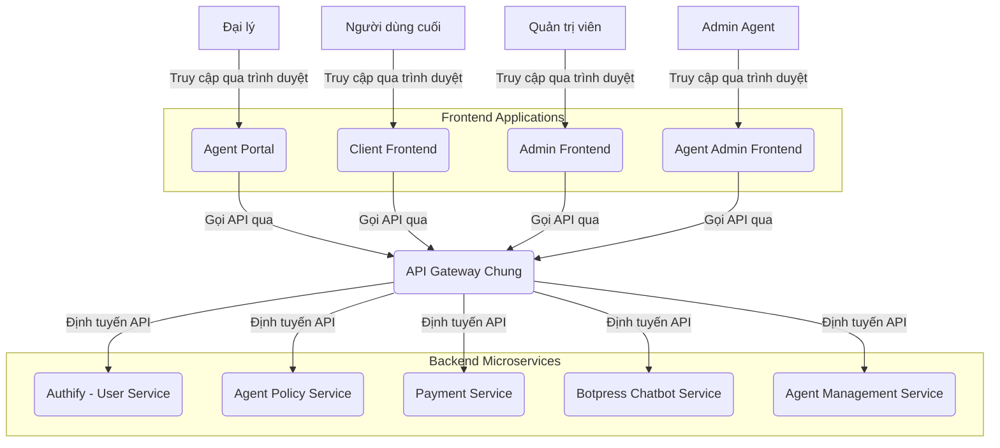

# ĐỀ BÀN DỰ ÁN: XÂY DỰNG HỆ THỐNG CỔNG ĐẠI LÝ (AGENT PORTAL) TRONG MONOREPO

**Tác giả:** Manus AI

**Ngày:** 19 tháng 8 năm 2025

---

## Mục lục

1.  Giới thiệu Dự án
    1.1. Bối cảnh và Động lực
    1.2. Mục tiêu Dự án
    1.3. Phạm vi Dự án

2.  Yêu cầu Kỹ thuật và Công nghệ
    2.1. Yêu cầu Chức năng
    2.2. Yêu cầu Phi chức năng
    2.3. Công nghệ Sử dụng

3.  Kiến trúc và Thiết kế Hệ thống
    3.1. Tổng quan Kiến trúc
    3.2. Thiết kế Giao diện Người dùng (UI/UX)
    3.3. Tích hợp API Backend và Giao tiếp giữa các Module

4.  Hạ tầng và DevOps
    4.1. Môi trường Phát triển
    4.2. CI/CD Pipeline
    4.3. Triển khai

5.  Phát triển Frontend
    5.1. Cấu trúc Dự án trong Monorepo
    5.2. Các Module/Trang Chính
    5.3. Quản lý Trạng thái và Dữ liệu

6.  Kiểm thử và Đảm bảo Chất lượng
    6.1. Unit Testing
    6.2. Integration Testing
    6.3. End-to-End Testing

7.  Quản lý Dự án và Tài liệu hóa
    7.1. Quản lý Phiên bản
    7.2. Quản lý Vấn đề
    7.3. Tài liệu Dự án

---

## 1. Giới thiệu Dự án

### 1.1. Bối cảnh và Động lực

Trong hệ thống tích hợp Botpress Chatbot Service, **Agent Portal** là giao diện chuyên biệt dành cho các đại lý, cho phép họ quản lý các hoạt động liên quan đến chương trình đại lý. Với sự ra đời của `Agent Policy Service` (dịch vụ quản lý chính sách đại lý) và kiến trúc microservice ở backend, việc xây dựng các ứng dụng frontend (Client Frontend, Admin Frontend, Agent Portal, Agent Admin Frontend) trong một cấu trúc **monorepo** là một cách tiếp cận hiệu quả. Điều này cho phép các đội ngũ phát triển làm việc độc lập trên các tính năng của mình nhưng vẫn chia sẻ được các tài nguyên chung, đảm bảo tính nhất quán về UI/UX và tối ưu hóa quy trình phát triển.

**Ghi chú về Kiến trúc Frontend Tổng thể:**
- **Client Frontend:** Giao diện chính cho người dùng cuối, tích hợp với Botpress Chatbot Service
- **Admin Frontend:** Bảng điều khiển quản trị viên để quản lý hệ thống và người dùng
- **Agent Portal:** Giao diện đăng ký và quản lý cơ bản cho đại lý
- **Agent Admin Frontend:** Giao diện chuyên biệt để quản lý đại lý (do Admin Agent sử dụng)

Động lực chính của dự án này là tạo ra một nền tảng tự phục vụ (self-service) mạnh mẽ cho đại lý, giúp họ dễ dàng tham gia và phát triển cùng hệ thống tích hợp Botpress. Việc phát triển Agent Portal như một module trong monorepo giúp tận dụng các component, hooks, và tiện ích dùng chung, đồng thời chuẩn bị cho khả năng tích hợp linh hoạt với các thành phần Frontend khác tùy thuộc vào chiến lược UX tổng thể.

### 1.2. Mục tiêu Dự án

Mục tiêu tổng thể của dự án "Agent Portal trong Monorepo" là phát triển một ứng dụng web hoàn chỉnh, cung cấp giao diện trực quan và hiệu quả cho các đại lý của hệ thống tích hợp Botpress, đồng thời tận dụng lợi ích của kiến trúc monorepo với 4 thành phần Frontend (Client Frontend, Admin Frontend, Agent Portal, Agent Admin Frontend). Các mục tiêu cụ thể bao gồm:

*   **Cung cấp trải nghiệm người dùng tối ưu cho đại lý:** Thiết kế giao diện thân thiện, dễ sử dụng, đáp ứng nhanh trên mọi thiết bị (responsive design) và hỗ trợ đa ngôn ngữ.
*   **Tích hợp liền mạch với các dịch vụ backend:** Đảm bảo Agent Portal có thể giao tiếp hiệu quả và an toàn với `Authify (User Service)`, `Agent Policy Service`, `Payment Service`, và `Botpress Chatbot Service` thông qua các API RESTful.
*   **Quản lý trạng thái xác thực và phân quyền:** Xử lý đăng ký, đăng nhập, quản lý hồ sơ đại lý và phiên làm việc một cách an toàn và hiệu quả, đảm bảo chỉ đại lý mới có thể truy cập các chức năng liên quan.
*   **Hiển thị báo cáo hoa hồng:** Cung cấp giao diện rõ ràng để đại lý xem chi tiết báo cáo hoa hồng kiếm được từ việc giới thiệu khách hàng sử dụng dịch vụ chatbot.
*   **Hỗ trợ yêu cầu thanh toán:** Cho phép đại lý gửi yêu cầu thanh toán hoa hồng và theo dõi trạng thái các yêu cầu này.
*   **Tối ưu hóa tái sử dụng:** Tận dụng tối đa các component, hooks, tiện ích dùng chung được định nghĩa trong monorepo để đảm bảo tính nhất quán và hiệu quả phát triển giữa 4 thành phần Frontend.
*   **Đảm bảo an toàn và bảo mật:** Áp dụng các biện pháp bảo mật cần thiết cho giao diện người dùng và các tương tác API, đặc biệt là với các chức năng tài chính nhạy cảm.

### 1.3. Phạm vi Dự án

Dự án "Agent Portal trong Monorepo" sẽ tập trung vào việc phát triển các thành phần cốt lõi sau:

*   **Giao diện Người dùng (UI):**
    *   **Trang Đăng ký Đại lý:** Cho phép người dùng đăng ký trở thành đại lý (có thể cần phê duyệt từ Admin).
    *   **Trang Đăng nhập:** Tích hợp với Authify để xử lý xác thực đại lý.
    *   **Trang Dashboard Đại lý:** Tổng quan về hiệu suất, hoa hồng kiếm được, các thông báo quan trọng.
    *   **Trang Hồ sơ Đại lý:** Cho phép xem và chỉnh sửa thông tin cá nhân, thông tin thanh toán.
    *   **Trang Báo cáo Hoa hồng:** Hiển thị chi tiết hoa hồng theo thời gian, theo giao dịch, theo người dùng giới thiệu.
    *   **Trang Yêu cầu Thanh toán:** Giao diện để đại lý gửi yêu cầu rút tiền hoa hồng và xem lịch sử các yêu cầu.
    *   **Trang FAQ/Hướng dẫn cho Đại lý:** Cung cấp thông tin hỗ trợ cho đại lý.
    *   **Hỗ trợ đa ngôn ngữ:** Chuyển đổi ngôn ngữ giao diện.

*   **Tích hợp API Backend:**
    *   **Authify (User Service):** Đăng ký, đăng nhập, lấy thông tin người dùng/đại lý, cập nhật hồ sơ.
    *   **Agent Policy Service:** Lấy thông tin đại lý, báo cáo hoa hồng, gửi yêu cầu thanh toán.
    *   **Payment Service:** Lấy lịch sử thanh toán (nếu có liên quan đến đại lý), xác nhận giao dịch thanh toán hoa hồng.

*   **Xử lý Trạng thái và Dữ liệu:**
    *   Quản lý trạng thái ứng dụng (loading, error, success).
    *   Xử lý lỗi từ API và hiển thị thông báo thân thiện cho đại lý.
    *   Quản lý phiên đại lý (JWT).

*   **Infrastructure & DevOps:**
    *   Container hóa ứng dụng frontend bằng Docker.
    *   Thiết lập môi trường phát triển cục bộ bằng Docker Compose (có thể bao gồm các dịch vụ backend phụ thuộc).
    *   Xây dựng quy trình CI/CD cơ bản (ví dụ: GitHub Actions) cho việc kiểm thử và đóng gói ứng dụng trong môi trường monorepo.

**Các tính năng nằm ngoài phạm vi của dự án này (nhưng có thể là các giai đoạn phát triển tiếp theo hoặc các module khác trong monorepo):**

*   Client Frontend hoặc Admin Frontend (trừ khi Agent Portal được tích hợp vào).
*   Hệ thống thông báo đẩy (push notifications) cho đại lý.
*   Chức năng chat/hỗ trợ trực tuyến cho đại lý.
*   Quản lý tài liệu/tài nguyên marketing cho đại lý.

## 2. Yêu cầu Kỹ thuật và Công nghệ

### 2.1. Yêu cầu Chức năng

Các yêu cầu chức năng mô tả những gì Agent Portal phải làm để đáp ứng mục tiêu của dự án:

*   **Xác thực Đại lý:**
    *   Cho phép người dùng đăng ký trở thành đại lý (có thể qua form đăng ký riêng hoặc nâng cấp từ tài khoản người dùng).
    *   Cho phép đại lý đăng nhập bằng tài khoản đã có.
    *   Cho phép đại lý đăng xuất.
    *   Hiển thị thông tin hồ sơ đại lý và cho phép cập nhật.
*   **Quản lý Hoa hồng:**
    *   Hiển thị tổng quan hoa hồng đã kiếm được và hoa hồng có thể rút.
    *   Hiển thị báo cáo chi tiết hoa hồng theo thời gian (ngày, tuần, tháng).
    *   Hiển thị chi tiết từng giao dịch phát sinh hoa hồng (người dùng giới thiệu, dịch vụ sử dụng, số tiền hoa hồng).
*   **Yêu cầu Thanh toán:**
    *   Cho phép đại lý gửi yêu cầu rút tiền hoa hồng.
    *   Hiển thị lịch sử các yêu cầu thanh toán và trạng thái của chúng (đang chờ, đã thanh toán, bị từ chối).
    *   Cung cấp các tùy chọn phương thức thanh toán (ví dụ: chuyển khoản ngân hàng).
*   **Hỗ trợ và Thông tin:**
    *   Cung cấp các trang FAQ, hướng dẫn sử dụng cho đại lý.
    *   Hiển thị các thông báo, tin tức quan trọng dành cho đại lý.
*   **Đa ngôn ngữ:**
    *   Giao diện người dùng phải hỗ trợ ít nhất hai ngôn ngữ (ví dụ: Tiếng Việt và Tiếng Anh).
    *   Đại lý có thể dễ dàng chuyển đổi ngôn ngữ.

### 2.2. Yêu cầu Phi chức năng

Các yêu cầu phi chức năng mô tả cách Agent Portal hoạt động, bao gồm các khía cạnh về chất lượng, hiệu suất, bảo mật, và khả năng bảo trì:

*   **Hiệu suất:**
    *   Thời gian tải trang ban đầu nhanh (dưới 2 giây).
    *   Thời gian phản hồi của giao diện người dùng mượt mà, không giật lag.
    *   Tối ưu hóa hình ảnh và tài nguyên để giảm thiểu thời gian tải.
*   **Khả năng mở rộng:**
    *   Kiến trúc module hóa, dễ dàng thêm các tính năng hoặc trang mới.
    *   Có khả năng mở rộng để hỗ trợ nhiều đại lý đồng thời.
*   **Bảo mật:**
    *   Tất cả các giao tiếp với backend phải được mã hóa bằng HTTPS/SSL.
    *   Xử lý JWT an toàn (ví dụ: lưu trữ trong HttpOnly cookies).
    *   Chống lại các cuộc tấn công phổ biến như XSS, CSRF.
    *   Không lưu trữ thông tin nhạy cảm của đại lý ở phía client.
    *   Đảm bảo các quyền hạn được áp dụng đúng đắn trên giao diện.
*   **Khả năng sử dụng (Usability):**
    *   Giao diện trực quan, dễ hiểu và dễ thao tác cho đại lý.
    *   Thông báo lỗi rõ ràng, thân thiện và hướng dẫn đại lý cách khắc phục.
    *   Thiết kế responsive, tương thích tốt trên các thiết bị desktop, tablet và mobile.
*   **Khả năng bảo trì:**
    *   Mã nguồn phải sạch, dễ đọc, tuân thủ các tiêu chuẩn mã hóa và có tài liệu hóa đầy đủ.
    *   Sử dụng các thư viện và framework phổ biến, có cộng đồng hỗ trợ lớn.
    *   Dễ dàng triển khai và cập nhật.
*   **Khả năng chịu lỗi (Fault Tolerance):**
    *   Xử lý các lỗi từ API backend một cách gracefully, hiển thị thông báo phù hợp thay vì crash.
    *   Có cơ chế retry cho các yêu cầu API thất bại tạm thời.
*   **Khả năng tương thích:**
    *   Hoạt động tốt trên các trình duyệt web phổ biến (Chrome, Firefox, Edge, Safari) và các phiên bản mới nhất.

### 2.3. Công nghệ Sử dụng

Để xây dựng Agent Portal trong monorepo, các công nghệ sau đây được đề xuất:

*   **Frontend Framework:** Next.js 14+ (để xây dựng ứng dụng React SSR/SSG, tối ưu SEO và hiệu suất).
*   **Thư viện UI:** React 18+
*   **Ngôn ngữ:** TypeScript (để tăng cường tính an toàn và khả năng bảo trì của mã nguồn).
*   **CSS Framework:** Tailwind CSS (để xây dựng giao diện nhanh chóng và responsive).
*   **Quản lý trạng thái:** React Context API, Zustand hoặc Redux Toolkit (tùy thuộc vào độ phức tạp và quy mô).
*   **HTTP Client:** Axios hoặc Fetch API (để gọi các API backend).
*   **Thư viện đa ngôn ngữ:** `react-i18next` hoặc tương tự.
*   **Thư viện biểu đồ/đồ thị:** `Chart.js` hoặc `Recharts` (cho các báo cáo hoa hồng).
*   **Form Management:** `React Hook Form` hoặc `Formik` (để quản lý form hiệu quả).
*   **Validation:** `Zod` hoặc `Yup` (để validate dữ liệu đầu vào).
*   **Công cụ Monorepo:** Nx hoặc Turborepo (để quản lý các ứng dụng và thư viện dùng chung trong monorepo).
*   **DevOps & Hạ tầng:**
    *   **Containerization:** Docker (để đóng gói ứng dụng và môi trường).
    *   **Môi trường phát triển cục bộ:** Docker Compose (để chạy frontend và các dịch vụ backend phụ thuộc).
    *   **CI/CD:** GitHub Actions (để tự động hóa kiểm thử và triển khai).
*   **Công cụ chất lượng mã nguồn:**
    *   ESLint (linter).
    *   Prettier (code formatter).
    *   Husky/lint-staged (pre-commit hooks).

## 3. Kiến trúc và Thiết kế Hệ thống

### 3.1. Tổng quan Kiến trúc

Agent Portal sẽ là một ứng dụng web trong monorepo, tương tác chủ yếu với các dịch vụ backend thông qua **API Gateway chung** của hệ thống. Nó sẽ không có database riêng mà chỉ quản lý trạng thái cục bộ và phiên đại lý. Các thành phần dùng chung (shared components, hooks, utilities) sẽ được định nghĩa ở cấp độ monorepo và được sử dụng bởi Agent Portal cũng như các ứng dụng frontend khác (Client Frontend, Admin Frontend, Agent Admin Frontend). Sơ đồ kiến trúc tổng quan như sau:

**Mô tả các thành phần chính và mối liên kết:**

*   **Client Frontend:** Giao diện chính cho người dùng cuối, tích hợp với Botpress Chatbot Service để cung cấp dịch vụ chatbot.
*   **Admin Frontend:** Bảng điều khiển quản trị viên để quản lý hệ thống, người dùng và cấu hình Botpress Chatbot.
*   **Agent Portal:** Ứng dụng web chính mà đại lý tương tác để đăng ký và quản lý cơ bản. Nó sẽ gửi các yêu cầu API đến API Gateway và hiển thị dữ liệu trả về.
*   **Agent Admin Frontend:** Giao diện chuyên biệt để quản lý đại lý, được sử dụng bởi Admin Agent.
*   **API Gateway Chung:** Là điểm tương tác duy nhất cho tất cả các ứng dụng frontend (bao gồm 4 thành phần Frontend). Nó chịu trách nhiệm định tuyến các yêu cầu đến các microservice backend tương ứng, xử lý xác thực, phân quyền, giới hạn tốc độ, và giám sát.
*   **Shared Components/Hooks/Utilities:** Các thư viện nội bộ trong monorepo chứa các thành phần UI, hooks, hàm tiện ích, cấu hình chung được tái sử dụng bởi tất cả các ứng dụng frontend trong monorepo.
*   **Authify (User Service):** Cung cấp các API cho việc đăng ký, đăng nhập, lấy thông tin người dùng/đại lý, cập nhật hồ sơ.
*   **Agent Policy Service:** Cung cấp các API để quản lý thông tin đại lý, báo cáo hoa hồng, và xử lý các yêu cầu thanh toán hoa hồng.
*   **Payment Service:** Cung cấp các API để quản lý các giao dịch tài chính liên quan đến hoa hồng và xử lý các yêu cầu rút tiền.
*   **Botpress Chatbot Service:** Cung cấp các API để quản lý chatbot, xử lý cuộc hội thoại, và tích hợp AI chatbot vào hệ thống.
*   **Agent Management Service:** Cung cấp các API chuyên biệt để quản lý đại lý, được sử dụng bởi Agent Admin Frontend.

**Luồng tương tác chính (ví dụ: Đại lý xem báo cáo hoa hồng từ dịch vụ chatbot):**

1.  Đại lý đăng nhập vào Agent Portal (thông qua API Gateway, sau đó API Gateway gọi Authify để xác thực).
2.  Agent Portal gửi yêu cầu xem báo cáo hoa hồng đến **API Gateway Chung** (kèm theo JWT).
3.  API Gateway nhận yêu cầu, xác thực và phân quyền.
4.  API Gateway định tuyến yêu cầu đến **Agent Policy Service**.
5.  Agent Policy Service xử lý yêu cầu, truy vấn dữ liệu hoa hồng từ các giao dịch liên quan đến Botpress Chatbot Service.
6.  Agent Policy Service trả về dữ liệu báo cáo hoa hồng cho API Gateway.
7.  API Gateway trả về dữ liệu báo cáo hoa hồng cho Agent Portal.
8.  Agent Portal hiển thị báo cáo hoa hồng cho đại lý (sử dụng các component từ Shared Components), bao gồm thông tin về số lượt tương tác chatbot và hoa hồng tương ứng.

### 3.2. Thiết kế Giao diện Người dùng (UI/UX)

Thiết kế UI/UX sẽ tập trung vào sự rõ ràng, minh bạch và dễ sử dụng cho các tác vụ quản lý hoa hồng và thanh toán, đồng thời đảm bảo tính nhất quán trên toàn bộ các ứng dụng frontend trong monorepo. Sử dụng một hệ thống thiết kế (Design System) nhất quán, được định nghĩa và triển khai thông qua các Shared Components. Chú trọng vào:

*   **Layout:** Responsive layout, sử dụng Flexbox/Grid để đảm bảo hiển thị tốt trên mọi kích thước màn hình. Có sidebar điều hướng rõ ràng.
*   **Typography:** Lựa chọn font chữ dễ đọc, kích thước phù hợp cho các bảng dữ liệu và form.
*   **Color Palette:** Sử dụng bảng màu hài hòa, chuyên nghiệp, có sự phân biệt rõ ràng giữa các trạng thái (thành công, lỗi, cảnh báo), được định nghĩa tập trung.
*   **Components:** Xây dựng các component UI tái sử dụng (tables, forms, modals, charts, navigation, alerts, buttons, inputs) trong thư viện dùng chung của monorepo để tăng tốc độ phát triển và đảm bảo tính nhất quán.
*   **Feedback:** Cung cấp phản hồi rõ ràng cho đại lý (loading states, error messages, success notifications, confirmation dialogs).
*   **Accessibility:** Đảm bảo ứng dụng có thể truy cập được bởi người dùng khuyết tật (ví dụ: sử dụng ARIA attributes).

### 3.3. Tích hợp API Backend và Giao tiếp giữa các Module

Agent Portal sẽ tương tác với các dịch vụ backend thông qua **API Gateway chung** của hệ thống. API Gateway sẽ đóng vai trò là cầu nối duy nhất giữa Agent Portal và các microservice backend khác, bao gồm cả Botpress Chatbot Service. Để quản lý việc gọi API hiệu quả và giao tiếp trong monorepo với 4 thành phần Frontend, cần:

*   **Tạo các API Client:** Xây dựng các module hoặc class riêng biệt để tương tác với API Gateway (ví dụ: `ApiClient`). Module này sẽ chứa các phương thức gọi đến các endpoint của API Gateway, bao gồm các API để quản lý thông tin đại lý, báo cáo hoa hồng từ dịch vụ chatbot, và yêu cầu thanh toán.
*   **Xử lý xác thực:** Gửi JWT trong header `Authorization` cho tất cả các yêu cầu API cần xác thực đến API Gateway. API Gateway sẽ chịu trách nhiệm xác thực và phân quyền cho các yêu cầu này.
*   **Xử lý lỗi:** Bắt các lỗi từ API (ví dụ: 4xx, 5xx) trả về từ API Gateway và hiển thị thông báo lỗi phù hợp cho đại lý. Các component hiển thị lỗi có thể là dùng chung giữa 4 thành phần Frontend.
*   **Caching (tùy chọn):** Sử dụng caching cho các dữ liệu ít thay đổi (ví dụ: thông tin đại lý cơ bản, cấu hình chatbot) để cải thiện hiệu suất và giảm tải cho API Gateway.
*   **Giao tiếp giữa các Module Frontend:** Đối với các trường hợp cần giao tiếp giữa Agent Portal và các module khác trong monorepo (Client Frontend, Admin Frontend, Agent Admin Frontend), sử dụng các cơ chế như Context API, Redux, hoặc các thư viện quản lý trạng thái dùng chung, hoặc các sự kiện tùy chỉnh (custom events) nếu cần.

## 4. Hạ tầng và DevOps

### 4.1. Môi trường Phát triển

*   **Node.js:** Cài đặt Node.js và npm/yarn để chạy Next.js và các công cụ monorepo.
*   **Docker:** Agent Portal sẽ được đóng gói thành Docker image.
*   **Docker Compose:** Sử dụng file `docker-compose.yml` để định nghĩa và khởi chạy toàn bộ môi trường phát triển cục bộ (Agent Portal và các dịch vụ backend phụ thuộc như Authify, Agent Policy Service, Payment Service) bằng một lệnh duy nhất. Docker Compose cũng có thể được cấu hình để chạy các ứng dụng frontend khác trong monorepo.

### 4.2. CI/CD Pipeline

*   **Nền tảng:** GitHub Actions (hoặc GitLab CI/CD, Jenkins).
*   **Quy trình trong Monorepo:** Tự động kích hoạt khi có push code hoặc tạo Pull Request.
    1.  **Build:** Cài đặt dependencies, chạy linter, chạy test cho các dự án bị ảnh hưởng bởi thay đổi.
    2.  **Test:** Chạy unit tests, integration tests cho các dự án liên quan.
    3.  **Build Docker Image:** Đóng gói ứng dụng Agent Portal thành Docker image.
    4.  **Deploy (staging/production):** Triển kh
(Content truncated due to size limit. Use page ranges or line ranges to read remaining content)

