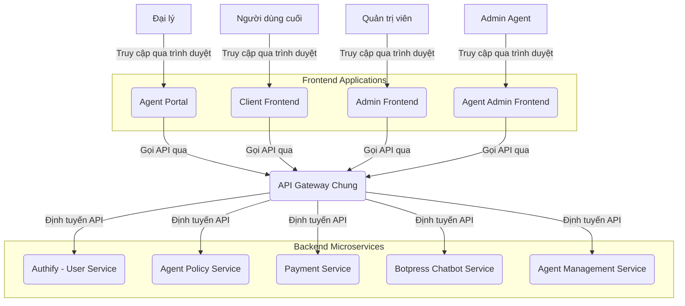

# ĐỀ BÀN DỰ ÁN: XÂY DỰNG HỆ THỐNG GIAO DIỆN QUẢN TRỊ ĐẠI LÝ (AGENT ADMIN FRONTEND) TRONG MONOREPO

**Tác giả:** Manus AI

**Ngày:** 19 tháng 8 năm 2025

---

## Mục lục

1.  Giới thiệu Dự án
    1.1. Bối cảnh và Động lực
    1.2. Mục tiêu Dự án
    1.3. Phạm vi Dự án

2.  Yêu cầu Kỹ thuật và Công nghệ
    2.1. Yêu cầu Chức năng
    2.2. Yêu cầu Phi chức năng
    2.3. Công nghệ Sử dụng

3.  Kiến trúc và Thiết kế Hệ thống
    3.1. Tổng quan Kiến trúc
    3.2. Thiết kế Giao diện Người dùng (UI/UX)
    3.3. Tích hợp API Backend và Giao tiếp giữa các Module

4.  Hạ tầng và DevOps
    4.1. Môi trường Phát triển
    4.2. CI/CD Pipeline
    4.3. Triển khai

5.  Phát triển Frontend
    5.1. Cấu trúc Dự án trong Monorepo
    5.2. Các Module/Trang Chính
    5.3. Quản lý Trạng thái và Dữ liệu

6.  Kiểm thử và Đảm bảo Chất lượng
    6.1. Unit Testing
    6.2. Integration Testing
    6.3. End-to-End Testing

7.  Quản lý Dự án và Tài liệu hóa
    7.1. Quản lý Phiên bản
    7.2. Quản lý Vấn đề
    7.3. Tài liệu Dự án

---

## 1. Giới thiệu Dự án

### 1.1. Bối cảnh và Động lực

Trong hệ thống tích hợp Botpress Chatbot Service, **Agent Admin Frontend** là giao diện chuyên biệt dành cho Admin Agent, cho phép họ quản lý toàn diện các hoạt động liên quan đến đại lý trong hệ thống. Với sự ra đời của `Agent Management Service` (dịch vụ quản lý đại lý chuyên biệt) và kiến trúc microservice ở backend, việc xây dựng các ứng dụng frontend (Client Frontend, Admin Frontend, Agent Portal, Agent Admin Frontend) trong một cấu trúc **monorepo** là một cách tiếp cận hiệu quả. Điều này cho phép các đội ngũ phát triển làm việc độc lập trên các tính năng của mình nhưng vẫn chia sẻ được các tài nguyên chung, đảm bảo tính nhất quán về UI/UX và tối ưu hóa quy trình phát triển.

**Ghi chú về Kiến trúc Frontend Tổng thể:**
- **Client Frontend:** Giao diện chính cho người dùng cuối, tích hợp với Botpress Chatbot Service
- **Admin Frontend:** Bảng điều khiển quản trị viên để quản lý hệ thống và người dùng (không quản lý đại lý)
- **Agent Portal:** Giao diện đăng ký và quản lý cơ bản cho đại lý
- **Agent Admin Frontend:** Giao diện chuyên biệt để quản lý đại lý (do Admin Agent sử dụng)

Động lực chính của dự án này là tạo ra một nền tảng quản lý mạnh mẽ cho Admin Agent, giúp họ dễ dàng quản lý, giám sát và hỗ trợ các đại lý trong hệ thống tích hợp Botpress. Việc phát triển Agent Admin Frontend như một module trong monorepo giúp tận dụng các component, hooks, và tiện ích dùng chung, đồng thời chuẩn bị cho khả năng tích hợp linh hoạt với các thành phần Frontend khác tùy thuộc vào chiến lược UX tổng thể.

### 1.2. Mục tiêu Dự án

Mục tiêu tổng thể của dự án "Agent Admin Frontend trong Monorepo" là phát triển một ứng dụng web hoàn chỉnh, cung cấp giao diện trực quan và hiệu quả cho Admin Agent để quản lý các đại lý trong hệ thống tích hợp Botpress, đồng thời tận dụng lợi ích của kiến trúc monorepo với 4 thành phần Frontend (Client Frontend, Admin Frontend, Agent Portal, Agent Admin Frontend). Các mục tiêu cụ thể bao gồm:

*   **Cung cấp trải nghiệm quản lý tối ưu cho Admin Agent:** Thiết kế giao diện chuyên nghiệp, dễ sử dụng, đáp ứng nhanh trên mọi thiết bị (responsive design) và hỗ trợ đa ngôn ngữ.
*   **Tích hợp liền mạch với các dịch vụ backend:** Đảm bảo Agent Admin Frontend có thể giao tiếp hiệu quả và an toàn với `Authify (User Service)`, `Agent Management Service`, `Agent Policy Service`, `Payment Service`, và `Botpress Chatbot Service` thông qua các API RESTful.
*   **Quản lý trạng thái xác thực và phân quyền:** Xử lý đăng nhập Admin Agent, quản lý hồ sơ và phiên làm việc một cách an toàn và hiệu quả, đảm bảo chỉ Admin Agent mới có thể truy cập các chức năng quản lý đại lý.
*   **Quản lý đại lý toàn diện:** Cung cấp giao diện để xem, tạo, chỉnh sửa, phê duyệt, tạm khóa/mở khóa đại lý, và quản lý thông tin chi tiết của từng đại lý.
*   **Giám sát hiệu suất đại lý:** Hiển thị báo cáo chi tiết về hiệu suất của từng đại lý, bao gồm hoa hồng kiếm được từ việc giới thiệu khách hàng sử dụng dịch vụ chatbot.
*   **Quản lý thanh toán hoa hồng:** Cho phép Admin Agent xem, phê duyệt hoặc từ chối các yêu cầu thanh toán hoa hồng từ đại lý.
*   **Tối ưu hóa tái sử dụng:** Tận dụng tối đa các component, hooks, tiện ích dùng chung được định nghĩa trong monorepo để đảm bảo tính nhất quán và hiệu quả phát triển giữa 4 thành phần Frontend.
*   **Đảm bảo an toàn và bảo mật:** Áp dụng các biện pháp bảo mật cần thiết cho giao diện người dùng và các tương tác API, đặc biệt là với các chức năng quản lý tài chính nhạy cảm.

### 1.3. Phạm vi Dự án

Dự án "Agent Admin Frontend trong Monorepo" sẽ tập trung vào việc phát triển các thành phần cốt lõi sau:

*   **Giao diện Người dùng (UI):**
    *   **Trang Đăng nhập Admin Agent:** Tích hợp với Authify để xử lý xác thực Admin Agent.
    *   **Trang Dashboard Admin Agent:** Tổng quan về hệ thống đại lý, thống kê tổng thể, các thông báo quan trọng.
    *   **Trang Quản lý Đại lý:** Danh sách tất cả đại lý với khả năng tìm kiếm, lọc, sắp xếp.
    *   **Trang Chi tiết Đại lý:** Xem và chỉnh sửa thông tin chi tiết của từng đại lý.
    *   **Trang Phê duyệt Đại lý:** Xem và xử lý các yêu cầu đăng ký đại lý mới.
    *   **Trang Báo cáo Hiệu suất:** Hiển thị báo cáo chi tiết về hiệu suất của từng đại lý và tổng thể.
    *   **Trang Quản lý Thanh toán:** Xem, phê duyệt hoặc từ chối các yêu cầu thanh toán hoa hồng.
    *   **Trang Cấu hình Hệ thống:** Cài đặt các tham số liên quan đến chương trình đại lý.
    *   **Trang Hồ sơ Admin Agent:** Cho phép xem và chỉnh sửa thông tin cá nhân của Admin Agent.
    *   **Hỗ trợ đa ngôn ngữ:** Chuyển đổi ngôn ngữ giao diện.

*   **Tích hợp API Backend:**
    *   **Authify (User Service):** Đăng nhập Admin Agent, lấy thông tin Admin Agent, cập nhật hồ sơ.
    *   **Agent Management Service:** Quản lý đại lý (CRUD operations), phê duyệt đại lý, thống kê đại lý.
    *   **Agent Policy Service:** Lấy thông tin chính sách đại lý, báo cáo hoa hồng, quản lý yêu cầu thanh toán.
    *   **Payment Service:** Xử lý các giao dịch thanh toán hoa hồng, lịch sử thanh toán.
    *   **Botpress Chatbot Service:** Lấy thống kê tương tác chatbot liên quan đến đại lý.

*   **Xử lý Trạng thái và Dữ liệu:**
    *   Quản lý trạng thái ứng dụng (loading, error, success).
    *   Xử lý lỗi từ API và hiển thị thông báo thân thiện cho Admin Agent.
    *   Quản lý phiên Admin Agent (JWT).
    *   Caching dữ liệu để tối ưu hiệu suất.

*   **Infrastructure & DevOps:**
    *   Container hóa ứng dụng frontend bằng Docker.
    *   Thiết lập môi trường phát triển cục bộ bằng Docker Compose (có thể bao gồm các dịch vụ backend phụ thuộc).
    *   Xây dựng quy trình CI/CD cơ bản (ví dụ: GitHub Actions) cho việc kiểm thử và đóng gói ứng dụng trong môi trường monorepo.

**Các tính năng nằm ngoài phạm vi của dự án này (nhưng có thể là các giai đoạn phát triển tiếp theo hoặc các module khác trong monorepo):**

*   Client Frontend, Admin Frontend hoặc Agent Portal (trừ khi Agent Admin Frontend được tích hợp vào).
*   Hệ thống thông báo đẩy (push notifications) cho Admin Agent.
*   Chức năng chat/hỗ trợ trực tuyến cho Admin Agent.
*   Quản lý tài liệu/tài nguyên đào tạo cho đại lý.
*   Hệ thống báo cáo nâng cao với AI/ML.

## 2. Yêu cầu Kỹ thuật và Công nghệ

### 2.1. Yêu cầu Chức năng

Các yêu cầu chức năng mô tả những gì Agent Admin Frontend phải làm để đáp ứng mục tiêu của dự án:

*   **Xác thực Admin Agent:**
    *   Cho phép Admin Agent đăng nhập bằng tài khoản đã có.
    *   Cho phép Admin Agent đăng xuất.
    *   Hiển thị thông tin hồ sơ Admin Agent và cho phép cập nhật.
*   **Quản lý Đại lý:**
    *   Hiển thị danh sách tất cả đại lý với thông tin cơ bản (tên, email, trạng thái, ngày đăng ký).
    *   Tìm kiếm đại lý theo tên, email, ID.
    *   Lọc đại lý theo trạng thái (đang hoạt động, tạm khóa, chờ phê duyệt).
    *   Xem chi tiết thông tin của từng đại lý.
    *   Chỉnh sửa thông tin đại lý.
    *   Phê duyệt hoặc từ chối yêu cầu đăng ký đại lý mới.
    *   Tạm khóa/mở khóa tài khoản đại lý.
    *   Xóa đại lý (nếu cần thiết).
*   **Quản lý Hiệu suất và Hoa hồng:**
    *   Hiển thị báo cáo hiệu suất tổng thể của tất cả đại lý.
    *   Hiển thị báo cáo chi tiết hiệu suất của từng đại lý.
    *   Xem chi tiết hoa hồng của từng đại lý theo thời gian.
    *   Theo dõi các chỉ số KPI của đại lý (số khách hàng giới thiệu, doanh thu từ chatbot, tỷ lệ chuyển đổi).
*   **Quản lý Thanh toán:**
    *   Hiển thị danh sách các yêu cầu thanh toán hoa hồng từ đại lý.
    *   Xem chi tiết từng yêu cầu thanh toán.
    *   Phê duyệt hoặc từ chối yêu cầu thanh toán.
    *   Xem lịch sử thanh toán đã thực hiện.
    *   Tạo báo cáo thanh toán.
*   **Thống kê và Báo cáo:**
    *   Dashboard với các biểu đồ thống kê tổng quan.
    *   Báo cáo doanh thu từ chương trình đại lý.
    *   Báo cáo hiệu suất chatbot thông qua đại lý.
    *   Xuất báo cáo dưới dạng PDF/Excel.
*   **Cấu hình Hệ thống:**
    *   Cài đặt các tham số chương trình đại lý (tỷ lệ hoa hồng, điều kiện thanh toán).
    *   Quản lý các template email/thông báo gửi cho đại lý.
*   **Đa ngôn ngữ:**
    *   Giao diện người dùng phải hỗ trợ ít nhất hai ngôn ngữ (ví dụ: Tiếng Việt và Tiếng Anh).
    *   Admin Agent có thể dễ dàng chuyển đổi ngôn ngữ.

### 2.2. Yêu cầu Phi chức năng

Các yêu cầu phi chức năng mô tả cách Agent Admin Frontend hoạt động, bao gồm các khía cạnh về chất lượng, hiệu suất, bảo mật, và khả năng bảo trì:

*   **Hiệu suất:**
    *   Thời gian tải trang ban đầu nhanh (dưới 2 giây).
    *   Thời gian phản hồi của giao diện người dùng mượt mà, không giật lag.
    *   Tối ưu hóa hình ảnh và tài nguyên để giảm thiểu thời gian tải.
    *   Hỗ trợ lazy loading cho các danh sách lớn.
*   **Khả năng mở rộng:**
    *   Kiến trúc module hóa, dễ dàng thêm các tính năng hoặc trang mới.
    *   Có khả năng mở rộng để hỗ trợ quản lý nhiều đại lý đồng thời.
    *   Hỗ trợ phân trang và tìm kiếm hiệu quả cho dữ liệu lớn.
*   **Bảo mật:**
    *   Tất cả các giao tiếp với backend phải được mã hóa bằng HTTPS/SSL.
    *   Xử lý JWT an toàn (ví dụ: lưu trữ trong HttpOnly cookies).
    *   Chống lại các cuộc tấn công phổ biến như XSS, CSRF.
    *   Không lưu trữ thông tin nhạy cảm ở phía client.
    *   Đảm bảo các quyền hạn Admin Agent được áp dụng đúng đắn trên giao diện.
    *   Audit log cho các thao tác quan trọng.
*   **Khả năng sử dụng (Usability):**
    *   Giao diện trực quan, chuyên nghiệp và dễ thao tác cho Admin Agent.
    *   Thông báo lỗi rõ ràng, thân thiện và hướng dẫn Admin Agent cách khắc phục.
    *   Thiết kế responsive, tương thích tốt trên các thiết bị desktop, tablet và mobile.
    *   Hỗ trợ keyboard shortcuts cho các thao tác thường xuyên.
*   **Khả năng bảo trì:**
    *   Mã nguồn phải sạch, dễ đọc, tuân thủ các tiêu chuẩn mã hóa và có tài liệu hóa đầy đủ.
    *   Sử dụng các thư viện và framework phổ biến, có cộng đồng hỗ trợ lớn.
    *   Dễ dàng triển khai và cập nhật.
    *   Logging và monitoring đầy đủ.
*   **Khả năng chịu lỗi (Fault Tolerance):**
    *   Xử lý các lỗi từ API backend một cách gracefully, hiển thị thông báo phù hợp thay vì crash.
    *   Có cơ chế retry cho các yêu cầu API thất bại tạm thời.
    *   Offline capability cho một số chức năng cơ bản.
*   **Khả năng tương thích:**
    *   Hoạt động tốt trên các trình duyệt web phổ biến (Chrome, Firefox, Edge, Safari) và các phiên bản mới nhất.

### 2.3. Công nghệ Sử dụng

Để xây dựng Agent Admin Frontend trong monorepo, các công nghệ sau đây được đề xuất:

*   **Frontend Framework:** Next.js 14+ (để xây dựng ứng dụng React SSR/SSG, tối ưu SEO và hiệu suất).
*   **Thư viện UI:** React 18+
*   **Ngôn ngữ:** TypeScript (để tăng cường tính an toàn và khả năng bảo trì của mã nguồn).
*   **CSS Framework:** Tailwind CSS (để xây dựng giao diện nhanh chóng và responsive).
*   **UI Component Library:** Ant Design hoặc Material-UI (để có các component quản trị chuyên nghiệp).
*   **Quản lý trạng thái:** React Context API, Zustand hoặc Redux Toolkit (tùy thuộc vào độ phức tạp và quy mô).
*   **HTTP Client:** Axios hoặc Fetch API (để gọi các API backend).
*   **Thư viện đa ngôn ngữ:** `react-i18next` hoặc tương tự.
*   **Thư viện biểu đồ/đồ thị:** `Chart.js`, `Recharts` hoặc `D3.js` (cho các báo cáo và dashboard).
*   **Form Management:** `React Hook Form` hoặc `Formik` (để quản lý form hiệu quả).
*   **Validation:** `Zod` hoặc `Yup` (để validate dữ liệu đầu vào).
*   **Table Management:** `TanStack Table` (cho các bảng dữ liệu phức tạp).
*   **Date/Time:** `date-fns` hoặc `dayjs` (để xử lý ngày tháng).
*   **Công cụ Monorepo:** Nx hoặc Turborepo (để quản lý các ứng dụng và thư viện dùng chung trong monorepo).
*   **DevOps & Hạ tầng:**
    *   **Containerization:** Docker (để đóng gói ứng dụng và môi trường).
    *   **Môi trường phát triển cục bộ:** Docker Compose (để chạy frontend và các dịch vụ backend phụ thuộc).
    *   **CI/CD:** GitHub Actions (để tự động hóa kiểm thử và triển khai).
*   **Công cụ chất lượng mã nguồn:**
    *   ESLint (linter).
    *   Prettier (code formatter).
    *   Husky/lint-staged (pre-commit hooks).

## 3. Kiến trúc và Thiết kế Hệ thống

### 3.1. Tổng quan Kiến trúc

Agent Admin Frontend sẽ là một ứng dụng web trong monorepo, tương tác chủ yếu với các dịch vụ backend thông qua **API Gateway chung** của hệ thống. Nó sẽ không có database riêng mà chỉ quản lý trạng thái cục bộ và phiên Admin Agent. Các thành phần dùng chung (shared components, hooks, utilities) sẽ được định nghĩa ở cấp độ monorepo và được sử dụng bởi Agent Admin Frontend cũng như các ứng dụng frontend khác (Client Frontend, Admin Frontend, Agent Portal). Sơ đồ kiến trúc tổng quan như sau:



**Mô tả các thành phần chính và mối liên kết:**

*   **Client Frontend:** Giao diện chính cho người dùng cuối, tích hợp với Botpress Chatbot Service để cung cấp dịch vụ chatbot.
*   **Admin Frontend:** Bảng điều khiển quản trị viên để quản lý hệ thống và người dùng (không quản lý đại lý).
*   **Agent Portal:** Giao diện đăng ký và quản lý cơ bản cho đại lý.
*   **Agent Admin Frontend:** Ứng dụng web chính mà Admin Agent tương tác để quản lý toàn diện các đại lý. Nó sẽ gửi các yêu cầu API đến API Gateway và hiển thị dữ liệu trả về.
*   **API Gateway Chung:** Là điểm tương tác duy nhất cho tất cả các ứng dụng frontend (bao gồm 4 thành phần Frontend). Nó chịu trách nhiệm định tuyến các yêu cầu đến các microservice backend tương ứng, xử lý xác thực, phân quyền, giới hạn tốc độ, và giám sát.
*   **Shared Components/Hooks/Utilities:** Các thư viện nội bộ trong monorepo chứa các thành phần UI, hooks, hàm tiện ích, cấu hình chung được tái sử dụng bởi tất cả các ứng dụng frontend trong monorepo.
*   **Authify (User Service):** Cung cấp các API cho việc đăng nhập Admin Agent, lấy thông tin Admin Agent, cập nhật hồ sơ.
*   **Agent Management Service:** Cung cấp các API chuyên biệt để quản lý đại lý (CRUD operations), phê duyệt đại lý, thống kê đại lý.
*   **Agent Policy Service:** Cung cấp các API để quản lý thông tin chính sách đại lý, báo cáo hoa hồng, và xử lý các yêu cầu thanh toán hoa hồng.
*   **Payment Service:** Cung cấp các API để quản lý các giao dịch tài chính liên quan đến hoa hồng và xử lý các yêu cầu thanh toán.
*   **Botpress Chatbot Service:** Cung cấp các API để lấy thống kê tương tác chatbot liên quan đến đại lý và hiệu suất chatbot.

**Luồng tương tác chính (ví dụ: Admin Agent phê duyệt yêu cầu đăng ký đại lý mới):**

1.  Admin Agent đăng nhập vào Agent Admin Frontend (thông qua API Gateway, sau đó API Gateway gọi Authify để xác thực).
2.  Agent Admin Frontend gửi yêu cầu lấy danh sách đại lý chờ phê duyệt đến **API Gateway Chung** (kèm theo JWT).
3.  API Gateway nhận yêu cầu, xác thực và phân quyền Admin Agent.
4.  API Gateway định tuyến yêu cầu đến **Agent Management Service**.
5.  Agent Management Service xử lý yêu cầu, truy vấn dữ liệu đại lý chờ phê duyệt.
6.  Agent Management Service trả về danh sách đại lý chờ phê duyệt cho API Gateway.
7.  API Gateway trả về dữ liệu cho Agent Admin Frontend.
8.  Agent Admin Frontend hiển thị danh sách đại lý chờ phê duyệt cho Admin Agent (sử dụng các component từ Shared Components).
9.  Admin Agent chọn phê duyệt một đại lý, Agent Admin Frontend gửi yêu cầu phê duyệt đến API Gateway.
10. API Gateway định tuyến yêu cầu đến Agent Management Service để cập nhật trạng thái đại lý.
11. Agent Management Service xử lý phê duyệt và có thể gửi thông báo đến đại lý thông qua các service khác.

### 3.2. Thiết kế Giao diện Người dùng (UI/UX)

Thiết kế UI/UX sẽ tập trung vào sự chuyên nghiệp, hiệu quả và dễ sử dụng cho các tác vụ quản lý đại lý phức tạp, đồng thời đảm bảo tính nhất quán trên toàn bộ các ứng dụng frontend trong monorepo. Sử dụng một hệ thống thiết kế (Design System) nhất quán, được định nghĩa và triển khai thông qua các Shared Components. Chú trọng vào:

*   **Layout:** 
    *   Sử dụng layout admin chuyên nghiệp với sidebar navigation và top header.
    *   Responsive layout, sử dụng Flexbox/Grid để đảm bảo hiển thị tốt trên mọi kích thước màn hình.
    *   Breadcrumb navigation để Admin Agent dễ dàng định hướng.
    *   Sticky header và sidebar để dễ dàng điều hướng.
*   **Typography:** 
    *   Lựa chọn font chữ chuyên nghiệp, dễ đọc.
    *   Hierarchy rõ ràng với các kích thước font phù hợp cho tiêu đề, nội dung, và metadata.
    *   Tối ưu cho việc hiển thị dữ liệu dạng bảng và form.
*   **Color Palette:** 
    *   Sử dụng bảng màu chuyên nghiệp, trang trọng.
    *   Có sự phân biệt rõ ràng giữa các trạng thái (thành công, lỗi, cảnh báo, thông tin).
    *   Màu sắc phù hợp cho dashboard và các biểu đồ thống kê.
    *   Được định nghĩa tập trung trong design system.
*   **Components:** 
    *   Xây dựng các component UI chuyên biệt cho quản trị (data tables, advanced forms, modals, charts, dashboards, filters, search bars).
    *   Tái sử dụng các component cơ bản từ thư viện dùng chung của monorepo.
    *   Component library riêng cho admin interfaces.
*   **Data Visualization:**
    *   Dashboard với các biểu đồ trực quan (line charts, bar charts, pie charts, KPI cards).
    *   Tables với khả năng sort, filter, pagination hiệu quả.
    *   Data export functionality.
*   **Feedback:** 
    *   Loading states chi tiết cho các thao tác khác nhau.
    *   Success/error notifications với action buttons.
    *   Confirmation dialogs cho các thao tác quan trọng.
    *   Progress indicators cho các quy trình dài.
*   **Accessibility:** 
    *   Đảm bảo ứng dụng có thể truy cập được bởi người dùng khuyết tật.
    *   Sử dụng ARIA attributes, keyboard navigation, screen reader support.
    *   High contrast mode support.

### 3.3. Tích hợp API Backend và Giao tiếp giữa các Module

Agent Admin Frontend sẽ tương tác với các dịch vụ backend thông qua **API Gateway chung** của hệ thống. API Gateway sẽ đóng vai trò là cầu nối duy nhất giữa Agent Admin Frontend và các microservice backend khác, bao gồm cả Botpress Chatbot Service và Agent Management Service. Để quản lý việc gọi API hiệu quả và giao tiếp trong monorepo với 4 thành phần Frontend, cần:

*   **Tạo các API Client:** 
    *   Xây dựng các module hoặc class riêng biệt để tương tác với API Gateway (ví dụ: `AdminApiClient`).
    *   Module này sẽ chứa các phương thức gọi đến các endpoint của API Gateway, bao gồm:
        *   Agent Management APIs (CRUD đại lý, phê duyệt, thống kê)
        *   Agent Policy APIs (báo cáo hoa hồng, chính sách)
        *   Payment APIs (quản lý thanh toán hoa hồng)
        *   Botpress APIs (thống kê chatbot liên quan đến đại lý)
    *   Sử dụng TypeScript interfaces để định nghĩa các data models.
*   **Xử lý xác thực:** 
    *   Gửi JWT trong header `Authorization` cho tất cả các yêu cầu API cần xác thực đến API Gateway.
    *   API Gateway sẽ chịu trách nhiệm xác thực và phân quyền Admin Agent.
    *   Automatic token refresh mechanism.
    *   Logout handling khi token hết hạn.
*   **Xử lý lỗi:** 
    *   Bắt các lỗi từ API (ví dụ: 4xx, 5xx) trả về từ API Gateway.
    *   Hiển thị thông báo lỗi phù hợp cho Admin Agent.
    *   Error boundary components để xử lý lỗi gracefully.
    *   Retry mechanism cho các lỗi tạm thời.
*   **Caching và Optimization:** 
    *   Sử dụng React Query hoặc SWR để caching dữ liệu và quản lý server state.
    *   Cache các dữ liệu ít thay đổi (danh sách đại lý, cấu hình hệ thống).
    *   Optimistic updates cho các thao tác CRUD.
    *   Background refetching để đảm bảo dữ liệu luôn mới.
*   **Real-time Updates:**
    *   WebSocket connection để nhận thông báo real-time về các thay đổi quan trọng.
    *   Server-sent events cho các cập nhật trạng thái đại lý.
*   **Giao tiếp giữa các Module Frontend:** 
    *   Sử dụng Context API hoặc Redux để chia sẻ trạng thái giữa các component.
    *   Event bus cho giao tiếp giữa các module độc lập.
    *   Shared state management cho các dữ liệu chung (user info, permissions).
    *   Cross-module navigation và deep linking.

## 4. Hạ tầng và DevOps

### 4.1. Môi trường Phát triển

*   **Node.js:** Cài đặt Node.js và npm/yarn để chạy Next.js và các công cụ monorepo.
*   **Docker:** Agent Admin Frontend sẽ được đóng gói thành Docker image.
*   **Docker Compose:** Sử dụng file `docker-compose.yml` để định nghĩa và khởi chạy toàn bộ môi trường phát triển cục bộ (Agent Admin Frontend và các dịch vụ backend phụ thuộc như Authify, Agent Management Service, Agent Policy Service, Payment Service, Botpress Chatbot Service) bằng một lệnh duy nhất. Docker Compose cũng có thể được cấu hình để chạy các ứng dụng frontend khác trong monorepo.
*   **Development Tools:**
    *   Hot reload cho development.
    *   Mock API server cho testing độc lập.
    *   Database seeding scripts cho test data.
    *   Environment configuration management.

### 4.2. CI/CD Pipeline

*   **Nền tảng:** GitHub Actions (hoặc GitLab CI/CD, Jenkins).
*   **Quy trình trong Monorepo:** Tự động kích hoạt khi có push code hoặc tạo Pull Request.
    1.  **Build:** Cài đặt dependencies, chạy linter, chạy test cho các dự án bị ảnh hưởng bởi thay đổi.
    2.  **Test:** Chạy unit tests, integration tests, e2e tests cho các dự án liên quan.
    3.  **Security Scan:** Quét lỗ hổng bảo mật trong dependencies và code.
    4.  **Build Docker Image:** Đóng gói ứng dụng Agent Admin Frontend thành Docker image.
    5.  **Deploy (staging/production):** Triển khai lên môi trường staging để kiểm thử, sau đó production.
    6.  **Monitoring:** Thiết lập monitoring và alerting sau khi deploy.

### 4.3. Triển khai

*   **Containerization:** Sử dụng Docker để đóng gói ứng dụng và dependencies.
*   **Orchestration:** Kubernetes hoặc Docker Swarm để quản lý containers trong production.
*   **Load Balancing:** Nginx hoặc cloud load balancer để phân tải traffic.
*   **CDN:** CloudFlare hoặc AWS CloudFront để cache static assets.
*   **Monitoring:** 
    *   Application monitoring với tools như New Relic, DataDog.
    *   Log aggregation với ELK stack hoặc cloud logging.
    *   Error tracking với Sentry.
    *   Performance monitoring và alerting.
*   **Security:**
    *   HTTPS/SSL certificates.
    *   Security headers configuration.
    *   Regular security updates và patches.
    *   Backup và disaster recovery procedures.

## 5. Phát triển Frontend

### 5.1. Cấu trúc Dự án trong Monorepo

```
monorepo/
├── apps/
│   ├── client-frontend/          # Client Frontend
│   ├── admin-frontend/           # Admin Frontend  
│   ├── agent-portal/             # Agent Portal
│   └── agent-admin-frontend/     # Agent Admin Frontend
├── packages/
│   ├── shared-ui/                # Shared UI Components
│   ├── shared-hooks/             # Shared React Hooks
│   ├── shared-utils/             # Shared Utilities
│   ├── api-client/               # Shared API Client
│   ├── types/                    # Shared TypeScript Types
│   └── config/                   # Shared Configuration
├── tools/
│   ├── eslint-config/            # Shared ESLint Config
│   └── webpack-config/           # Shared Webpack Config
└── docker/
    ├── docker-compose.dev.yml    # Development Environment
    └── docker-compose.prod.yml   # Production Environment
```

### 5.2. Các Module/Trang Chính

Agent Admin Frontend sẽ bao gồm các module/trang chính sau:

*   **Authentication Module:**
    *   Login Page
    *   Profile Management
    *   Password Reset

*   **Dashboard Module:**
    *   Overview Dashboard
    *   KPI Cards
    *   Charts và Graphs
    *   Recent Activities

*   **Agent Management Module:**
    *   Agent List với Search/Filter
    *   Agent Detail View
    *   Agent Creation/Edit Forms
    *   Agent Approval Workflow
    *   Agent Status Management

*   **Performance Analytics Module:**
    *   Performance Reports
    *   Commission Reports
    *   Chatbot Interaction Statistics
    *   Revenue Analytics

*   **Payment Management Module:**
    *   Payment Requests List
    *   Payment Approval Workflow
    *   Payment History
    *   Financial Reports

*   **System Configuration Module:**
    *   Agent Policy Settings
    *   Commission Rate Configuration
    *   Email Template Management
    *   System Parameters

*   **Notification Module:**
    *   Notification Center
    *   Alert Management
    *   Communication Templates

### 5.3. Quản lý Trạng thái và Dữ liệu

*   **Global State Management:**
    *   User authentication state
    *   Application configuration
    *   Notification state
    *   Theme và language preferences

*   **Local State Management:**
    *   Form state với React Hook Form
    *   Component-specific state với useState/useReducer
    *   Modal và dialog state

*   **Server State Management:**
    *   React Query cho data fetching và caching
    *   Optimistic updates
    *   Background synchronization
    *   Error handling và retry logic

*   **Data Flow:**
    *   Unidirectional data flow
    *   Centralized error handling
    *   Loading state management
    *   Data validation và sanitization

## 6. Kiểm thử và Đảm bảo Chất lượng

### 6.1. Unit Testing

*   **Testing Framework:** Jest + React Testing Library
*   **Coverage:** Minimum 80% code coverage
*   **Test Types:**
    *   Component rendering tests
    *   Hook functionality tests
    *   Utility function tests
    *   API client tests với mocking

### 6.2. Integration Testing

*   **API Integration:** Test tích hợp với backend APIs
*   **Component Integration:** Test tương tác giữa các components
*   **State Management:** Test flow của state changes
*   **Form Validation:** Test các validation rules

### 6.3. End-to-End Testing

*   **Testing Framework:** Playwright hoặc Cypress
*   **Test Scenarios:**
    *   Complete user workflows
    *   Cross-browser compatibility
    *   Mobile responsiveness
    *   Performance testing

## 7. Quản lý Dự án và Tài liệu hóa

### 7.1. Quản lý Phiên bản

*   **Version Control:** Git với GitFlow workflow
*   **Semantic Versioning:** Sử dụng SemVer cho releases
*   **Release Management:** Automated releases với changelog generation
*   **Branch Strategy:** Feature branches, develop, staging, main

### 7.2. Quản lý Vấn đề

*   **Issue Tracking:** GitHub Issues hoặc Jira
*   **Bug Reporting:** Standardized bug report templates
*   **Feature Requests:** User story format
*   **Priority Management:** Labels và milestones

### 7.3. Tài liệu Dự án

*   **Technical Documentation:**
    *   API documentation
    *   Component library documentation
    *   Architecture decision records
    *   Deployment guides

*   **User Documentation:**
    *   Admin user manual
    *   Feature guides
    *   Troubleshooting guides
    *   FAQ section

*   **Developer Documentation:**
    *   Setup và development guides
    *   Coding standards
    *   Contributing guidelines
    *   Code review checklist

---

**Kết luận:**

Agent Admin Frontend là một thành phần quan trọng trong hệ sinh thái monorepo, cung cấp giao diện quản lý chuyên nghiệp cho Admin Agent để quản lý toàn diện các đại lý trong hệ thống tích hợp Botpress. Với kiến trúc modular, tích hợp API liền mạch, và focus vào user experience, ứng dụng này sẽ đóng vai trò then chốt trong việc vận hành hiệu quả chương trình đại lý và tối ưu hóa doanh thu từ dịch vụ chatbot.