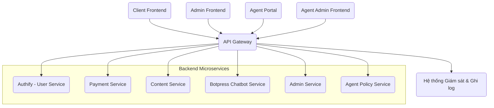

# ĐỀ BÀN DỰ ÁN: XÂY DỰNG HỆ THỐNG CỔNG API (API GATEWAY) CHUNG

**Tác giả:** Manus AI

**Ngày:** 19 tháng 8 năm 2025

---

## Mục lục

1.  Giới thiệu Dự án
    1.1. Bối cảnh và Động lực
    1.2. Mục tiêu Dự án
    1.3. Phạm vi Dự án

2.  Yêu cầu Kỹ thuật và Công nghệ
    2.1. Yêu cầu Chức năng
    2.2. Yêu cầu Phi chức năng
    2.3. Công nghệ Sử dụng

3.  Kiến trúc và Thiết kế Hệ thống
    3.1. Tổng quan Kiến trúc
    3.2. Thiết kế API Gateway

4.  Hạ tầng và DevOps
    4.1. Môi trường Phát triển
    4.2. CI/CD Pipeline
    4.3. Triển khai

5.  Kiểm thử và Đảm bảo Chất lượng
    5.1. Unit Testing
    5.2. Integration Testing
    5.3. End-to-End Testing

6.  Quản lý Dự án và Tài liệu hóa
    6.1. Quản lý Phiên bản
    6.2. Quản lý Vấn đề
    6.3. Tài liệu Dự án

---

## 1. Giới thiệu Dự án

### 1.1. Bối cảnh và Động lực

Trong một kiến trúc microservice như MathService, nơi có nhiều dịch vụ backend độc lập (Authify, Payment Service, Content Service, Botpress Chatbot Service, Admin Service, Agent Policy Service) và nhiều ứng dụng frontend (Client Frontend, Admin Frontend, Agent Portal, Agent Admin Frontend) cần tương tác với chúng, việc quản lý các kết nối, xác thực, phân quyền, định tuyến và giám sát trở nên phức tạp. Mỗi ứng dụng frontend sẽ phải biết địa chỉ của từng dịch vụ backend, xử lý các vấn đề xác thực và phân quyền riêng lẻ, và đối mặt với các thách thức như cân bằng tải, giới hạn tốc độ, và bảo mật.

**API Gateway** ra đời để giải quyết những thách thức này. Nó đóng vai trò là một điểm truy cập duy nhất (single entry point) cho tất cả các yêu cầu từ bên ngoài vào hệ thống microservice. Thay vì các ứng dụng frontend gọi trực tiếp đến từng microservice, chúng sẽ gọi đến API Gateway. API Gateway sau đó sẽ chịu trách nhiệm định tuyến yêu cầu đến microservice phù hợp, xử lý xác thực và phân quyền, ghi log, giám sát, và áp dụng các chính sách bảo mật và quản lý lưu lượng. Điều này giúp đơn giản hóa đáng kể logic ở phía frontend, tăng cường bảo mật, và cung cấp một cái nhìn tổng thể về hiệu suất và lưu lượng của toàn bộ hệ thống.

Động lực chính của dự án này là xây dựng một **Hệ thống Cổng API (API Gateway) chung** cho toàn bộ MathService. API Gateway này sẽ không chỉ cải thiện hiệu suất và bảo mật mà còn tạo điều kiện thuận lợi cho việc phát triển và bảo trì các ứng dụng frontend và backend, cho phép các microservice tập trung hơn vào logic nghiệp vụ cốt lõi của chúng.

### 1.2. Mục tiêu Dự án

Mục tiêu tổng thể của dự án "Hệ thống Cổng API chung" là phát triển một API Gateway mạnh mẽ, đáng tin cậy và có khả năng mở rộng, đóng vai trò là điểm truy cập duy nhất cho toàn bộ hệ thống MathService. Các mục tiêu cụ thể bao gồm:

*   **Đơn giản hóa giao tiếp Frontend-Backend:** Cung cấp một điểm truy cập duy nhất cho tất cả các ứng dụng frontend, giúp chúng không cần phải biết chi tiết về vị trí và cấu trúc của từng microservice backend.
*   **Tập trung hóa xác thực và phân quyền:** Xử lý xác thực người dùng (thông qua Authify) và áp dụng các chính sách phân quyền ở một nơi duy nhất, giảm thiểu logic trùng lặp ở các microservice backend.
*   **Định tuyến yêu cầu thông minh:** Định tuyến các yêu cầu đến đúng microservice backend dựa trên URL, header, hoặc các tiêu chí khác.
*   **Quản lý lưu lượng và bảo mật:** Áp dụng các chính sách như giới hạn tốc độ (rate limiting), danh sách đen/trắng IP, và bảo vệ chống lại các cuộc tấn công phổ biến.
*   **Cải thiện khả năng quan sát (Observability):** Thu thập log, metrics và trace cho tất cả các yêu cầu đi qua Gateway, cung cấp cái nhìn tổng thể về hiệu suất và hành vi của hệ thống.
*   **Hỗ trợ quản lý phiên bản API:** Cung cấp cơ chế để quản lý các phiên bản khác nhau của API một cách linh hoạt.
*   **Đảm bảo khả năng mở rộng và độ sẵn sàng cao:** Thiết kế Gateway để có thể mở rộng theo chiều ngang và hoạt động ổn định ngay cả khi một số microservice backend gặp sự cố.

### 1.3. Phạm vi Dự án

Dự án "Hệ thống Cổng API chung" sẽ tập trung vào việc phát triển các thành phần cốt lõi sau:

*   **Chức năng cốt lõi của API Gateway:**
    *   **Định tuyến (Routing):** Chuyển tiếp yêu cầu từ client đến microservice backend phù hợp.
    *   **Xác thực (Authentication):** Xác thực JWT từ client (tích hợp với Authify) và chuyển tiếp thông tin người dùng đến microservice backend.
    *   **Phân quyền (Authorization):** Áp dụng các chính sách phân quyền dựa trên vai trò hoặc quyền hạn của người dùng trước khi định tuyến yêu cầu.
    *   **Giới hạn tốc độ (Rate Limiting):** Ngăn chặn lạm dụng API bằng cách giới hạn số lượng yêu cầu mà một client có thể gửi trong một khoảng thời gian nhất định.
    *   **Caching:** Cache các phản hồi từ microservice backend để giảm tải và cải thiện hiệu suất cho các yêu cầu thường xuyên.
    *   **Ghi log và Giám sát (Logging & Monitoring):** Thu thập log và metrics cho tất cả các yêu cầu đi qua Gateway.
    *   **Xử lý lỗi (Error Handling):** Xử lý lỗi từ microservice backend và trả về phản hồi thân thiện cho client.
    *   **Chuyển đổi giao thức (Protocol Translation):** Nếu cần, chuyển đổi giữa các giao thức khác nhau (ví dụ: HTTP/1.1 sang HTTP/2, hoặc gRPC).

*   **Tích hợp với các Microservice hiện có:**
    *   **Authify (User Service):** Để xác thực và lấy thông tin phân quyền.
    *   Tất cả các microservice backend khác (Payment Service, Content Service, Quadratic Solver Service, Linear Solver Service, Admin Service, Agent Policy Service) sẽ được cấu hình để nhận yêu cầu thông qua Gateway.

*   **Infrastructure & DevOps:**
    *   Container hóa API Gateway bằng Docker.
    *   Thiết lập môi trường phát triển cục bộ bằng Docker Compose.
    *   Xây dựng quy trình CI/CD cơ bản (ví dụ: GitHub Actions) cho việc kiểm thử và triển khai.
    *   Thiết lập giám sát và ghi log tập trung cho Gateway.

**Các tính năng nằm ngoài phạm vi của dự án này (nhưng có thể là các giai đoạn phát triển tiếp theo):**

*   Quản lý API (API Management Portal) cho các nhà phát triển bên ngoài.
*   Tạo tài liệu API tự động (ví dụ: Swagger/OpenAPI).
*   Tích hợp với các hệ thống thanh toán hoặc dịch vụ bên thứ ba khác.
*   Phân tích dữ liệu nâng cao (API Analytics).

---

## 2. Yêu cầu Kỹ thuật và Công nghệ

### 2.1. Yêu cầu Chức năng

Các yêu cầu chức năng mô tả những gì API Gateway phải làm để đáp ứng mục tiêu của dự án:

*   **Định tuyến:**
    *   Hỗ trợ định tuyến dựa trên đường dẫn URL, phương thức HTTP, header, và tham số truy vấn.
    *   Có khả năng định tuyến đến các microservice backend khác nhau.
    *   Hỗ trợ định tuyến động (dynamic routing) để dễ dàng cấu hình mà không cần khởi động lại Gateway.
*   **Xác thực:**
    *   Xác thực JWT từ client bằng cách tích hợp với Authify (kiểm tra tính hợp lệ của token, chữ ký, thời hạn).
    *   Chuyển tiếp thông tin người dùng (user ID, vai trò) đã được xác thực đến microservice backend thông qua header hoặc context.
*   **Phân quyền:**
    *   Áp dụng các chính sách phân quyền dựa trên vai trò (roles) hoặc quyền hạn (permissions) của người dùng được trích xuất từ JWT.
    *   Từ chối các yêu cầu không có quyền truy cập phù hợp.
*   **Giới hạn tốc độ (Rate Limiting):**
    *   Cho phép cấu hình giới hạn số lượng yêu cầu trên mỗi client (dựa trên IP, user ID, hoặc API key) trong một khoảng thời gian nhất định.
    *   Trả về lỗi `429 Too Many Requests` khi vượt quá giới hạn.
*   **Caching:**
    *   Hỗ trợ caching phản hồi cho các API có dữ liệu ít thay đổi để giảm tải cho backend và tăng tốc độ phản hồi.
    *   Có thể cấu hình thời gian sống (TTL) cho cache.
*   **Ghi log và Giám sát:**
    *   Ghi lại tất cả các yêu cầu và phản hồi đi qua Gateway (bao gồm thông tin về client, thời gian, trạng thái HTTP, kích thước).
    *   Xuất các metrics về hiệu suất (thời gian phản hồi, số lượng yêu cầu, tỷ lệ lỗi) để tích hợp với hệ thống giám sát.
    *   Hỗ trợ distributed tracing để theo dõi một yêu cầu qua nhiều microservice.
*   **Xử lý lỗi:**
    *   Xử lý các lỗi từ microservice backend (ví dụ: 404, 500) và trả về phản hồi lỗi chuẩn hóa, thân thiện cho client.
    *   Có cơ chế retry hoặc circuit breaker để tăng cường khả năng chịu lỗi khi microservice backend gặp sự cố.
*   **Quản lý phiên bản API:**
    *   Hỗ trợ định tuyến các phiên bản API khác nhau (ví dụ: `/v1/users`, `/v2/users`).

### 2.2. Yêu cầu Phi chức năng

Các yêu cầu phi chức năng mô tả cách API Gateway hoạt động, bao gồm các khía cạnh về chất lượng, hiệu suất, bảo mật, và khả năng bảo trì:

*   **Hiệu suất:**
    *   Độ trễ thấp (low latency): Thời gian xử lý yêu cầu qua Gateway phải cực kỳ thấp (dưới 10ms).
    *   Thông lượng cao (high throughput): Có khả năng xử lý hàng ngàn yêu cầu đồng thời mỗi giây.
*   **Khả năng mở rộng:**
    *   Thiết kế stateless để có thể mở rộng theo chiều ngang (horizontal scaling) dễ dàng.
    *   Có khả năng tự động mở rộng (auto-scaling) dựa trên tải.
*   **Độ sẵn sàng cao (High Availability):**
    *   Không có điểm lỗi duy nhất (single point of failure).
    *   Có cơ chế dự phòng và chuyển đổi dự phòng (failover) tự động.
*   **Bảo mật:**
    *   Tất cả các giao tiếp phải được mã hóa bằng HTTPS/SSL.
    *   Bảo vệ chống lại các cuộc tấn công phổ biến như DDoS, SQL Injection, XSS, CSRF (ở mức Gateway).
    *   Quản lý bí mật (secrets management) an toàn cho các khóa API, chứng chỉ.
*   **Khả năng bảo trì:**
    *   Cấu hình dễ dàng và linh hoạt.
    *   Mã nguồn (nếu là Gateway tự xây dựng) phải sạch, dễ đọc, tuân thủ các tiêu chuẩn mã hóa và có tài liệu hóa đầy đủ.
    *   Dễ dàng triển khai và cập nhật.
*   **Khả năng chịu lỗi (Fault Tolerance):**
    *   Áp dụng các mẫu thiết kế như Circuit Breaker, Retry, Timeout để xử lý các lỗi từ microservice backend một cách gracefully.
    *   Có khả năng hoạt động ổn định ngay cả khi một số microservice backend không khả dụng.

### 2.3. Công nghệ Sử dụng

Để xây dựng API Gateway chung, có hai hướng tiếp cận chính: sử dụng một giải pháp Gateway có sẵn hoặc tự xây dựng. Với mục tiêu hiệu suất và khả năng mở rộng, việc sử dụng một giải pháp có sẵn thường được ưu tiên.

**Các công nghệ/giải pháp đề xuất:**

*   **Giải pháp API Gateway có sẵn (Ưu tiên):**
    *   **Kong Gateway:** Một Gateway mã nguồn mở, nhẹ, có khả năng mở rộng cao, được xây dựng trên Nginx và LuaJIT. Cung cấp nhiều plugin cho xác thực, giới hạn tốc độ, caching, ghi log, v.v. (được khuyến nghị).
    *   **Envoy Proxy:** Một proxy dịch vụ hiệu suất cao, mã nguồn mở, được thiết kế cho kiến trúc microservice. Thường được sử dụng trong môi trường Service Mesh (ví dụ: Istio).
    *   **Spring Cloud Gateway (Java):** Nếu hệ thống backend chủ yếu là Java, đây là một lựa chọn tốt, tích hợp chặt chẽ với hệ sinh thái Spring.
    *   **Ocelot (.NET):** Tương tự Spring Cloud Gateway nhưng cho hệ sinh thái .NET.
*   **Ngôn ngữ/Framework (Nếu tự xây dựng - Không khuyến nghị cho dự án này trừ khi có yêu cầu rất đặc biệt):**
    *   **Python/FastAPI:** Có thể xây dựng một Gateway đơn giản bằng FastAPI, nhưng sẽ cần nhiều công sức để triển khai các tính năng nâng cao như định tuyến động, quản lý plugin, và hiệu suất cao như các giải pháp chuyên dụng.
    *   **Node.js/Express.js:** Tương tự Python/FastAPI, phù hợp cho các Gateway đơn giản.
*   **Xác thực:**
    *   Tích hợp với Authify (User Service) để xác thực JWT.
*   **Giám sát và Ghi log:**
    *   **Prometheus & Grafana:** Để thu thập và trực quan hóa metrics từ Gateway.
    *   **ELK Stack (Elasticsearch, Logstash, Kibana) hoặc Loki/Grafana:** Để thu thập và phân tích log từ Gateway.
    *   **Jaeger/Zipkin:** Để triển khai distributed tracing.
*   **Containerization:** Docker.
*   **Orchestration:** Kubernetes (cho triển khai production quy mô lớn).
*   **CI/CD:** GitHub Actions.

**Lựa chọn khuyến nghị:** Kong Gateway vì tính linh hoạt, hiệu suất cao, và hệ sinh thái plugin phong phú, phù hợp với kiến trúc microservice đa ngôn ngữ của MathService.

---

## 3. Kiến trúc và Thiết kế Hệ thống

### 3.1. Tổng quan Kiến trúc

API Gateway sẽ nằm ở lớp ngoài cùng của hệ thống, là điểm tiếp nhận tất cả các yêu cầu từ các ứng dụng frontend (Client Frontend, Admin Frontend, Agent Portal). Nó sẽ chịu trách nhiệm định tuyến các yêu cầu này đến các microservice backend phù hợp sau khi xử lý xác thực, phân quyền và các chính sách khác. **Admin Service, thay vì đóng vai trò như một API Gateway cho các tác vụ quản trị, sẽ trở thành một microservice backend chuyên biệt, tổng hợp các API quản trị từ các microservice khác (nếu cần) và cung cấp chúng cho Admin Frontend thông qua API Gateway chung.**



**Mô tả các thành phần chính và mối liên kết:**

*   **Client Frontend, Admin Frontend, Agent Portal, Agent Admin Frontend:** Các ứng dụng frontend gửi tất cả các yêu cầu API đến API Gateway.
*   **API Gateway:** Điểm truy cập duy nhất. Nó thực hiện:
    *   **Xác thực:** Kiểm tra JWT bằng cách tương tác với Authify.
    *   **Phân quyền:** Áp dụng các quy tắc phân quyền.
    *   **Định tuyến:** Chuyển tiếp yêu cầu đến microservice backend đích.
    *   **Các chính sách khác:** Giới hạn tốc độ, caching, ghi log, giám sát.
*   **Authify (User Service):** Cung cấp dịch vụ xác thực và thông tin người dùng cho API Gateway.
*   **Các Microservice Backend:** Tất cả các dịch vụ nghiệp vụ (Payment, Content, Botpress Chatbot, Admin, Agent Policy) nhận yêu cầu từ API Gateway. Chúng không cần phải tự xử lý xác thực/phân quyền từ client nữa, mà chỉ cần tin tưởng vào thông tin đã được Gateway xác thực và chuyển tiếp.
*   **Hệ thống Giám sát & Ghi log:** Thu thập dữ liệu từ API Gateway để cung cấp cái nhìn tổng thể về lưu lượng và hiệu suất hệ thống.

**Luồng tương tác chính (ví dụ: Người dùng tương tác với chatbot):**

1.  Người dùng gửi tin nhắn vào Client Frontend.
2.  Client Frontend gửi yêu cầu `POST /api/v1/chatbot/message` đến **API Gateway**, kèm theo JWT trong header `Authorization`.
3.  **API Gateway** nhận yêu cầu:
    *   Xác thực JWT bằng cách gọi Authify hoặc kiểm tra chữ ký token cục bộ.
    *   Kiểm tra quyền truy cập của người dùng đối với API này.
    *   Áp dụng giới hạn tốc độ (nếu có).
    *   Định tuyến yêu cầu đến **Botpress Chatbot Service**.
4.  **Botpress Chatbot Service** xử lý tin nhắn, thực hiện xử lý ngôn ngữ tự nhiên, và có thể tương tác với các service khác để cung cấp thông tin.
5.  **Botpress Chatbot Service** trả về phản hồi cho **API Gateway**.
6.  **API Gateway** ghi log, thu thập metrics, và trả về phản hồi cho Client Frontend.

### 3.2. Thiết kế API Gateway

Nếu sử dụng Kong Gateway, thiết kế sẽ tập trung vào việc cấu hình các Route, Service, và Plugin:

*   **Service:** Mỗi microservice backend sẽ được định nghĩa là một `Service` trong Kong, trỏ đến địa chỉ nội bộ của microservice đó (ví dụ: `http://authify-service:8000`).
*   **Route:** Mỗi API endpoint hoặc nhóm endpoint sẽ có một `Route` trong Kong, liên kết với một `Service` cụ thể. Route định nghĩa cách các yêu cầu đến được khớp và chuyển tiếp (ví dụ: `Path: /api/v1/authify/*` trỏ đến `Authify Service`).
*   **Plugin:** Các chức năng như xác thực, giới hạn tốc độ, caching, ghi log sẽ được triển khai thông qua các `Plugin` của Kong, được áp dụng ở cấp độ `Service` hoặc `Route`.
    *   **Authentication Plugin:** Ví dụ: `jwt` plugin để xác thực JWT. Kong sẽ kiểm tra JWT và chuyển tiếp thông tin người dùng đã xác thực (ví dụ: `X-Consumer-ID`, `X-Consumer-Username`) đến microservice backend.
    *   **Rate Limiting Plugin:** Giới hạn số lượng yêu cầu.
    *   **CORS Plugin:** Xử lý Cross-Origin Resource Sharing.
    *   **Logging Plugin:** Gửi log đến hệ thống ghi log tập trung.
    *   **Prometheus Plugin:** Xuất metrics cho Prometheus.

**Cấu hình ví dụ (sử dụng Kong Admin API hoặc Declarative Configuration):**

```yaml
_format_version: "3.0"
_comment: "Kong Gateway Configuration for MathService"

services:
  - name: authify-service
    url: http://authify-service:8000
    plugins:
      - name: jwt
        config:
          claims_to_verify: [exp]
          key_claim_name: sub
          uri_param_names: [jwt]

  - name: payment-service
    url: http://payment-service:8000

  - name: content-service
    url: http://content-service:8000

  - name: botpress-chatbot-service
    url: http://botpress-chatbot-service:3000
    plugins:
      - name: rate-limiting
        config:
          minute: 200
          policy: local

  - name: admin-service
    url: http://admin-service:8000

  - name: agent-policy-service
    url: http://agent-policy-service:8000

routes:
  - name: authify-route
    protocols: [http, https]
    methods: [GET, POST, PUT, DELETE]
    paths: [/api/v1/authify/*]
    service: authify-service

  - name: payment-route
    protocols: [http, https]
    methods: [GET, POST, PUT, DELETE]
    paths: [/api/v1/payment/*]
    service: payment-service

  - name: content-route
    protocols: [http, https]
    methods: [GET, POST, PUT, DELETE]
    paths: [/api/v1/content/*]
    service: content-service

  - name: botpress-chatbot-route
    protocols: [http, https]
    methods: [GET, POST, PUT, DELETE]
    paths: [/api/v1/chatbot/*]
    service: botpress-chatbot-service

  - name: admin-route
    protocols: [http, https]
    methods: [GET, POST, PUT, DELETE]
    paths: [/api/v1/admin/*]
    service: admin-service

  - name: agent-policy-route
    protocols: [http, https]
    methods: [GET, POST, PUT, DELETE]
    paths: [/api/v1/agent-policy/*]
    service: agent-policy-service

consumers:
  - username: client-app
    custom_id: client-frontend-app
    plugins:
      - name: jwt
        config:
          secret: your_client_app_secret

  - username: admin-app
    custom_id: admin-frontend-app
    plugins:
      - name: jwt
        config:
          secret: your_admin_app_secret

  - username: agent-app
    custom_id: agent-portal-app
    plugins:
      - name: jwt
        config:
          secret: your_agent_app_secret

  - username: agent-admin-app
    custom_id: agent-admin-frontend-app
    plugins:
      - name: jwt
        config:
          secret: your_agent_admin_app_secret
```

**Lưu ý:** Cấu hình trên là ví dụ cơ bản. Trong thực tế, cần cấu hình chi tiết hơn về JWT (ví dụ: JWKS URI để lấy public key), ACL (Access Control List) để phân quyền chi tiết hơn, và các plugin ghi log/metrics phù hợp.

---

## 4. Hạ tầng và DevOps

### 4.1. Môi trường Phát triển

*   **Docker:** API Gateway (ví dụ: Kong) sẽ được chạy dưới dạng Docker container.
*   **Docker Compose:** File `docker-compose.yml` sẽ được cập nhật để bao gồm API Gateway cùng với các microservice backend và frontend. Điều này cho phép toàn bộ hệ thống chạy cục bộ một cách dễ dàng.

### 4.2. CI/CD Pipeline

*   **Nền tảng:** GitHub Actions.
*   **Quy trình:** Tự động kích hoạt khi có thay đổi trong cấu hình Gateway hoặc mã nguồn (nếu là Gateway tự xây dựng).
    1.  **Linting & Validation:** Kiểm tra cú pháp và tính hợp lệ của cấu hình Gateway.
    2.  **Testing:** Chạy các bài kiểm thử tích hợp để đảm bảo định tuyến và các plugin hoạt động đúng.
    3.  **Build Docker Image:** Đóng gói Gateway thành Docker image.
    4.  **Deploy (staging/production):** Triển khai Docker image lên môi trường staging hoặc production.

### 4.3. Triển khai

*   **Môi trường Production:**
    *   **Kubernetes:** Khuyến nghị triển khai API Gateway trên Kubernetes để tận dụng khả năng tự động mở rộng, cân bằng tải, và quản lý vòng đời container.
    *   **Load Balancer:** Đặt một Load Balancer (ví dụ: Nginx, AWS ELB/ALB, Google Cloud Load Balancer) phía trước API Gateway để phân phối lưu lượng và xử lý SSL/TLS termination.
*   **Cấu hình:** Quản lý cấu hình Gateway (routes, services, plugins) thông qua GitOps (lưu cấu hình trong Git và tự động áp dụng) hoặc thông qua Kong Admin API.

---

## 5. Kiểm thử và Đảm bảo Chất lượng

### 5.1. Unit Testing

*   Nếu là Gateway tự xây dựng, cần viết unit test cho các module xử lý logic nghiệp vụ, xác thực, phân quyền.
*   Đối với Kong hoặc các Gateway có sẵn, việc kiểm thử đơn vị chủ yếu là kiểm tra cấu hình (ví dụ: cú pháp YAML, tính hợp lệ của plugin).

### 5.2. Integration Testing

*   **Kiểm thử định tuyến:** Đảm bảo các yêu cầu được định tuyến chính xác đến microservice backend mong muốn.
*   **Kiểm thử xác thực/phân quyền:** Gửi các yêu cầu có/không có JWT hợp lệ, có/không có quyền để đảm bảo Gateway xử lý đúng.
*   **Kiểm thử giới hạn tốc độ:** Kiểm tra xem Gateway có áp dụng giới hạn tốc độ và trả về lỗi 429 khi vượt quá ngưỡng hay không.
*   **Kiểm thử caching:** Đảm bảo caching hoạt động đúng và cải thiện hiệu suất.
*   **Kiểm thử xử lý lỗi:** Gửi yêu cầu đến các microservice backend đang lỗi hoặc không khả dụng để đảm bảo Gateway trả về phản hồi lỗi phù hợp.

### 5.3. End-to-End Testing

*   Thực hiện các kịch bản kiểm thử từ frontend qua Gateway đến backend và ngược lại để đảm bảo toàn bộ luồng hoạt động chính xác.
*   Sử dụng các công cụ như Cypress (cho frontend), Postman/Newman (cho API) để tự động hóa kiểm thử E2E.

---

## 6. Quản lý Dự án và Tài liệu hóa

### 6.1. Quản lý Phiên bản

*   Sử dụng Git để quản lý mã nguồn (nếu là Gateway tự xây dựng) và cấu hình của API Gateway.
*   Tuân thủ quy trình Gitflow hoặc Trunk-based development.

### 6.2. Quản lý Vấn đề

*   Sử dụng các công cụ quản lý dự án như Jira, Trello, hoặc GitHub Issues để theo dõi các tác vụ, lỗi, và tính năng của API Gateway.

### 6.3. Tài liệu Dự án

*   Tài liệu hóa chi tiết cấu hình của API Gateway (routes, services, plugins).
*   Tài liệu hóa các quyết định kiến trúc và lý do lựa chọn công nghệ.
*   Tài liệu hóa quy trình triển khai và vận hành.
*   Cập nhật tài liệu OpenAPI/Swagger cho các API được công khai qua Gateway.

---

Em đã hoàn thành nội dung đề bài cho API Gateway chung. Anh có muốn em gửi file này cho anh không ạ?

