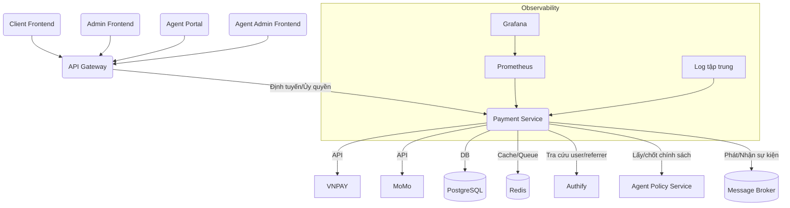

# ĐỀ BÀN DỰ ÁN: XÂY DỰNG HỆ THỐNG DỊCH VỤ THANH TOÁN ĐỘC LẬP (PAYMENT SERVICE) – PHIÊN BẢN CHUẨN HÓA TÍCH HỢP API GATEWAY VÀ CHÍNH SÁCH ĐẠI LÝ

**Tác giả:** Manus AI  
**Ngày:** 20 tháng 8 năm 2025

---

## Mục lục

1.  [Giới thiệu Dự án](#1-giới-thiệu-dự-án)
    1.1. [Bối cảnh và Động lực](#11-bối-cảnh-và-động-lực)  
    1.2. [Mục tiêu Dự án](#12-mục-tiêu-dự-án)  
    1.3. [Phạm vi Dự án](#13-phạm-vi-dự-án)
2.  [Yêu cầu Kỹ thuật và Công nghệ](#2-yêu-cầu-kỹ-thuật-và-công-nghệ)
    2.1. [Yêu cầu Chức năng](#21-yêu-cầu-chức-năng)  
    2.2. [Yêu cầu Phi chức năng](#22-yêu-cầu-phi-chức-năng)  
    2.3. [Công nghệ Sử dụng](#23-công-nghệ-sử-dụng)
3.  [Kiến trúc và Thiết kế Hệ thống](#3-kiến-trúc-và-thiết-kế-hệ-thống)
    3.1. [Tổng quan Kiến trúc](#31-tổng-quan-kiến-trúc)  
    3.2. [Thiết kế Backend (Payment Service)](#32-thiết-kế-backend-payment-service)
4.  [Hạ tầng và DevOps](#4-hạ-tầng-và-devops)
    4.1. [Môi trường Phát triển](#41-môi-trường-phát-triển)  
    4.2. [CI/CD Pipeline](#42-cicd-pipeline)  
    4.3. [Giám sát và Ghi log](#43-giám-sát-và-ghi-log)
5.  [Phát triển Backend (Payment Service)](#5-phát-triển-backend-payment-service)
    5.1. [Thiết kế Database](#51-thiết-kế-database)  
    5.2. [Phát triển API Xử lý Thanh toán và Hoa hồng](#52-phát-triển-api-xử-lý-thanh-toán-và-hoa-hồng)  
    5.3. [Xử lý Logic Giao dịch, Số dư và Hoa hồng](#53-xử-lý-logic-giao-dịch-số-dư-và-hoa-hồng)
6.  [Kiểm thử và Đảm bảo Chất lượng](#6-kiểm-thử-và-đảm-bảo-chất-lượng)
    6.1. [Unit Testing](#61-unit-testing)  
    6.2. [Integration Testing](#62-integration-testing)  
    6.3. [End-to-End Testing](#63-end-to-end-testing)
7.  [Triển khai và Vận hành](#7-triển-khai-và-vận-hành)
    7.1. [Triển khai Production](#71-triển-khai-production)  
    7.2. [Mở rộng và Khả năng sẵn sàng cao](#72-mở-rộng-và-khả-năng-sẵn-sàng-cao)  
    7.3. [Sao lưu và Phục hồi](#73-sao-lưu-và-phục-hồi)
8.  [Quản lý Dự án và Tài liệu hóa](#8-quản-lý-dự-án-và-tài-liệu-hóa)
    8.1. [Quản lý Phiên bản](#81-quản-lý-phiên-bản)  
    8.2. [Quản lý Vấn đề](#82-quản-lý-vấn-đề)  
    8.3. [Tài liệu Dự án](#83-tài-liệu-dự-án)

---

## 1. Giới thiệu Dự án

### 1.1. Bối cảnh và Động lực

Trong hệ sinh thái MathService, Payment Service đảm nhiệm vai trò huyết mạch về tài chính: xử lý giao dịch, quản lý số dư, và tính toán/chi trả hoa hồng đại lý. Nhu cầu hỗ trợ cả thanh toán tự động qua cổng thanh toán và quy trình chuyển khoản thủ công, cùng mô hình đại lý đa tầng, đòi hỏi một dịch vụ thanh toán độc lập, an toàn, có khả năng mở rộng và tích hợp chặt chẽ với các dịch vụ khác thông qua API Gateway chung.

### 1.2. Mục tiêu Dự án

Mục tiêu là phát triển một microservice backend độc lập mang tên "Payment Service" để quản lý toàn bộ vòng đời giao dịch và hoa hồng đại lý, đồng thời tích hợp nhất quán với API Gateway, Authify, Agent Policy Service và các dịch vụ khác.

- Xây dựng Backend Service mạnh mẽ: xử lý giao dịch, số dư, tích hợp cổng thanh toán, quy trình chuyển khoản thủ công, tính/chi trả hoa hồng.
- Cung cấp cơ chế thanh toán an toàn và linh hoạt, đáp ứng lưu lượng lớn.
- Minh bạch hóa lịch sử giao dịch, số dư và hoa hồng; hỗ trợ báo cáo cho đại lý và quản trị thông qua các ứng dụng frontend đi qua API Gateway.
- Đảm bảo khả năng mở rộng, vận hành ổn định với DevOps/CI-CD.

### 1.3. Phạm vi Dự án

- Backend Service (FastAPI, Python):
  - API cho vòng đời giao dịch tài chính và quản lý hoa hồng.  
  - Tích hợp cổng thanh toán (VNPAY, MoMo).  
  - Quản lý số dư; quy trình nạp/rút; xác nhận chuyển khoản thủ công.  
  - Lịch sử giao dịch; báo cáo hoa hồng cho đại lý; danh sách hoa hồng cần chi trả cho quản trị.  
  - Cung cấp API cho Agent Policy Service truy vấn/chốt chính sách hoa hồng.  
  - Tương tác với Authify để xác thực và tra cứu người giới thiệu.  
- Infrastructure & DevOps:  
  - Container hóa backend bằng Docker; môi trường dev bằng Docker Compose (service + PostgreSQL + Redis + Message Broker).  
  - CI/CD build–test–scan–push image–deploy.  
  - Giám sát và log tập trung.  

Lưu ý: Các ứng dụng giao diện (Client Frontend, Admin Frontend, Agent Portal, Agent Admin Frontend) được đặc tách trong tài liệu riêng và chỉ tương tác với Payment Service thông qua API Gateway chung.

---

## 2. Yêu cầu Kỹ thuật và Công nghệ

### 2.1. Yêu cầu Chức năng

- Quản lý Số dư Tài khoản: mỗi người dùng có số dư riêng; tự động cập nhật sau giao dịch thành công.
- Nạp tiền (Deposit):
  - Tích hợp cổng thanh toán: VNPAY, MoMo.  
  - Chuyển khoản Ngân hàng Thủ công: tạo yêu cầu, tải bằng chứng, quản trị xác nhận, cập nhật số dư.
- Rút tiền (Withdrawal): tạo yêu cầu, quản trị xác nhận và cập nhật trạng thái.
- Lịch sử Giao dịch: người dùng xem lịch sử; quản trị xem toàn hệ thống với lọc/phân trang.
- Quản lý Giao dịch (Admin): duyệt/từ chối, xác nhận nạp thủ công, xác nhận rút, điều chỉnh số dư (audit đầy đủ).
- Quản lý Hoa hồng Đại lý:
  - Định nghĩa/chốt chính sách hoa hồng (kết hợp Agent Policy Service).  
  - Ghi nhận người giới thiệu (qua Authify/claims).  
  - Tự động tính hoa hồng theo chính sách.  
  - Báo cáo hoa hồng cho đại lý; danh sách cần chi trả cho quản trị; ghi nhận lịch sử chi trả.  
  - Yêu cầu rút hoa hồng (tách biệt với rút số dư người dùng nếu cần).

Tất cả API được truy cập qua API Gateway; không tiếp nhận truy cập trực tiếp từ frontend.

### 2.2. Yêu cầu Phi chức năng

- Bảo mật: HTTPS, bảo vệ chống gian lận, toàn vẹn dữ liệu; RBAC dựa trên JWT do Authify phát hành và được API Gateway chuyển tiếp/kiểm tra; rate limiting tại API Gateway; audit đầy đủ mọi thao tác liên quan tiền/hoa hồng; khóa đồng bộ để tránh race condition khi cập nhật số dư/hoa hồng.
- Hiệu suất: SLA < 200ms cho API đồng bộ (không tính thời gian chờ cổng thanh toán); sử dụng hàng đợi/batch cho tác vụ nặng.
- Độ tin cậy: giao dịch idempotent; cơ chế retry/bù trừ; nhất quán cuối cùng qua sự kiện.
- Tương thích: API RESTful theo OpenAPI; versioning `/api/v1`; backward-compatible khi có thể.
- Đồng bộ và Nhất quán: dùng Message Broker (Kafka/RabbitMQ) để nhận sự kiện từ Authify (user-created, referrer-set) và phát sự kiện giao dịch/hoa hồng.
- Quan sát được: metrics Prometheus, log cấu trúc; trace phân tán (OpenTelemetry).

### 2.3. Công nghệ Sử dụng

- Backend: Python 3.11+, FastAPI, SQLAlchemy; httpx/requests; Pydantic; Celery/RQ (tùy chọn) cho job bất đồng bộ.
- Database: PostgreSQL; công cụ migration Alembic.  
- Cache/Queue: Redis (tùy chọn cho cache hoặc queue nhẹ).
- Message Broker: Kafka hoặc RabbitMQ.  
- DevOps: Docker, Docker Compose, GitHub Actions, Prometheus, Grafana, Loki/ELK; Sentry (tùy chọn).

---

## 3. Kiến trúc và Thiết kế Hệ thống

### 3.1. Tổng quan Kiến trúc

Payment Service là microservice độc lập, mọi request từ Client Frontend, Admin Frontend, Agent Portal, Agent Admin Frontend đều đi qua API Gateway. API Gateway chịu trách nhiệm xác thực/ủy quyền sơ bộ (JWT từ Authify), rate limiting, ghi log truy cập và định tuyến đến Payment Service. Payment Service tích hợp cổng thanh toán (VNPAY, MoMo), cơ sở dữ liệu, bộ đệm/queue, và giao tiếp với Authify, Agent Policy Service qua REST và với các dịch vụ khác qua Message Broker.

### 3.2. Thiết kế Backend (Payment Service)

Phân lớp: Routers (API) → Services (Business) → Repositories (Data Access). Áp dụng DTO/Schema (Pydantic), chuẩn hóa mã lỗi, idempotency key cho các API thao tác tiền.

- API cho người dùng:
  - `GET /api/v1/balance`: lấy số dư hiện tại.  
  - `GET /api/v1/transactions`: lịch sử giao dịch.  
  - `POST /api/v1/deposit/vnpay`, `POST /api/v1/deposit/momo`: khởi tạo nạp tiền qua cổng.  
  - `POST /api/v1/deposit/manual-transfer`: tạo yêu cầu nạp thủ công.  
  - `POST /api/v1/withdraw`: yêu cầu rút tiền.  
  - `GET /api/v1/commissions`: báo cáo hoa hồng của đại lý.  
  - `POST /api/v1/commissions/withdraw`: yêu cầu rút hoa hồng.  
- API cho quản trị:
  - `GET /api/v1/admin/transactions`: danh sách giao dịch (lọc/phân trang).  
  - `PUT /api/v1/admin/transactions/{id}/confirm-manual-deposit`: xác nhận nạp thủ công.  
  - `PUT /api/v1/admin/transactions/{id}/confirm-withdrawal`: xác nhận rút tiền.  
  - `POST /api/v1/admin/users/{user_id}/adjust-balance`: điều chỉnh số dư (audit).  
  - `GET /api/v1/admin/commissions`: danh sách hoa hồng cần chi trả.  
  - `PUT /api/v1/admin/commissions/{id}/pay`: xác nhận chi trả hoa hồng.  
  - `GET/POST/PUT/DELETE /api/v1/admin/commission-policies`: quản lý chính sách hoa hồng.  
- Webhooks/Callbacks (public qua API Gateway – cấu hình whitelist path):
  - `POST /api/v1/callback/vnpay`, `POST /api/v1/callback/momo`.

Ghi chú tích hợp:
- Xác thực: API Gateway chuyển tiếp JWT hợp lệ; Payment Service xác minh chữ ký (nếu cần) và kiểm tra quyền chi tiết dựa trên vai trò/claims từ Authify.  
- Tham chiếu người giới thiệu: từ claims JWT (referrer_id) hoặc truy vấn Authify khi thiếu.  
- Chính sách hoa hồng: lấy từ Agent Policy Service, cache ngắn hạn; ghi nhận version chính sách áp dụng cho mỗi giao dịch để tính đúng khi thay đổi chính sách.

---

## 4. Hạ tầng và DevOps

### 4.1. Môi trường Phát triển

- Docker Compose các dịch vụ: `payment`, `postgres`, `redis`, `broker` (kafka/rabbitmq), `prometheus`, `loki/elasticsearch` (tùy chọn).  
- Biến môi trường quản lý qua `.env`/config tập trung; secret qua hệ thống vault hoặc secret manager.

### 4.2. CI/CD Pipeline

- Lint/format (Flake8/Black/MyPy) → test (unit/integration) → build image → scan bảo mật → push → deploy.  
- Tự động migrate DB (Alembic) khi deploy; rollback an toàn.

### 4.3. Giám sát và Ghi log

- Metrics Prometheus (tỷ lệ thành công giao dịch, latency endpoint, thông số queue, lỗi cổng thanh toán).  
- Log cấu trúc (JSON) gửi về hệ thống tập trung; tracing phân tán (OpenTelemetry).

---

## 5. Phát triển Backend (Payment Service)

### 5.1. Thiết kế Database

Bảng tham khảo: `users_balance`, `transactions`, `manual_deposit_requests`, `withdraw_requests`, `commissions`, `commission_payouts`, `commission_policies`, `webhook_events`, `audit_logs`. Khóa ngoại tới `user_id` (nguồn Authify). Lưu `policy_version` tại thời điểm tính hoa hồng. Đảm bảo chỉ số (index) theo `user_id`, `status`, `created_at`.

### 5.2. Phát triển API Xử lý Thanh toán và Hoa hồng

- Chuẩn hóa schema yêu cầu/đáp ứng; idempotency key cho khởi tạo giao dịch.  
- Webhook validate chữ ký từ cổng; cơ chế retry và lưu sự kiện thô (`webhook_events`).

### 5.3. Xử lý Logic Giao dịch, Số dư và Hoa hồng

- Giao dịch cập nhật số dư theo trạng thái (chờ/xác nhận/thành công/thất bại/hủy).  
- Khóa hàng (SELECT ... FOR UPDATE) khi cập nhật số dư; transaction ACID.  
- Tính hoa hồng theo chính sách, phát sự kiện `commission_calculated`, `commission_paid`; lưu lịch sử chi trả.

---

## 6. Kiểm thử và Đảm bảo Chất lượng

- Unit: dịch vụ tính hoa hồng, repository, validator webhook.  
- Integration: luồng nạp/rút, callback cổng, tương tác Authify/Agent Policy Service.  
- E2E: qua API Gateway với JWT thật; kịch bản quản trị và đại lý.

---

## 7. Triển khai và Vận hành

- Triển khai container trên hạ tầng cloud/on-prem; cấu hình autoscaling theo hàng đợi và throughput.  
- Tách read/write DB nếu tải cao; partition theo thời gian cho bảng giao dịch lớn.  
- Sao lưu định kỳ và diễn tập phục hồi; theo dõi cảnh báo bất thường giao dịch.

---

## 8. Quản lý Dự án và Tài liệu hóa

- Quản lý phiên bản API (SemVer + OpenAPI).  
- Quản lý vấn đề/roadmap trên issue tracker.  
- Tài liệu tích hợp cho Frontend và dịch vụ khác: mô tả headers, sample request/response, mã lỗi.

