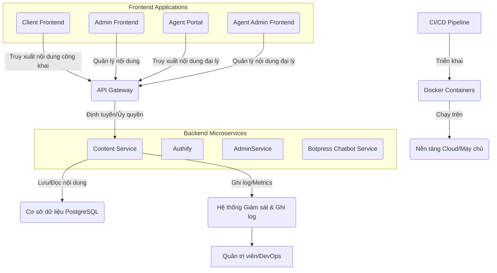

# ĐỀ BÀN DỰ ÁN: XÂY DỰNG HỆ THỐNG DỊCH VỤ NỘI DUNG (CONTENT SERVICE) ĐỘC LẬP

**Tác giả:** Manus AI

**Ngày:** 19 tháng 8 năm 2025

---

## Mục lục

1.  [Giới thiệu Dự án](#1-giới-thiệu-dự-án)
    1.1. [Bối cảnh và Động lực](#11-bối-cảnh-và-động-lực)
    1.2. [Mục tiêu Dự án](#12-mục-tiêu-dự-án)
    1.3. [Phạm vi Dự án](#13-phạm-vi-dự-án)

2.  [Yêu cầu Kỹ thuật và Công nghệ](#2-yêu-cầu-kỹ-thuật-và-công-nghệ)
    2.1. [Yêu cầu Chức năng](#21-yêu-cầu-chức-năng)
    2.2. [Yêu cầu Phi chức năng](#22-yêu-cầu-phi-chức-năng)
    2.3. [Công nghệ Sử dụng](#23-công-nghệ-sử-dụng)

3.  [Kiến trúc và Thiết kế Hệ thống](#3-kiến-trúc-và-thiết-kế-hệ-thống)
    3.1. [Tổng quan Kiến trúc](#31-tổng-quan-kiến-trúc)
    3.2. [Thiết kế Backend (Content Service)](#32-thiết-kế-backend-content-service)

4.  [Hạ tầng và DevOps](#4-hạ-tầng-và-devops)
    4.1. [Môi trường Phát triển](#41-môi-trường-phát-triển)
    4.2. [CI/CD Pipeline](#42-cicd-pipeline)
    4.3. [Giám sát và Ghi log](#43-giám-sát-và-ghi-log)

5.  [Phát triển Backend (Content Service)](#5-phát-triển-backend-content-service)
    5.1. [Thiết kế Database](#51-thiết-kế-database)
    5.2. [Phát triển API Quản lý Nội dung](#52-phát-triển-api-quản-lý-nội-dung)

6.  [Kiểm thử và Đảm bảo Chất lượng](#6-kiểm-thử-và-đảm-bảo-chất-lượng)
    6.1. [Unit Testing](#61-unit-testing)
    6.2. [Integration Testing](#62-integration-testing)
    6.3. [End-to-End Testing](#63-end-to-end-testing)

7.  [Triển khai và Vận hành](#7-triển-khai-và-vận-hành)
    7.1. [Triển khai Production](#71-triển-khai-production)
    7.2. [Mở rộng và Khả năng sẵn sàng cao](#72-mở-rộng-và-khả-năng-sẵn-sàng-cao)
    7.3. [Sao lưu và Phục hồi](#73-sao-lưu-và-phục-hồi)

8.  [Quản lý Dự án và Tài liệu hóa](#8-quản-lý-dự-án-và-tài-liệu-hóa)
    8.1. [Quản lý Phiên bản](#81-quản-lý-phiên-bản)
    8.2. [Quản lý Vấn đề](#82-quản-lý-vấn-đề)
    8.3. [Tài liệu Dự án](#83-tài-liệu-dự-án)

---

## 1. Giới thiệu Dự án

### 1.1. Bối cảnh và Động lực

Trong bất kỳ hệ thống web phức tạp nào, việc quản lý các nội dung tĩnh như trang giới thiệu (About Us), câu hỏi thường gặp (FAQ), chính sách bảo mật (Privacy Policy), điều khoản dịch vụ (Terms of Service) hay các bài viết blog là vô cùng quan trọng. Các nội dung này thường xuyên cần được cập nhật, chỉnh sửa, và đặc biệt là hỗ trợ đa ngôn ngữ để phục vụ người dùng toàn cầu. Việc quản lý thủ công các nội dung này trong mã nguồn hoặc thông qua các file tĩnh sẽ trở nên cồng kềnh, khó bảo trì và không linh hoạt khi hệ thống phát triển.

Động lực chính của dự án này là xây dựng một **Hệ thống Dịch vụ Nội dung (Content Service) độc lập**. Dịch vụ này sẽ chuyên biệt hóa việc lưu trữ, quản lý và phân phối các nội dung tĩnh của website một cách tập trung và hiệu quả. Bằng cách tách biệt phần quản lý nội dung ra thành một microservice riêng, chúng ta có thể đảm bảo tính linh hoạt, khả năng mở rộng và dễ dàng bảo trì cho toàn bộ hệ thống. Dịch vụ này sẽ cung cấp các API cho phép các ứng dụng frontend (Client Frontend, Admin Panel) dễ dàng truy xuất và hiển thị nội dung, đồng thời hỗ trợ đa ngôn ngữ để đáp ứng nhu cầu của người dùng từ nhiều quốc gia khác nhau.

### 1.2. Mục tiêu Dự án

Mục tiêu tổng thể của dự án "Hệ thống Dịch vụ Nội dung độc lập" là phát triển một backend service mạnh mẽ và một giao diện quản trị (Admin Panel) thân thiện để quản lý mọi nội dung tĩnh của website. Các mục tiêu cụ thể bao gồm:

*   **Tập trung hóa quản lý nội dung:** Xây dựng một hệ thống tập trung để lưu trữ và quản lý tất cả các nội dung tĩnh của website, bao gồm trang giới thiệu, FAQ, chính sách, v.v.
*   **Hỗ trợ đa ngôn ngữ:** Cho phép quản lý và hiển thị nội dung bằng nhiều ngôn ngữ khác nhau, giúp hệ thống phục vụ người dùng toàn cầu.
*   **Cung cấp API linh hoạt:** Phát triển các API RESTful cho phép các ứng dụng frontend dễ dàng truy xuất nội dung theo ID, slug hoặc loại nội dung.
*   **Xây dựng giao diện quản trị thân thiện:** Phát triển một Admin Panel trực quan, dễ sử dụng để quản trị viên có thể thêm, sửa, xóa, xuất bản và quản lý phiên bản của các nội dung.
*   **Đảm bảo khả năng mở rộng và bảo trì:** Áp dụng kiến trúc microservice, container hóa và quy trình DevOps để đảm bảo hệ thống có thể mở rộng khi số lượng nội dung tăng lên và dễ dàng bảo trì.
*   **Đảm bảo an toàn và bảo mật:** Áp dụng các biện pháp bảo mật cần thiết cho API và dữ liệu, bao gồm xác thực, mã hóa và kiểm soát truy cập.

### 1.3. Phạm vi Dự án

Dự án "Hệ thống Dịch vụ Nội dung độc lập" sẽ tập trung vào việc phát triển các thành phần cốt lõi sau:

*   **Backend Service (Content Service):**
    *   API để quản lý các loại nội dung (ví dụ: `page`, `faq`, `policy`, `blog_post`).
    *   API để quản lý các mục nội dung cụ thể (ví dụ: trang "About Us", câu hỏi "Làm sao để đăng ký?").
    *   Hỗ trợ đa ngôn ngữ cho mỗi mục nội dung.
    *   Hỗ trợ quản lý phiên bản nội dung (lịch sử chỉnh sửa).
    *   API để truy xuất nội dung cho Client Frontend (công khai) thông qua API Gateway.
    *   API quản trị để thêm, sửa, xóa, xuất bản nội dung (yêu cầu xác thực Admin) thông qua API Gateway.

*   **Infrastructure & DevOps:**
    *   Container hóa backend service bằng Docker.
    *   Thiết lập môi trường phát triển cục bộ bằng Docker Compose.
    *   Xây dựng quy trình CI/CD cơ bản (ví dụ: GitHub Actions) cho việc kiểm thử và đóng gói ứng dụng.
    *   Thiết lập giám sát (Prometheus, Grafana) và ghi log tập trung cho service.

**Các tính năng nằm ngoài phạm vi của dự án này (nhưng có thể là các giai đoạn phát triển tiếp theo):**

*   Hệ thống quản lý tài sản (Asset Management) cho hình ảnh/video.
*   Tích hợp SEO nâng cao.
*   Hệ thống bình luận hoặc tương tác người dùng trên nội dung.
*   Tìm kiếm nội dung toàn văn (Full-text search).

## 2. Yêu cầu Kỹ thuật và Công nghệ

### 2.1. Yêu cầu Chức năng

Các yêu cầu chức năng mô tả những gì hệ thống phải làm để đáp ứng mục tiêu của dự án:

*   **Quản lý Loại Nội dung:**
    *   Cho phép tạo, đọc, cập nhật, xóa (CRUD) các loại nội dung (ví dụ: `page`, `faq`, `policy`, `blog_post`).
*   **Quản lý Mục Nội dung:**
    *   Cho phép CRUD các mục nội dung cụ thể (ví dụ: trang "About Us", câu hỏi "Làm sao để đăng ký?").
    *   Mỗi mục nội dung phải có `slug` (đường dẫn thân thiện), `title`, `content` (nội dung chính).
    *   Hỗ trợ trạng thái `draft` (bản nháp) và `published` (đã xuất bản).
*   **Hỗ trợ Đa ngôn ngữ:**
    *   Mỗi mục nội dung phải có thể được dịch sang nhiều ngôn ngữ khác nhau.
    *   API phải cho phép truy xuất nội dung theo ngôn ngữ yêu cầu (ví dụ: `GET /content/about-us?lang=en`).
*   **Quản lý Phiên bản Nội dung:**
    *   Tự động lưu lại lịch sử các lần chỉnh sửa nội dung.
    *   Cho phép xem lại các phiên bản cũ và khôi phục về một phiên bản cụ thể.
*   **API Truy xuất Nội dung (Public):**
    *   Cung cấp API công khai để Client Frontend có thể lấy nội dung theo `slug` và `language`.
    *   Chỉ trả về nội dung đã được `published`.
*   **API Quản trị Nội dung (Admin):**
    *   Cung cấp API được bảo vệ để Admin Panel có thể thực hiện CRUD trên tất cả nội dung và loại nội dung.
    *   API này yêu cầu xác thực quản trị viên (từ Authify).

### 2.2. Yêu cầu Phi chức năng

Các yêu cầu phi chức năng mô tả cách hệ thống hoạt động, bao gồm các khía cạnh về chất lượng, hiệu suất, bảo mật, và khả năng bảo trì:

*   **Hiệu suất:**
    *   Thời gian phản hồi của API truy xuất nội dung phải dưới 50ms.
    *   Admin Panel phải tải trang và hiển thị nội dung nhanh chóng.
*   **Khả năng mở rộng:**
    *   Hệ thống backend phải được thiết kế để có thể mở rộng theo chiều ngang (horizontal scaling) khi số lượng yêu cầu tăng lên.
    *   Kiến trúc microservice độc lập cho phép dễ dàng thêm các loại nội dung mới hoặc tích hợp với các hệ thống khác.
*   **Bảo mật:**
    *   Tất cả các giao tiếp giữa frontend và backend phải được mã hóa bằng HTTPS/SSL.
    *   API quản trị phải được bảo vệ bằng cơ chế xác thực (JWT từ Authify) và phân quyền phù hợp (chỉ admin mới có quyền chỉnh sửa).
    *   Hệ thống phải có khả năng chống lại các cuộc tấn công phổ biến như SQL Injection, XSS, CSRF.
*   **Khả năng sử dụng (Usability):**
    *   Giao diện Admin Panel phải trực quan, dễ hiểu và dễ thao tác cho quản trị viên.
    *   Trình soạn thảo văn bản phong phú phải dễ sử dụng.
*   **Khả năng bảo trì:**
    *   Mã nguồn phải sạch, dễ đọc, tuân thủ các tiêu chuẩn mã hóa và có tài liệu hóa đầy đủ.
    *   Hệ thống phải dễ dàng triển khai, cấu hình và cập nhật.
*   **Khả năng chịu lỗi (Fault Tolerance):**
    *   Hệ thống phải có khả năng xử lý các lỗi đầu vào không hợp lệ một cách gracefully, trả về thông báo lỗi phù hợp.
*   **Khả năng tương thích:**
    *   Admin Panel phải hoạt động tốt trên các trình duyệt web phổ biến (Chrome, Firefox, Edge, Safari).

### 2.3. Công nghệ Sử dụng

Để xây dựng hệ thống Dịch vụ Nội dung độc lập, các công nghệ sau đây được đề xuất:

*   **Backend (Content Service):**
    *   **Ngôn ngữ lập trình:** Python 3.11+
    *   **Framework:** FastAPI (để xây dựng API RESTful hiệu quả và có tài liệu OpenAPI tự động).
    *   **ORM/Database Driver:** SQLAlchemy (để tương tác với PostgreSQL).
    *   **Xác thực:** Tích hợp với Authify (User Service) để xác thực JWT cho các API quản trị.

*   **Database:**
    *   **Cơ sở dữ liệu quan hệ:** PostgreSQL (để lưu trữ nội dung, phiên bản nội dung và các loại nội dung).
*   **DevOps & Hạ tầng:**
    *   **Containerization:** Docker (để đóng gói ứng dụng và môi trường).
    *   **Môi trường phát triển cục bộ:** Docker Compose (để chạy backend và frontend cùng lúc).
    *   **CI/CD:** GitHub Actions (để tự động hóa kiểm thử và triển khai).
    *   **Giám sát:** Prometheus (thu thập metrics), Grafana (tạo dashboard trực quan).
    *   **Ghi log tập trung:** ELK Stack (Elasticsearch, Logstash, Kibana) hoặc Loki/Grafana (cho log).
*   **Công cụ chất lượng mã nguồn:**
    *   Black (code formatter).
    *   Flake8 (linter).
    *   MyPy (type checker).
    *   Pre-commit hooks (tự động chạy các công cụ trên trước khi commit).

## 3. Kiến trúc và Thiết kế Hệ thống

### 3.1. Tổng quan Kiến trúc

Hệ thống Dịch vụ Nội dung độc lập sẽ được thiết kế theo kiến trúc microservice, bao gồm một backend service chuyên biệt (Content Service). Client Frontend (ứng dụng chính cho người dùng cuối) và Admin Service (dịch vụ quản trị tổng hợp) sẽ truy xuất nội dung từ Content Service thông qua API Gateway chung của hệ thống. Sơ đồ kiến trúc tổng quan như sau:

**Mô tả các thành phần chính:**

*   **Client Frontend:** Là ứng dụng web/mobile chính mà người dùng cuối tương tác. Nó sẽ gọi các API công khai của Content Service thông qua API Gateway để hiển thị các trang như About Us, FAQ, Policies.
*   **Admin Frontend:** Giao diện quản trị chính cho quản trị viên hệ thống, cho phép quản lý toàn bộ nội dung và cấu hình hệ thống.
*   **Agent Portal:** Giao diện dành cho đại lý, cho phép truy cập và xem các nội dung liên quan đến hoạt động đại lý.
*   **Agent Admin Frontend:** Giao diện quản trị dành cho quản lý đại lý, cho phép quản lý nội dung và thông tin liên quan đến đại lý.
*   **Admin Service:** Là dịch vụ quản trị tổng hợp, sẽ gọi các API quản trị của Content Service thông qua API Gateway để thêm, sửa, xóa, xuất bản nội dung. Admin Service sẽ chịu trách nhiệm xác thực quản trị viên thông qua Authify.
*   **API Gateway:** Điểm truy cập duy nhất cho các yêu cầu từ các ứng dụng Frontend và Admin Service đến Content Service. Chịu trách nhiệm xác thực, ủy quyền sơ bộ, rate limiting và định tuyến yêu cầu.
*   **Content Service (Backend):** Là trái tim của hệ thống, được xây dựng bằng FastAPI/Python. Dịch vụ này chứa logic quản lý nội dung, hỗ trợ đa ngôn ngữ, quản lý phiên bản và tương tác với cơ sở dữ liệu PostgreSQL. Nó cung cấp cả API công khai và API quản trị (yêu cầu xác thực).
*   **Botpress Chatbot Service:** Dịch vụ chatbot thông minh sử dụng Botpress, cung cấp khả năng tương tác tự động với người dùng và hỗ trợ khách hàng.
*   **Authify (User Service):** Dịch vụ quản lý người dùng, chịu trách nhiệm xác thực (đăng ký, đăng nhập, JWT) và cung cấp thông tin người dùng cơ bản. Đối với Admin Service, Authify sẽ xác thực vai trò `ADMIN`.
*   **Cơ sở dữ liệu PostgreSQL:** Là nơi lưu trữ dữ liệu bền vững cho hệ thống, bao gồm các loại nội dung, các mục nội dung, và lịch sử phiên bản nội dung.
*   **Hệ thống Giám sát & Ghi log:** Bao gồm Prometheus để thu thập metrics từ Content Service và Grafana để trực quan hóa các metrics này. Hệ thống ghi log tập trung sẽ thu thập log từ service để hỗ trợ debug và phân tích.
*   **Docker Containers:** Backend service sẽ được đóng gói thành các Docker image, đảm bảo môi trường chạy nhất quán từ phát triển đến sản xuất.
*   **CI/CD Pipeline:** Sử dụng GitHub Actions để tự động hóa quá trình kiểm thử, build Docker image và triển khai ứng dụng.

### 3.2. Thiết kế Backend (Content Service)

Content Service sẽ là một ứng dụng FastAPI, tuân thủ các nguyên tắc thiết kế API RESTful. Cấu trúc dịch vụ sẽ bao gồm các lớp chính:

*   **API Layer (Controllers/Routers):** Chứa các endpoint API, xử lý request, validate input và gọi đến Business Logic Layer.
*   **Business Logic Layer (Services):** Chứa logic nghiệp vụ chính, bao gồm quản lý nội dung, xử lý đa ngôn ngữ, quản lý phiên bản.
*   **Data Access Layer (Repositories):** Chứa logic tương tác với cơ sở dữ liệu (CRUD operations).

**Các API Endpoints chính:**

*   **Public APIs (dành cho Client Frontend):**
    *   `GET /api/v1/content/types`: Lấy danh sách các loại nội dung công khai.
    *   `GET /api/v1/content/{slug}?lang={lang_code}`: Lấy nội dung chi tiết theo slug và ngôn ngữ. Chỉ trả về nội dung đã `published`.
*   **Admin APIs (dành cho Admin Panel, yêu cầu xác thực Admin):**
    *   `GET /api/v1/admin/content/types`: Lấy danh sách tất cả các loại nội dung (bao gồm cả loại nháp).
    *   `POST /api/v1/admin/content/types`: Tạo loại nội dung mới.
    *   `PUT /api/v1/admin/content/types/{type_id}`: Cập nhật loại nội dung.
    *   `DELETE /api/v1/admin/content/types/{type_id}`: Xóa loại nội dung.
    *   `GET /api/v1/admin/content/items`: Lấy danh sách tất cả các mục nội dung.
    *   `POST /api/v1/admin/content/items`: Tạo mục nội dung mới.
    *   `GET /api/v1/admin/content/items/{item_id}`: Lấy chi tiết mục nội dung.
    *   `PUT /api/v1/admin/content/items/{item_id}`: Cập nhật mục nội dung (tự động tạo phiên bản mới).
    *   `DELETE /api/v1/admin/content/items/{item_id}`: Xóa mục nội dung.
    *   `POST /api/v1/admin/content/items/{item_id}/publish`: Xuất bản nội dung.
    *   `GET /api/v1/admin/content/items/{item_id}/versions`: Lấy lịch sử phiên bản của nội dung.
    *   `POST /api/v1/admin/content/items/{item_id}/versions/{version_id}/restore`: Khôi phục về phiên bản cũ.

**Luồng xử lý yêu cầu (ví dụ: `PUT /api/v1/admin/content/items/{item_id}`):**

1.  **Nhận yêu cầu:** Content Service nhận yêu cầu cập nhật nội dung từ Admin Panel, kèm theo JWT trong header `Authorization`.
2.  **Xác thực và Phân quyền:**
    *   Service gọi API của Authify để xác thực JWT và kiểm tra xem người dùng có vai trò `ADMIN` hay không.
    *   Nếu không hợp lệ hoặc không có quyền, trả về lỗi `401 Unauthorized` hoặc `403 Forbidden`.
3.  **Lưu phiên bản cũ:** Trước khi cập nhật, Service sẽ lưu một bản sao của nội dung hiện tại vào bảng lịch sử phiên bản.
4.  **Cập nhật nội dung:** Cập nhật nội dung mới vào bảng chính.
5.  **Trả về kết quả:** Trả về nội dung đã cập nhật cho Admin Panel.

### 3.3. Thiết kế Frontend (Admin Panel)

Admin Panel sẽ là một ứng dụng Next.js/React độc lập, tập trung vào việc cung cấp giao diện quản trị nội dung. Cấu trúc theo component-based: Pages, Components, Layouts, Hooks, API services.

*   **Luồng người dùng:**
    *   **Trang đăng nhập:** Quản trị viên đăng nhập thông qua Authify.
    *   **Dashboard:** Tổng quan về nội dung.
    *   **Quản lý Loại Nội dung:** Danh sách, thêm, sửa, xóa loại.
    *   **Quản lý Mục Nội dung:** Danh sách, thêm, sửa, xóa mục.
        *   Giao diện nhập liệu với Rich Text Editor.
        *   Chọn ngôn ngữ cho nội dung.
        *   Chức năng xuất bản/bỏ xuất bản.
        *   Chức năng xem trước nội dung.
        *   Chức năng quản lý phiên bản (xem lịch sử, khôi phục).

---

## 4. Hạ tầng và DevOps

### 4.1. Môi trường Phát triển

*   **Docker:** Backend và frontend sẽ được đóng gói thành Docker image.
*   **Docker Compose:** Sử dụng file `docker-compose.yml` để định nghĩa và khởi chạy toàn bộ môi trường phát triển cục bộ (backend, frontend, database) bằng một lệnh duy nhất.

### 4.2. CI/CD Pipeline

*   **Nền tảng:** GitHub Actions.
*   **Quy trình:** Tự động kích hoạt khi có push code hoặc tạo Pull Request.
    1.  **Build:** Cài đặt dependencies, chạy linter, format code.
    2.  **Test:** Chạy Unit Test, Integration Test.
    3.  **Build Image:** Build Docker image cho backend và frontend.
    4.  **Push Image:** Đẩy image lên Docker Registry.
    5.  **Deploy:** Tự động triển khai lên môi trường Staging. Triển khai lên Production có thể cần phê duyệt thủ công.

### 4.3. Giám sát và Ghi log

*   **Prometheus:** Thu thập các metrics về hiệu suất từ backend service (thời gian phản hồi, số lượng request, tỷ lệ lỗi).
*   **Grafana:** Trực quan hóa các metrics từ Prometheus qua các dashboard.
*   **Ghi log tập trung:** Sử dụng ELK Stack hoặc Loki để thu thập, lưu trữ và truy vấn log từ các container, hỗ trợ việc debug và phân tích sự cố.

---

## 5. Phát triển Backend (Content Service)

### 5.1. Thiết kế Database

Sử dụng PostgreSQL. Dưới đây là thiết kế cơ bản cho các bảng:

*   **Bảng `content_types`:** (Lưu các loại nội dung)
    | Tên cột | Kiểu dữ liệu | Ràng buộc | Mô tả |
    | :--- | :--- | :--- | :--- |
    | `id` | UUID | PRIMARY KEY | ID duy nhất của loại nội dung |
    | `name` | VARCHAR(255) | NOT NULL, UNIQUE | Tên loại (ví dụ: "Page", "FAQ", "Policy") |
    | `description` | TEXT | | Mô tả loại nội dung |
    | `created_at` | TIMESTAMP | NOT NULL | Thời gian tạo |
    | `updated_at` | TIMESTAMP | NOT NULL | Thời gian cập nhật cuối cùng |

*   **Bảng `content_items`:** (Lưu các mục nội dung)
    | Tên cột | Kiểu dữ liệu | Ràng buộc | Mô tả |
    | :--- | :--- | :--- | :--- |
    | `id` | UUID | PRIMARY KEY | ID duy nhất của mục nội dung |
    | `content_type_id` | UUID | NOT NULL, FOREIGN KEY | Tham chiếu đến loại nội dung |
    | `slug` | VARCHAR(255) | NOT NULL, UNIQUE | Đường dẫn thân thiện (ví dụ: "about-us", "privacy-policy") |
    | `status` | VARCHAR(50) | NOT NULL | Trạng thái (draft, published) |
    | `created_at` | TIMESTAMP | NOT NULL | Thời gian tạo |
    | `updated_at` | TIMESTAMP | NOT NULL | Thời gian cập nhật cuối cùng |

*   **Bảng `content_translations`:** (Lưu nội dung đa ngôn ngữ)
    | Tên cột | Kiểu dữ liệu | Ràng buộc | Mô tả |
    | :--- | :--- | :--- | :--- |
    | `id` | UUID | PRIMARY KEY | ID duy nhất của bản dịch |
    | `content_item_id` | UUID | NOT NULL, FOREIGN KEY | Tham chiếu đến mục nội dung |
    | `language_code` | VARCHAR(10) | NOT NULL | Mã ngôn ngữ (ví dụ: "en", "vi") |
    | `title` | VARCHAR(500) | NOT NULL | Tiêu đề nội dung |
    | `content` | TEXT | NOT NULL | Nội dung chính (HTML/Markdown) |
    | `created_at` | TIMESTAMP | NOT NULL | Thời gian tạo bản dịch |
    | `updated_at` | TIMESTAMP | NOT NULL | Thời gian cập nhật cuối cùng |
    | `UNIQUE(content_item_id, language_code)` | | | Đảm bảo mỗi mục nội dung chỉ có một bản dịch cho mỗi ngôn ngữ |

*   **Bảng `content_versions`:** (Lưu lịch sử phiên bản nội dung)
    | Tên cột | Kiểu dữ liệu | Ràng buộc | Mô tả |
    | :--- | :--- | :--- | :--- |
    | `id` | UUID | PRIMARY KEY | ID duy nhất của phiên bản |
    | `content_translation_id` | UUID | NOT NULL, FOREIGN KEY | Tham chiếu đến bản dịch nội dung |
    | `version_data` | JSONB | NOT NULL | Dữ liệu phiên bản (title, content, v.v.) |
    | `changed_at` | TIMESTAMP | NOT NULL | Thời gian thay đổi |
    | `changed_by` | UUID | | ID người dùng thực hiện thay đổi (từ Authify) |

### 5.2. Phát triển API Quản lý Nội dung

*   Triển khai các API endpoint đã được thiết kế trong mục 3.2 bằng FastAPI.
*   Sử dụng Pydantic để validate dữ liệu đầu vào và định dạng dữ liệu đầu ra.
*   Tổ chức code theo cấu trúc module rõ ràng (ví dụ: `routers`, `services`, `crud`, `schemas`).
*   Đảm bảo các API quản trị yêu cầu xác thực và phân quyền (chỉ quản trị viên mới có quyền).

---

## 7. Kiểm thử và Đảm bảo Chất lượng

### 7.1. Unit Testing

*   Viết Unit Test cho các hàm xử lý logic trong Business Logic Layer của backend và các component/hook của frontend.

### 7.2. Integration Testing

*   Viết Integration Test để kiểm tra sự tương tác giữa backend và database, cũng như giữa frontend và backend trong môi trường Docker Compose.

### 7.3. End-to-End Testing

*   Thực hiện End-to-End Testing từ Admin Panel đến các dịch vụ backend để đảm bảo toàn bộ luồng quản lý nội dung hoạt động chính xác.

---

## 8. Triển khai và Vận hành

### 8.1. Triển khai Production

*   Sử dụng Kubernetes hoặc một dịch vụ PaaS để triển khai Docker container cho cả backend và frontend.
*   Thiết lập cấu hình môi trường production (biến môi trường, kết nối database, khóa API).

### 8.2. Mở rộng và Khả năng sẵn sàng cao

*   Thiết kế backend và frontend để có thể mở rộng theo chiều ngang (horizontal scaling).
*   Sử dụng database cluster (ví dụ: PostgreSQL replication) để đảm bảo khả năng sẵn sàng cao và chịu lỗi.

### 8.3. Sao lưu và Phục hồi

*   Thiết lập lịch trình sao lưu tự động cho cơ sở dữ liệu.
*   Xây dựng quy trình phục hồi dữ liệu từ bản sao lưu trong trường hợp có sự cố.

---

## 9. Quản lý Dự án và Tài liệu hóa

### 9.1. Quản lý Phiên bản

*   Sử dụng Git để quản lý mã nguồn.
*   Tuân thủ quy tắc đặt tên nhánh và commit message.

### 9.2. Quản lý Vấn đề

*   Sử dụng một công cụ quản lý dự án (ví dụ: Jira, Trello) để theo dõi các tác vụ, lỗi và tính năng.

### 9.3. Tài liệu Dự án

*   Tài liệu hóa chi tiết kiến trúc, thiết kế, API (sử dụng OpenAPI/Swagger), và hướng dẫn triển khai.
*   Tài liệu hóa chi tiết các loại nội dung, cấu trúc dữ liệu và luồng quản lý nội dung.

