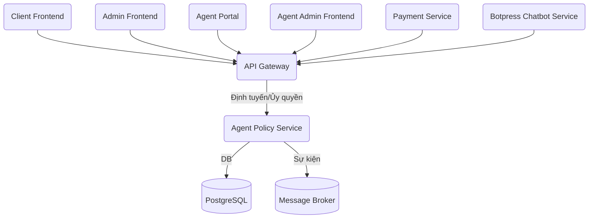

# ĐỀ BÀN DỰ ÁN: XÂY DỰNG HỆ THỐNG DỊCH VỤ CHÍNH SÁCH ĐẠI LÝ (AGENT POLICY SERVICE) – PHIÊN BẢN CHUẨN HÓA

**Tác giả:** Manus AI  
**Ngày:** 20 tháng 8 năm 2025

---

## Mục lục

1.  [Giới thiệu Dự án](#1-giới-thiệu-dự-án)
    1.1. [Bối cảnh và Động lực](#11-bối-cảnh-và-động-lực)  
    1.2. [Mục tiêu Dự án](#12-mục-tiêu-dự-án)  
    1.3. [Phạm vi Dự án](#13-phạm-vi-dự-án)
2.  [Yêu cầu Kỹ thuật và Công nghệ](#2-yêu-cầu-kỹ-thuật-và-công-nghệ)
    2.1. [Yêu cầu Chức năng](#21-yêu-cầu-chức-năng)  
    2.2. [Yêu cầu Phi chức năng](#22-yêu-cầu-phi-chức-năng)  
    2.3. [Công nghệ Sử dụng](#23-công-nghệ-sử-dụng)
3.  [Kiến trúc và Thiết kế Hệ thống](#3-kiến-trúc-và-thiết-kế-hệ-thống)
    3.1. [Tổng quan Kiến trúc](#31-tổng-quan-kiến-trúc)  
    3.2. [Thiết kế Backend (Agent Policy Service)](#32-thiết-kế-backend-agent-policy-service)
4.  [Hạ tầng và DevOps](#4-hạ-tầng-và-devops)
    4.1. [Môi trường Phát triển](#41-môi-trường-phát-triển)  
    4.2. [CI/CD Pipeline](#42-cicd-pipeline)  
    4.3. [Giám sát và Ghi log](#43-giám-sát-và-ghi-log)
5.  [Phát triển Backend (Agent Policy Service)](#5-phát-triển-backend-agent-policy-service)
    5.1. [Thiết kế Database](#51-thiết-kế-database)  
    5.2. [Phát triển API Quản lý Chính sách](#52-phát-triển-api-quản-lý-chính-sách)  
    5.3. [Xử lý Logic Chính sách và Tích hợp](#53-xử-lý-logic-chính-sách-và-tích-hợp)
6.  [Kiểm thử và Đảm bảo Chất lượng](#6-kiểm-thử-và-đảm-bảo-chất-lượng)
    6.1. [Unit Testing](#61-unit-testing)  
    6.2. [Integration Testing](#62-integration-testing)  
    6.3. [End-to-End Testing](#63-end-to-end-testing)
7.  [Triển khai và Vận hành](#7-triển-khai-và-vận-hành)
    7.1. [Triển khai Production](#71-triển-khai-production)  
    7.2. [Mở rộng và Khả năng sẵn sàng cao](#72-mở-rộng-và-khả-năng-sẵn-sàng-cao)  
    7.3. [Sao lưu và Phục hồi](#73-sao-lưu-và-phục-hồi)
8.  [Quản lý Dự án và Tài liệu hóa](#8-quản-lý-dự-án-và-tài-liệu-hóa)
    8.1. [Quản lý Phiên bản](#81-quản-lý-phiên-bản)  
    8.2. [Quản lý Vấn đề](#82-quản-lý-vấn-đề)  
    8.3. [Tài liệu Dự án](#83-tài-liệu-dự-án)

---

## 1. Giới thiệu Dự án

### 1.1. Bối cảnh và Động lực

Trong hệ sinh thái microservice, Agent Policy Service là dịch vụ chuyên biệt, tập trung quản lý các chính sách hoa hồng cho đại lý. Việc tách biệt logic này giúp đảm bảo tính nhất quán, minh bạch và dễ bảo trì khi các quy tắc kinh doanh thay đổi, đồng thời cho phép các dịch vụ khác như Payment Service truy vấn và áp dụng chính sách một cách đồng bộ thông qua API Gateway.

### 1.2. Mục tiêu Dự án

Mục tiêu là phát triển một microservice backend độc lập "Agent Policy Service" để:
-   Xử lý toàn bộ logic định nghĩa, lưu trữ, truy vấn và quản lý phiên bản các chính sách hoa hồng.
-   Cung cấp API RESTful an toàn, hiệu suất cao cho các dịch vụ khác (Payment Service, Admin Service) truy vấn thông qua API Gateway.
-   Hỗ trợ đa dạng các loại chính sách (phần trăm, cố định, theo cấp bậc) và các điều kiện áp dụng linh hoạt.
-   Đảm bảo khả năng mở rộng, vận hành ổn định với DevOps/CI-CD.

### 1.3. Phạm vi Dự án

-   **Backend Service (FastAPI, Python):**
    -   API RESTful cho quản lý (CRUD) và truy vấn chính sách hoa hồng.
    -   Logic xác định chính sách phù hợp dựa trên các tiêu chí đầu vào.
    -   Tích hợp Message Broker để phát sự kiện khi chính sách thay đổi.
-   **Infrastructure & DevOps:**
    -   Container hóa backend bằng Docker.
    -   Môi trường phát triển cục bộ với Docker Compose.
    -   CI/CD tự động hóa kiểm thử và triển khai cho backend.
    -   Giám sát và ghi log tập trung.

Lưu ý: Giao diện quản lý chính sách được đặt trong Admin Frontend và Agent Admin Frontend (tài liệu riêng) và tương tác với Agent Policy Service qua API Gateway. Client Frontend và Agent Portal cũng có thể truy cập một số thông tin chính sách thông qua API Gateway.

---

## 2. Yêu cầu Kỹ thuật và Công nghệ

### 2.1. Yêu cầu Chức năng

-   **Quản lý Chính sách:** CRUD, kích hoạt/vô hiệu hóa, tìm kiếm/lọc chính sách.
-   **Truy vấn Chính sách:** Cung cấp API cho các dịch vụ khác truy vấn chính sách phù hợp dựa trên các tham số (ví dụ: `transaction_amount`, `user_id`, `transaction_type`).
-   **Lịch sử Chính sách:** Lưu trữ lịch sử thay đổi của các chính sách để kiểm toán.

### 2.2. Yêu cầu Phi chức năng

-   **Bảo mật:** Giao tiếp qua HTTPS. Ủy quyền qua JWT từ Authify, được API Gateway kiểm tra và chuyển tiếp. Ghi log đầy đủ các thay đổi.
-   **Hiệu suất:** API truy vấn chính sách phải phản hồi nhanh (< 100ms).
-   **Độ tin cậy:** Đảm bảo tính toàn vẹn và nhất quán của dữ liệu chính sách.
-   **Khả năng mở rộng:** Xử lý số lượng lớn chính sách và yêu cầu truy vấn.
-   **Đồng bộ hóa:** Phát sự kiện qua Message Broker khi chính sách thay đổi.

### 2.3. Công nghệ Sử dụng

-   **Backend:** Python 3.11+, FastAPI, SQLAlchemy.
-   **Database:** PostgreSQL.
-   **DevOps:** Docker, Docker Compose, GitHub Actions, Prometheus, Grafana.
-   **Message Broker:** Apache Kafka hoặc RabbitMQ.

---

## 3. Kiến trúc và Thiết kế Hệ thống

### 3.1. Tổng quan Kiến trúc

Agent Policy Service là một microservice độc lập. Mọi yêu cầu từ bên ngoài (Client Frontend, Admin Frontend, Agent Portal, Agent Admin Frontend, Payment Service, Botpress Chatbot Service) đều phải đi qua API Gateway. API Gateway chịu trách nhiệm xác thực, ủy quyền, và định tuyến đến Agent Policy Service.

### 3.2. Thiết kế Backend (Agent Policy Service)

-   **API Endpoints chính:**
    -   `/api/v1/policies`: (GET, POST) Lấy danh sách hoặc tạo mới chính sách.
    -   `/api/v1/policies/{policy_id}`: (GET, PUT, DELETE) Lấy chi tiết, cập nhật hoặc xóa chính sách.
    -   `/api/v1/policies/{policy_id}/activate`, `/deactivate`: (PUT) Kích hoạt/Vô hiệu hóa chính sách.
    -   `/api/v1/query-policy`: (POST) API cho các dịch vụ khác truy vấn chính sách phù hợp.

---

## 4. Hạ tầng và DevOps

### 4.1. Môi trường Phát triển

-   **Docker Compose:** Định nghĩa môi trường phát triển cục bộ (backend, database).

### 4.2. CI/CD Pipeline

-   **GitHub Actions:** Tự động build, test, build image, push image và deploy backend service.

### 4.3. Giám sát và Ghi log

-   **Prometheus & Grafana:** Thu thập và trực quan hóa metrics.
-   **Loki/ELK:** Ghi log tập trung.

---

## 5. Phát triển Backend (Agent Policy Service)

### 5.1. Thiết kế Database

-   **Bảng `commission_policies`:** Lưu các chính sách hoa hồng (tên, loại, giá trị, điều kiện, trạng thái, độ ưu tiên).
-   **Bảng `policy_history`:** Lưu lịch sử thay đổi của chính sách.

### 5.2. Phát triển API Quản lý Chính sách

-   Triển khai các API endpoint bằng FastAPI, sử dụng Pydantic để validation.
-   API quản lý chính sách yêu cầu quyền admin.

### 5.3. Xử lý Logic Chính sách và Tích hợp

-   Xây dựng logic để chọn chính sách phù hợp nhất dựa trên các điều kiện và độ ưu tiên.
-   Phát sự kiện (`policy_created`, `policy_updated`, `policy_deleted`) ra Message Broker khi có thay đổi.

---

## 6. Kiểm thử và Đảm bảo Chất lượng

-   **Unit Testing:** Kiểm thử các hàm logic, service, repository.
-   **Integration Testing:** Kiểm thử tương tác với database và Message Broker.
-   **End-to-End Testing:** Kiểm thử luồng hoàn chỉnh qua API Gateway.

---

## 7. Triển khai và Vận hành

-   Triển khai container trên hạ tầng cloud/on-prem.
-   Thiết lập sao lưu và quy trình phục hồi cho database.

---

## 8. Quản lý Dự án và Tài liệu hóa

-   Quản lý phiên bản API theo SemVer.
-   Tài liệu hóa API bằng OpenAPI/Swagger.

