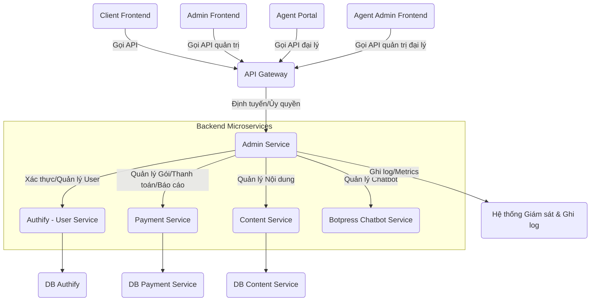

# ĐỀ BÀN DỰ ÁN: XÂY DỰNG HỆ THỐNG DỊCH VỤ QUẢN TRỊ (ADMIN SERVICE) ĐỘC LẬP – PHIÊN BẢN CHUẨN HÓA

**Tác giả:** Manus AI

**Ngày:** 20 tháng 8 năm 2025

---

## Mục lục

1.  [Giới thiệu Dự án](#1-giới-thiệu-dự-án)
    1.1. [Bối cảnh và Động lực](#11-bối-cảnh-và-động-lực)
    1.2. [Mục tiêu Dự án](#12-mục-tiêu-dự-án)
    1.3. [Phạm vi Dự án](#13-phạm-vi-dự-án)

2.  [Yêu cầu Kỹ thuật và Công nghệ](#2-yêu-cầu-kỹ-thuật-và-công-nghệ)
    2.1. [Yêu cầu Chức năng](#21-yêu-cầu-chức-năng)
    2.2. [Yêu cầu Phi chức năng](#22-yêu-cầu-phi-chức-năng)
    2.3. [Công nghệ Sử dụng](#23-công-nghệ-sử-dụng)

3.  [Kiến trúc và Thiết kế Hệ thống](#3-kiến-trúc-và-thiết-kế-hệ-thống)
    3.1. [Tổng quan Kiến trúc](#31-tổng-quan-kiến-trúc)
    3.2. [Thiết kế Backend (Admin Service)](#32-thiết-kế-backend-admin-service)

4.  [Hạ tầng và DevOps](#4-hạ-tầng-và-devops)
    4.1. [Môi trường Phát triển](#41-môi-trường-phát-triển)
    4.2. [CI/CD Pipeline](#42-cicd-pipeline)
    4.3. [Giám sát và Ghi log](#43-giám-sát-và-ghi-log)

5.  [Phát triển Backend (Admin Service)](#5-phát-triển-backend-admin-service)
    5.1. [Thiết kế Database](#51-thiết-kế-database)
    5.2. [Phát triển API Quản trị](#52-phát-triển-api-quản-trị)

6.  [Kiểm thử và Đảm bảo Chất lượng](#6-kiểm-thử-và-đảm-bảo-chất-lượng)
    6.1. [Unit Testing](#61-unit-testing)
    6.2. [Integration Testing](#62-integration-testing)
    6.3. [End-to-End Testing](#63-end-to-end-testing)

7.  [Triển khai và Vận hành](#7-triển-khai-và-vận-hành)
    7.1. [Triển khai Production](#71-triển-khai-production)
    7.2. [Mở rộng và Khả năng sẵn sàng cao](#72-mở-rộng-và-khả-năng-sẵn-sàng-cao)
    7.3. [Sao lưu và Phục hồi](#73-sao-lưu-và-phục-hồi)

8.  [Quản lý Dự án và Tài liệu hóa](#8-quản-lý-dự-án-và-tài-liệu-hóa)
    8.1. [Quản lý Phiên bản](#81-quản-lý-phiên-bản)
    8.2. [Quản lý Vấn đề](#82-quản-lý-vấn-đề)
    8.3. [Tài liệu Dự án](#83-tài-liệu-dự-án)

---

## 1. Giới thiệu Dự án

### 1.1. Bối cảnh và Động lực

Trong một hệ thống microservice, việc quản lý và giám sát toàn bộ hệ thống trở nên phức tạp do sự phân tách chức năng thành nhiều dịch vụ độc lập (Authify, Payment Service, Content Service, các dịch vụ giải toán). Để giải quyết vấn đề này, **Hệ thống Dịch vụ Quản trị (Admin Service) độc lập** được xây dựng. Dịch vụ này đóng vai trò là một lớp tổng hợp (aggregation layer) cho các tác vụ quản trị, tổng hợp các chức năng quản lý từ các microservice khác. Admin Service sẽ cung cấp một bộ API thống nhất cho Admin Frontend (Admin Panel). Các API này sẽ được tiếp xúc thông qua **API Gateway chung** của hệ thống, đảm bảo một điểm truy cập tập trung, an toàn và có tổ chức cho các tác vụ quản trị. Điều này giúp tách biệt rõ ràng các API dành cho người dùng cuối và các API dành cho quản trị viên, tăng cường bảo mật và khả năng bảo trì.

### 1.2. Mục tiêu Dự án

Mục tiêu tổng thể của dự án "Hệ thống Dịch vụ Quản trị độc lập" là phát triển một backend service mạnh mẽ, cung cấp các API tập trung cho việc quản lý và giám sát toàn bộ hệ sinh thái microservice. Các mục tiêu cụ thể bao gồm:

*   **Tập trung hóa API quản trị:** Cung cấp một bộ API thống nhất để quản lý người dùng, nội dung, gói dịch vụ, và xem các báo cáo từ các dịch vụ khác.
*   **Tăng cường bảo mật:** Đảm bảo tất cả các API quản trị đều được bảo vệ chặt chẽ bằng cơ chế xác thực và phân quyền mạnh mẽ.
*   **Đơn giản hóa việc quản lý:** Giúp Admin Frontend dễ dàng tương tác với hệ thống mà không cần biết chi tiết về từng microservice backend.
*   **Đảm bảo khả năng mở rộng và bảo trì:** Áp dụng kiến trúc microservice, container hóa và quy trình DevOps để đảm bảo hệ thống có thể mở rộng và dễ dàng bảo trì.
*   **Cung cấp báo cáo và thống kê:** Tổng hợp dữ liệu từ các dịch vụ khác để cung cấp các báo cáo và thống kê cần thiết cho quản trị viên.

### 1.3. Phạm vi Dự án

Dự án "Hệ thống Dịch vụ Quản trị độc lập" sẽ tập trung vào việc phát triển các thành phần cốt lõi sau:

*   **Backend Service (Admin Service):**
    *   API để quản lý người dùng (thông qua Authify): Xem, tìm kiếm, sửa đổi thông tin, quản lý trạng thái, quản lý vai trò.
    *   API để quản lý nội dung (thông qua Content Service): Xem, thêm, sửa, xóa, xuất bản nội dung và loại nội dung.
    *   API để quản lý gói dịch vụ và giá (thông qua Payment Service): Xem, thêm, sửa, xóa, ẩn/hiện gói, thay đổi giá pay-per-solve.
    *   API để xem báo cáo và thống kê (thông qua Payment Service và các dịch vụ khác): Báo cáo sử dụng dịch vụ của người dùng, thống kê doanh thu, số lượt giải.
    *   API để quản lý vai trò và quyền hạn của quản trị viên (nếu cần một lớp phân quyền chi tiết hơn Authify).
    *   Tất cả các API đều yêu cầu xác thực và phân quyền (từ Authify).

*   **Tích hợp với các Microservice khác:**
    *   Authify (User Service): Để xác thực quản trị viên và quản lý người dùng.
    *   Payment Service: Để quản lý gói dịch vụ, giá cả, và lấy báo cáo tài chính/sử dụng.
    *   Content Service: Để quản lý nội dung tĩnh.
    *   Botpress Chatbot Service: Để quản lý và giám sát hoạt động của chatbot, cấu hình bot, và lấy thông tin về tương tác người dùng với chatbot.

*   **Infrastructure & DevOps:**
    *   Container hóa backend service bằng Docker.
    *   Thiết lập môi trường phát triển cục bộ bằng Docker Compose.
    *   Xây dựng quy trình CI/CD cơ bản (ví dụ: GitHub Actions) cho việc kiểm thử và đóng gói ứng dụng.
    *   Thiết lập giám sát (Prometheus, Grafana) và ghi log tập trung cho service.

**Các tính năng nằm ngoài phạm vi của dự án này (nhưng có thể là các giai đoạn phát triển tiếp theo):**

*   Admin Frontend (Admin Panel): Đây là một dự án frontend riêng biệt sẽ tương tác với Admin Service.
*   Hệ thống thông báo cho quản trị viên.
*   Quản lý cấu hình hệ thống toàn cục.
*   Tích hợp với các hệ thống bên ngoài khác.

---

## 2. Yêu cầu Kỹ thuật và Công nghệ

### 2.1. Yêu cầu Chức năng

Các yêu cầu chức năng mô tả những gì Admin Service phải làm để đáp ứng mục tiêu của dự án:

*   **Quản lý Người dùng:**
    *   Cung cấp API để xem danh sách người dùng, tìm kiếm, lọc.
    *   Cung cấp API để xem chi tiết hồ sơ người dùng.
    *   Cung cấp API để cập nhật thông tin người dùng (tên, email, trạng thái).
    *   Cung cấp API để quản lý vai trò người dùng (user, admin).
    *   Cung cấp API để kích hoạt/vô hiệu hóa tài khoản người dùng.
*   **Quản lý Nội dung:**
    *   Cung cấp API để xem danh sách các loại nội dung và mục nội dung.
    *   Cung cấp API để tạo, cập nhật, xóa loại nội dung và mục nội dung.
    *   Cung cấp API để xuất bản/bỏ xuất bản nội dung.
    *   Cung cấp API để xem lịch sử phiên bản và khôi phục nội dung.
*   **Quản lý Gói Dịch vụ và Giá:**
    *   Cung cấp API để xem danh sách các gói dịch vụ và giá pay-per-solve.
    *   Cung cấp API để tạo, cập nhật, xóa, ẩn/hiện các gói dịch vụ.
    *   Cung cấp API để cập nhật giá pay-per-solve cho từng công cụ.
*   **Báo cáo và Thống kê:**
    *   Cung cấp API để lấy báo cáo chi tiết việc sử dụng dịch vụ của một người dùng (số lượt giải, giao dịch).
    *   Cung cấp API để lấy thống kê tổng quan về doanh thu, số lượng người dùng, số lượt giải theo công cụ.
    *   Cung cấp API để xem lịch sử giao dịch tài chính.
*   **Xác thực và Phân quyền:**
    *   Tất cả các API đều yêu cầu xác thực quản trị viên (JWT từ Authify).
    *   Hỗ trợ phân quyền dựa trên vai trò (ví dụ: chỉ Super Admin mới có quyền thay đổi giá).

### 2.2. Yêu cầu Phi chức năng

Các yêu cầu phi chức năng mô tả cách Admin Service hoạt động, bao gồm các khía cạnh về chất lượng, hiệu suất, bảo mật, và khả năng bảo trì:

*   **Hiệu suất:**
    *   Thời gian phản hồi của API phải nhanh, dưới 100ms cho các tác vụ thông thường.
    *   Có khả năng xử lý đồng thời nhiều yêu cầu từ Admin Frontend.
*   **Khả năng mở rộng:**
    *   Thiết kế stateless để có thể mở rộng theo chiều ngang.
    *   Kiến trúc microservice độc lập, dễ dàng thêm các chức năng quản trị mới.
*   **Bảo mật:**
    *   Tất cả các giao tiếp phải được mã hóa bằng HTTPS/SSL.
    *   API phải được bảo vệ chặt chẽ bằng cơ chế xác thực (JWT từ Authify) và phân quyền phù hợp.
    *   Áp dụng các biện pháp chống lại các cuộc tấn công phổ biến như SQL Injection, XSS, CSRF.
    *   Ghi log đầy đủ các hoạt động quản trị để phục vụ mục đích kiểm toán.
*   **Khả năng bảo trì:**
    *   Mã nguồn phải sạch, dễ đọc, tuân thủ các tiêu chuẩn mã hóa và có tài liệu hóa đầy đủ.
    *   Hệ thống phải dễ dàng triển khai, cấu hình và cập nhật.
*   **Khả năng chịu lỗi (Fault Tolerance):**
    *   Xử lý các lỗi từ các dịch vụ backend khác một cách gracefully, trả về thông báo lỗi phù hợp cho Admin Frontend.
    *   Có cơ chế retry hoặc circuit breaker khi gọi các dịch vụ khác.

### 2.3. Công nghệ Sử dụng

Để xây dựng Admin Service, các công nghệ sau đây được đề xuất:

*   **Backend (Admin Service):**
    *   **Ngôn ngữ lập trình:** Python 3.11+
    *   **Framework:** FastAPI (để xây dựng API RESTful hiệu quả và có tài liệu OpenAPI tự động).
    *   **HTTP Client:** `httpx` hoặc `requests` (để gọi API của các microservice khác).
    *   **Xác thực:** Tích hợp với Authify (User Service) để xác thực JWT và phân quyền cho các API quản trị.
*   **Database:**
    *   Admin Service **không cần database riêng** cho dữ liệu nghiệp vụ. Nó sẽ truy vấn dữ liệu từ các microservice khác thông qua API của chúng.
    *   Tuy nhiên, có thể cần một database nhỏ (ví dụ: SQLite hoặc PostgreSQL) để lưu trữ cấu hình nội bộ của Admin Service hoặc các thông tin liên quan đến quyền hạn quản trị viên nếu cần một lớp phân quyền phức tạp hơn Authify.
*   **DevOps & Hạ tầng:**
    *   **Containerization:** Docker (để đóng gói ứng dụng và môi trường).
    *   **Môi trường phát triển cục bộ:** Docker Compose (để chạy Admin Service và các dịch vụ phụ thuộc).
    *   **CI/CD:** GitHub Actions (để tự động hóa kiểm thử và triển khai).
    *   **Giám sát:** Prometheus (thu thập metrics), Grafana (tạo dashboard trực quan).
    *   **Ghi log tập trung:** ELK Stack (Elasticsearch, Logstash, Kibana) hoặc Loki/Grafana (cho log).
*   **Công cụ chất lượng mã nguồn:**
    *   Black (code formatter).
    *   Flake8 (linter).
    *   MyPy (type checker).
    *   Pre-commit hooks (tự động chạy các công cụ trên trước khi commit).

---

## 3. Kiến trúc và Thiết kế Hệ thống

### 3.1. Tổng quan Kiến trúc

Admin Service sẽ là một microservice độc lập, hoạt động như một lớp tổng hợp (aggregation layer) cho các API quản trị từ các dịch vụ khác. Nó sẽ không trực tiếp quản lý dữ liệu mà sẽ điều phối các yêu cầu đến các dịch vụ backend chuyên biệt. Admin Frontend (Admin Panel) sẽ tương tác với Admin Service thông qua API Gateway chung của hệ thống. Sơ đồ kiến trúc tổng quan như sau:

**Mô tả các thành phần chính và mối liên kết:**

*   **Client Frontend:** Giao diện chính cho người dùng cuối để sử dụng các dịch vụ của hệ thống.
*   **Admin Frontend:** Là ứng dụng web/mobile dành cho quản trị viên (Admin Panel). Nó sẽ gọi các API của Admin Service thông qua API Gateway để thực hiện các tác vụ quản trị.
*   **Agent Portal:** Giao diện dành cho đại lý để đăng ký, quản lý hồ sơ và xem báo cáo hoa hồng.
*   **Agent Admin Frontend:** Giao diện quản trị dành riêng cho việc quản lý các đại lý và chính sách đại lý.
*   **API Gateway:** Điểm truy cập duy nhất cho các yêu cầu từ Admin Frontend đến Admin Service. Chịu trách nhiệm xác thực, ủy quyền sơ bộ, rate limiting và định tuyến yêu cầu.
*   **Admin Service (Backend):** Là trái tim của hệ thống quản trị, được xây dựng bằng FastAPI/Python. Dịch vụ này chứa logic điều phối các yêu cầu quản trị đến các microservice khác và tổng hợp kết quả. Nó cũng chịu trách nhiệm về xác thực và phân quyền cho các API quản trị.
*   **Authify (User Service):** Cung cấp các API cho việc xác thực quản trị viên (đăng nhập, JWT) và quản lý người dùng cuối (xem, sửa, xóa, quản lý vai trò).
*   **Payment Service:** Cung cấp các API để quản lý gói dịch vụ, giá cả, và lấy các báo cáo tài chính/sử dụng của người dùng.
*   **Content Service:** Cung cấp các API để quản lý nội dung tĩnh của website (thêm, sửa, xóa, xuất bản).
*   **Botpress Chatbot Service:** Cung cấp các API để quản lý chatbot, cấu hình bot, và xử lý tương tác với người dùng.
*   **Cơ sở dữ liệu (DB_Auth, DB_Payment, DB_Content):** Mỗi dịch vụ backend có cơ sở dữ liệu riêng, đảm bảo tính độc lập và phân tách dữ liệu.

**Luồng tương tác chính (ví dụ: Quản trị viên xem danh sách người dùng):**

1.  Quản trị viên đăng nhập vào Admin Frontend (thông qua Authify).
2.  Admin Frontend gửi yêu cầu xem danh sách người dùng đến **API Gateway**, kèm theo JWT trong header `Authorization`.
3.  **API Gateway** xác thực JWT và định tuyến yêu cầu đến **Admin Service**.
4.  **Admin Service** nhận yêu cầu:
    *   Kiểm tra quyền hạn của người dùng (dựa trên thông tin từ JWT).
    *   Nếu hợp lệ, Admin Service gọi API `GET /api/v1/admin/users` của **Authify**.
    *   Authify trả về danh sách người dùng.
    *   Admin Service trả về danh sách người dùng cho API Gateway.
5.  **API Gateway** trả về kết quả cho Admin Frontend.

### 3.2. Thiết kế Backend (Admin Service)

Admin Service sẽ là một ứng dụng FastAPI, tuân thủ các nguyên tắc thiết kế API RESTful. Cấu trúc dịch vụ sẽ bao gồm các lớp chính:

*   **API Layer (Controllers/Routers):** Chứa các endpoint API, xử lý request, validate input và gọi đến Business Logic Layer.
*   **Business Logic Layer (Services):** Chứa logic nghiệp vụ chính, bao gồm điều phối các yêu cầu đến các dịch vụ khác, xử lý lỗi, và tổng hợp dữ liệu.
*   **Integration Layer (Clients):** Chứa các client HTTP để gọi API của các microservice khác (AuthifyClient, PaymentClient, ContentClient, BotpressClient).

**Các API Endpoints chính:**

*   **User Management (tương tác với Authify):**
    *   `GET /api/v1/admin/users`: Lấy danh sách người dùng.
    *   `GET /api/v1/admin/users/{user_id}`: Lấy chi tiết người dùng.
    *   `PUT /api/v1/admin/users/{user_id}`: Cập nhật thông tin người dùng.
    *   `PUT /api/v1/admin/users/{user_id}/status`: Cập nhật trạng thái người dùng (active/inactive).
    *   `PUT /api/v1/admin/users/{user_id}/role`: Cập nhật vai trò người dùng.
*   **Content Management (tương tác với Content Service):**
    *   `GET /api/v1/admin/content/types`: Lấy danh sách loại nội dung.
    *   `POST /api/v1/admin/content/types`: Tạo loại nội dung mới.
    *   `PUT /api/v1/admin/content/types/{type_id}`: Cập nhật loại nội dung.
    *   `DELETE /api/v1/admin/content/types/{type_id}`: Xóa loại nội dung.
    *   `GET /api/v1/admin/content/items`: Lấy danh sách mục nội dung.
    *   `POST /api/v1/admin/content/items`: Tạo mục nội dung mới.
    *   `PUT /api/v1/admin/content/items/{item_id}`: Cập nhật mục nội dung.
    *   `DELETE /api/v1/admin/content/items/{item_id}`: Xóa mục nội dung.
    *   `POST /api/v1/admin/content/items/{item_id}/publish`: Xuất bản nội dung.
    *   `GET /api/v1/admin/content/items/{item_id}/versions`: Lấy lịch sử phiên bản.
    *   `POST /api/v1/admin/content/items/{item_id}/versions/{version_id}/restore`: Khôi phục phiên bản.
*   **Payment & Package Management (tương tác với Payment Service):**
    *   `GET /api/v1/admin/packages`: Lấy danh sách gói dịch vụ.
    *   `POST /api/v1/admin/packages`: Tạo gói dịch vụ mới.
    *   `PUT /api/v1/admin/packages/{package_id}`: Cập nhật gói dịch vụ.
    *   `DELETE /api/v1/admin/packages/{package_id}`: Xóa gói dịch vụ.
    *   `GET /api/v1/admin/pay-per-use-rates`: Lấy giá pay-per-use.
    *   `PUT /api/v1/admin/pay-per-use-rates`: Cập nhật giá pay-per-use.
    *   `GET /api/v1/admin/users/{user_id}/balance`: Lấy số dư của người dùng.
    *   `GET /api/v1/admin/users/{user_id}/transactions`: Lấy lịch sử giao dịch của người dùng.
    *   `GET /api/v1/admin/users/{user_id}/usage-report`: Lấy báo cáo sử dụng dịch vụ của người dùng.
    *   `GET /api/v1/admin/usage-statistics`: Lấy thống kê tổng quan sử dụng dịch vụ.
*   **Chatbot Management (tương tác với Botpress Chatbot Service):**
    *   `GET /api/v1/admin/chatbot/config`: Lấy cấu hình chatbot.
    *   `PUT /api/v1/admin/chatbot/config`: Cập nhật cấu hình chatbot.
    *   `GET /api/v1/admin/chatbot/conversations`: Lấy danh sách cuộc hội thoại.
    *   `GET /api/v1/admin/chatbot/analytics`: Lấy thống kê tương tác chatbot.
    *   `POST /api/v1/admin/chatbot/broadcast`: Gửi tin nhắn broadcast qua chatbot.

**Luồng xử lý yêu cầu (ví dụ: `GET /api/v1/admin/users`):**

1.  **Nhận yêu cầu:** Admin Service nhận yêu cầu từ Admin Frontend, kèm theo JWT trong header `Authorization`.
2.  **Xác thực và Phân quyền:**
    *   Service gọi API của Authify để xác thực JWT và kiểm tra xem người dùng có vai trò `ADMIN` (hoặc vai trò cụ thể cho tác vụ này) hay không.
    *   Nếu không hợp lệ hoặc không có quyền, trả về lỗi `401 Unauthorized` hoặc `403 Forbidden`.
3.  **Gọi dịch vụ liên quan:** Admin Service gọi API `GET /api/v1/admin/users` của Authify.
4.  **Xử lý phản hồi:** Nhận dữ liệu từ Authify, có thể xử lý thêm (ví dụ: lọc, sắp xếp) nếu cần.
5.  **Trả về kết quả:** Trả về dữ liệu đã xử lý cho Admin Frontend.

---

## 4. Hạ tầng và DevOps

### 4.1. Môi trường Phát triển

*   **Docker:** Admin Service sẽ được đóng gói thành Docker image.
*   **Docker Compose:** Sử dụng file `docker-compose.yml` để định nghĩa và khởi chạy toàn bộ môi trường phát triển cục bộ (Admin Service và các dịch vụ backend phụ thuộc như Authify, Payment Service, Content Service) bằng một lệnh duy nhất.

### 4.2. CI/CD Pipeline

*   **Nền tảng:** GitHub Actions.
*   **Quy trình:** Tự động kích hoạt khi có push code hoặc tạo Pull Request.
    1.  **Build:** Cài đặt dependencies, chạy linter, format code.
    2.  **Test:** Chạy Unit Test, Integration Test.
    3.  **Build Image:** Build Docker image cho backend.
    4.  **Push Image:** Đẩy image lên Docker Registry.
    5.  **Deploy:** Tự động triển khai lên môi trường Staging. Triển khai lên Production có thể cần phê duyệt thủ công.

### 4.3. Giám sát và Ghi log

*   **Prometheus:** Thu thập các metrics về hiệu suất từ backend service.
*   **Grafana:** Trực quan hóa các metrics từ Prometheus qua các dashboard.
*   **Ghi log tập trung:** Sử dụng ELK Stack (Elasticsearch, Logstash, Kibana) hoặc Loki/Grafana (cho log).

---

## 5. Phát triển Backend (Admin Service)

### 5.1. Thiết kế Database

Admin Service **không cần database riêng** cho dữ liệu nghiệp vụ. Nó sẽ truy vấn dữ liệu từ các microservice khác thông qua API của chúng. Tuy nhiên, có thể cần một database nhỏ (ví dụ: SQLite hoặc PostgreSQL) để lưu trữ cấu hình nội bộ của Admin Service hoặc các thông tin liên quan đến quyền hạn quản trị viên nếu cần một lớp phân quyền phức tạp hơn Authify.

### 5.2. Phát triển API Quản trị

-   Triển khai các API endpoint đã được thiết kế trong mục 3.2 bằng FastAPI.
-   Sử dụng Pydantic để validate dữ liệu đầu vào và định dạng dữ liệu đầu ra.
-   Tổ chức code theo cấu trúc module rõ ràng (ví dụ: `routers`, `services`, `clients`).
-   Đảm bảo các API quản trị yêu cầu xác thực và phân quyền mạnh mẽ.

---

## 6. Kiểm thử và Đảm bảo Chất lượng

### 6.1. Unit Testing

-   Kiểm thử các hàm logic nghiệp vụ, các client gọi API của các service khác.

### 6.2. Integration Testing

-   Kiểm thử sự tương tác giữa Admin Service và các microservice khác (Authify, Payment Service, Content Service).

### 6.3. End-to-End Testing

-   Kiểm thử luồng hoàn chỉnh từ Admin Frontend, qua API Gateway, đến Admin Service và các microservice backend liên quan.

---

## 7. Triển khai và Vận hành

### 7.1. Triển khai Production

-   Sử dụng Kubernetes hoặc một dịch vụ PaaS để triển khai Docker container.
-   Thiết lập cấu hình môi trường production (biến môi trường, kết nối API của các service khác, khóa API).

### 7.2. Mở rộng và Khả năng sẵn sàng cao

-   Thiết kế stateless để có thể mở rộng theo chiều ngang (horizontal scaling).
-   Sử dụng các cơ chế chịu lỗi như retry, circuit breaker khi gọi các dịch vụ khác.

### 7.3. Sao lưu và Phục hồi

-   Nếu có database nội bộ, thiết lập lịch trình sao lưu tự động và quy trình phục hồi.

---

## 8. Quản lý Dự án và Tài liệu hóa

### 8.1. Quản lý Phiên bản

-   Sử dụng Git để quản lý mã nguồn.
-   Quản lý phiên bản API theo SemVer.

### 8.2. Quản lý Vấn đề

-   Sử dụng các công cụ quản lý dự án (Jira, Trello) để theo dõi các task, bug, feature.

### 8.3. Tài liệu Dự án

-   Tài liệu hóa API bằng OpenAPI/Swagger.
-   Tài liệu hóa kiến trúc, thiết kế, và quy trình vận hành.

