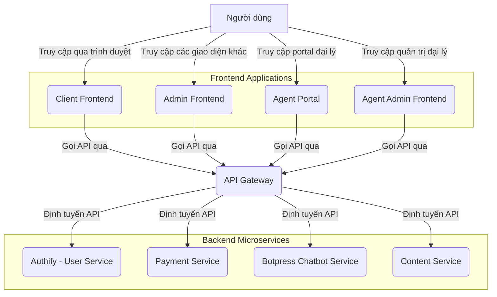

# ĐỀ BÀN DỰ ÁN: XÂY DỰNG HỆ THỐNG GIAO DIỆN NGƯỜI DÙNG (CLIENT FRONTEND) ĐỘC LẬP

**Tác giả:** Manus AI

**Ngày:** 19 tháng 8 năm 2025

---

## Mục lục

1.  Giới thiệu Dự án
    1.1. Bối cảnh và Động lực
    1.2. Mục tiêu Dự án
    1.3. Phạm vi Dự án

2.  Yêu cầu Kỹ thuật và Công nghệ
    2.1. Yêu cầu Chức năng
    2.2. Yêu cầu Phi chức năng
    2.3. Công nghệ Sử dụng

3.  Kiến trúc và Thiết kế Hệ thống
    3.1. Tổng quan Kiến trúc
    3.2. Thiết kế Giao diện Người dùng (UI/UX)
    3.3. Tích hợp API Backend

4.  Hạ tầng và DevOps
    4.1. Môi trường Phát triển
    4.2. CI/CD Pipeline
    4.3. Triển khai

5.  Phát triển Frontend
    5.1. Cấu trúc Dự án
    5.2. Các Module/Trang Chính
    5.3. Quản lý Trạng thái và Dữ liệu

6.  Kiểm thử và Đảm bảo Chất lượng
    6.1. Unit Testing
    6.2. Integration Testing
    6.3. End-to-End Testing

7.  Quản lý Dự án và Tài liệu hóa
    7.1. Quản lý Phiên bản
    7.2. Quản lý Vấn đề
    7.3. Tài liệu Dự án

---

## 1. Giới thiệu Dự án

### 1.1. Bối cảnh và Động lực

Trong hệ sinh thái microservice, Client Frontend đóng vai trò là điểm tiếp xúc chính giữa người dùng cuối và toàn bộ các dịch vụ backend. Nó là giao diện trực quan, thân thiện, cho phép người dùng truy cập các dịch vụ chatbot thông minh, quản lý tài khoản, xem lịch sử thanh toán, và đọc các nội dung hỗ trợ. Với kiến trúc microservice, các dịch vụ backend (Authify, Payment Service, Botpress Chatbot Service, Content Service) hoạt động độc lập. Do đó, việc xây dựng một Client Frontend độc lập, có khả năng tích hợp linh hoạt với các dịch vụ này là rất quan trọng để đảm bảo tính module hóa, khả năng mở rộng và dễ dàng bảo trì cho toàn bộ hệ thống.

Động lực chính của dự án này là tạo ra một giao diện người dùng hiện đại, đáp ứng nhanh, cung cấp trải nghiệm mượt mà và nhất quán cho người dùng khi tương tác với các chức năng đa dạng của hệ thống. Việc tách rời frontend giúp đội ngũ phát triển có thể làm việc độc lập, triển khai nhanh chóng các cập nhật giao diện mà không ảnh hưởng đến các dịch vụ backend, đồng thời chuẩn bị cho khả năng tích hợp vào một hệ thống lớn hơn hoặc hoạt động như một ứng dụng độc lập.

### 1.2. Mục tiêu Dự án

Mục tiêu tổng thể của dự án "Client Frontend độc lập" là phát triển một ứng dụng web hoàn chỉnh, cung cấp giao diện người dùng trực quan và hiệu quả cho tất cả các dịch vụ của hệ thống. Các mục tiêu cụ thể bao gồm:

*   **Cung cấp trải nghiệm người dùng tối ưu:** Thiết kế giao diện thân thiện, dễ sử dụng, đáp ứng nhanh trên mọi thiết bị (responsive design) và hỗ trợ đa ngôn ngữ.
*   **Tích hợp liền mạch với các dịch vụ backend:** Đảm bảo Client Frontend có thể giao tiếp hiệu quả và an toàn với Authify, Payment Service, Botpress Chatbot Service, và Content Service thông qua các API RESTful.
*   **Quản lý trạng thái người dùng và phiên:** Xử lý đăng ký, đăng nhập, quản lý hồ sơ người dùng và phiên làm việc một cách an toàn và hiệu quả.
*   **Hiển thị và tương tác với chatbot thông minh:** Cung cấp giao diện chat trực quan, hiển thị cuộc hội thoại và tích hợp các tính năng chatbot thông minh từ Botpress.
*   **Quản lý thanh toán và lịch sử giao dịch:** Cho phép người dùng xem số dư, lịch sử giao dịch, và thực hiện các thao tác thanh toán.
*   **Hiển thị nội dung tĩnh:** Truy xuất và hiển thị các trang nội dung tĩnh (FAQ, chính sách, giới thiệu) từ Content Service.
*   **Đảm bảo khả năng mở rộng và bảo trì:** Áp dụng các nguyên tắc phát triển frontend hiện đại, mã nguồn sạch, dễ đọc và dễ bảo trì.
*   **Đảm bảo an toàn và bảo mật:** Áp dụng các biện pháp bảo mật cần thiết cho giao diện người dùng và các tương tác API.

### 1.3. Phạm vi Dự án

Dự án "Client Frontend độc lập" sẽ tập trung vào việc phát triển các thành phần cốt lõi sau:

*   **Giao diện Người dùng (UI):**
    *   **Trang Đăng ký/Đăng nhập:** Tích hợp với Authify để xử lý xác thực người dùng.
    *   **Trang Dashboard/Trang chủ:** Tổng quan về các dịch vụ, thông tin người dùng.
    *   **Trang Hồ sơ Người dùng:** Cho phép xem và chỉnh sửa thông tin cá nhân.
    *   **Trang Chat với Botpress:** Giao diện chat trực quan để tương tác với chatbot thông minh.
    *   **Trang Lịch sử Chat:** Hiển thị danh sách các cuộc hội thoại đã thực hiện với chatbot.
    *   **Trang Quản lý Thanh toán:** Hiển thị số dư, lịch sử giao dịch, và các tùy chọn nạp tiền/thanh toán.
    *   **Các trang Nội dung tĩnh:** Hiển thị trang Giới thiệu, FAQ, Chính sách từ Content Service.
    *   **Hỗ trợ đa ngôn ngữ:** Chuyển đổi ngôn ngữ giao diện và nội dung.

*   **Tích hợp API Backend:**
    *   **Authify (User Service):** Đăng ký, đăng nhập, lấy thông tin người dùng, cập nhật hồ sơ.
    *   **Payment Service:** Lấy số dư, lịch sử giao dịch, gọi API thanh toán.
    *   **Botpress Chatbot Service:** Gửi tin nhắn, nhận phản hồi từ chatbot, quản lý cuộc hội thoại.
    *   **Content Service:** Lấy nội dung tĩnh theo slug và ngôn ngữ.

*   **Xử lý Trạng thái và Dữ liệu:**
    *   Quản lý trạng thái ứng dụng (loading, error, success).
    *   Xử lý lỗi từ API và hiển thị thông báo thân thiện cho người dùng.
    *   Quản lý phiên người dùng (JWT).

*   **Infrastructure & DevOps:**
    *   Container hóa ứng dụng frontend bằng Docker.
    *   Thiết lập môi trường phát triển cục bộ bằng Docker Compose.
    *   Xây dựng quy trình CI/CD cơ bản (ví dụ: GitHub Actions) cho việc kiểm thử và đóng gói ứng dụng.

**Các tính năng nằm ngoài phạm vi của dự án này (nhưng có thể là các giai đoạn phát triển tiếp theo):**

*   Hệ thống thông báo đẩy (push notifications).
*   Tích hợp với các dịch vụ bên thứ ba khác ngoài phạm vi hệ thống.
*   Tính năng phân tích và báo cáo chi tiết.

**Lưu ý về kiến trúc Frontend tổng thể:**

Client Frontend này là một trong bốn thành phần giao diện chính của hệ thống:
*   **Client Frontend:** Giao diện chính cho người dùng cuối (dự án này).
*   **Admin Frontend:** Bảng điều khiển dành cho quản trị viên hệ thống.
*   **Agent Portal:** Giao diện dành cho đại lý đăng ký và quản lý.
*   **Agent Admin Frontend:** Giao diện quản trị dành cho đại lý cấp cao.

## 2. Yêu cầu Kỹ thuật và Công nghệ

### 2.1. Yêu cầu Chức năng

Các yêu cầu chức năng mô tả những gì Client Frontend phải làm để đáp ứng mục tiêu của dự án:

*   **Xác thực Người dùng:**
    *   Cho phép người dùng đăng ký tài khoản mới.
    *   Cho phép người dùng đăng nhập bằng tài khoản đã có.
    *   Cho phép người dùng đăng xuất.
    *   Hiển thị thông tin hồ sơ người dùng và cho phép cập nhật.
*   **Tương tác Chatbot:**
    *   Cung cấp giao diện chat trực quan và thân thiện.
    *   Gửi và nhận tin nhắn từ Botpress Chatbot Service.
    *   Hiển thị lịch sử cuộc hội thoại một cách rõ ràng và dễ theo dõi.
    *   Hỗ trợ các tính năng chat nâng cao như gửi file, emoji, quick replies.
    *   Hiển thị thông báo về trạng thái chatbot và kết nối.
*   **Quản lý Lịch sử Chat:**
    *   Hiển thị danh sách các cuộc hội thoại đã thực hiện với chatbot.
    *   Cho phép xem lại chi tiết từng cuộc hội thoại từ lịch sử.
*   **Quản lý Thanh toán:**
    *   Hiển thị số dư tài khoản của người dùng.
    *   Hiển thị lịch sử các giao dịch thanh toán.
    *   Cung cấp giao diện để người dùng có thể nạp tiền hoặc thực hiện thanh toán cho các lượt giải.
*   **Nội dung tĩnh:**
    *   Hiển thị các trang nội dung tĩnh như Giới thiệu, FAQ, Chính sách.
    *   Hỗ trợ chuyển đổi ngôn ngữ cho các nội dung này.
*   **Đa ngôn ngữ:**
    *   Giao diện người dùng phải hỗ trợ ít nhất hai ngôn ngữ (ví dụ: Tiếng Việt và Tiếng Anh).
    *   Người dùng có thể dễ dàng chuyển đổi ngôn ngữ.

### 2.2. Yêu cầu Phi chức năng

Các yêu cầu phi chức năng mô tả cách Client Frontend hoạt động, bao gồm các khía cạnh về chất lượng, hiệu suất, bảo mật, và khả năng bảo trì:

*   **Hiệu suất:**
    *   Thời gian tải trang ban đầu nhanh (dưới 2 giây).
    *   Thời gian phản hồi của giao diện người dùng mượt mà, không giật lag.
    *   Tối ưu hóa hình ảnh và tài nguyên để giảm thiểu thời gian tải.
*   **Khả năng mở rộng:**
    *   Kiến trúc module hóa, dễ dàng thêm các tính năng hoặc trang mới.
    *   Có khả năng mở rộng để hỗ trợ nhiều người dùng đồng thời.
*   **Bảo mật:**
    *   Tất cả các giao tiếp với backend phải được mã hóa bằng HTTPS/SSL.
    *   Xử lý JWT an toàn (ví dụ: lưu trữ trong HttpOnly cookies).
    *   Chống lại các cuộc tấn công phổ biến như XSS, CSRF.
    *   Không lưu trữ thông tin nhạy cảm của người dùng ở phía client.
*   **Khả năng sử dụng (Usability):**
    *   Giao diện trực quan, dễ hiểu và dễ thao tác cho mọi đối tượng người dùng.
    *   Thông báo lỗi rõ ràng, thân thiện và hướng dẫn người dùng cách khắc phục.
    *   Thiết kế responsive, tương thích tốt trên các thiết bị desktop, tablet và mobile.
*   **Khả năng bảo trì:**
    *   Mã nguồn phải sạch, dễ đọc, tuân thủ các tiêu chuẩn mã hóa và có tài liệu hóa đầy đủ.
    *   Sử dụng các thư viện và framework phổ biến, có cộng đồng hỗ trợ lớn.
    *   Dễ dàng triển khai và cập nhật.
*   **Khả năng chịu lỗi (Fault Tolerance):**
    *   Xử lý các lỗi từ API backend một cách gracefully, hiển thị thông báo phù hợp thay vì crash.
    *   Có cơ chế retry cho các yêu cầu API thất bại tạm thời.
*   **Khả năng tương thích:**
    *   Hoạt động tốt trên các trình duyệt web phổ biến (Chrome, Firefox, Edge, Safari) và các phiên bản mới nhất.

### 2.3. Công nghệ Sử dụng

Để xây dựng Client Frontend độc lập, các công nghệ sau đây được đề xuất:

*   **Frontend Framework:** Next.js 14+ (để xây dựng ứng dụng React SSR/SSG, tối ưu SEO và hiệu suất).
*   **Thư viện UI:** React 18+
*   **Ngôn ngữ:** TypeScript (để tăng cường tính an toàn và khả năng bảo trì của mã nguồn).
*   **CSS Framework:** Tailwind CSS (để xây dựng giao diện nhanh chóng và responsive).
*   **Quản lý trạng thái:** React Context API, Zustand hoặc Redux Toolkit (tùy thuộc vào độ phức tạp và quy mô).
*   **HTTP Client:** Axios hoặc Fetch API (để gọi các API backend).
*   **Thư viện đa ngôn ngữ:** `react-i18next` hoặc tương tự.
*   **Thư viện chat UI:** `react-chat-elements` hoặc tương tự (cho giao diện chat với Botpress).
*   **Form Management:** `React Hook Form` hoặc `Formik` (để quản lý form hiệu quả).
*   **Validation:** `Zod` hoặc `Yup` (để validate dữ liệu đầu vào).
*   **DevOps & Hạ tầng:**
    *   **Containerization:** Docker (để đóng gói ứng dụng và môi trường).
    *   **Môi trường phát triển cục bộ:** Docker Compose (để chạy frontend và các dịch vụ backend phụ thuộc).
    *   **CI/CD:** GitHub Actions (để tự động hóa kiểm thử và triển khai).
*   **Công cụ chất lượng mã nguồn:**
    *   ESLint (linter).
    *   Prettier (code formatter).
    *   Husky/lint-staged (pre-commit hooks).

## 3. Kiến trúc và Thiết kế Hệ thống

### 3.1. Tổng quan Kiến trúc

Client Frontend sẽ là một ứng dụng web độc lập, tương tác với các microservice backend của MathService thông qua API Gateway (nếu có) hoặc trực tiếp với các service. Nó sẽ không có database riêng mà chỉ quản lý trạng thái cục bộ và phiên người dùng. Sơ đồ kiến trúc tổng quan như sau:

**Mô tả các thành phần chính và mối liên kết:**

**Frontend Applications:**
*   **Client Frontend:** Ứng dụng web chính mà người dùng cuối tương tác. Nó sẽ gửi các yêu cầu API đến API Gateway và hiển thị dữ liệu trả về.
*   **Admin Frontend:** Bảng điều khiển dành cho quản trị viên hệ thống để quản lý người dùng, nội dung và cấu hình.
*   **Agent Portal:** Giao diện dành cho đại lý để đăng ký, quản lý thông tin và theo dõi hoạt động.
*   **Agent Admin Frontend:** Giao diện quản trị dành cho đại lý cấp cao để quản lý đội nhóm và báo cáo.

**Backend Infrastructure:**
*   **API Gateway:** Là điểm truy cập duy nhất cho tất cả các API của hệ thống. Nó chịu trách nhiệm định tuyến các yêu cầu từ các ứng dụng Frontend đến các microservice backend tương ứng, thực hiện xác thực sơ bộ, quản lý lưu lượng và bảo mật.
*   **Authify (User Service):** Cung cấp các API cho việc đăng ký, đăng nhập, quản lý hồ sơ và xác thực người dùng (JWT).
*   **Payment Service:** Cung cấp các API để quản lý số dư, lịch sử giao dịch và xử lý thanh toán.
*   **Botpress Chatbot Service:** Cung cấp API để tương tác với chatbot thông minh, xử lý tin nhắn và quản lý cuộc hội thoại.
*   **Content Service:** Cung cấp API để lấy các nội dung tĩnh của website.

**Luồng tương tác chính (ví dụ: Người dùng chat với Botpress):**

1.  Người dùng nhập tin nhắn vào giao diện chat trên Client Frontend.
2.  Client Frontend gửi tin nhắn đến **API Gateway** (kèm theo JWT nếu người dùng đã đăng nhập).
3.  API Gateway định tuyến yêu cầu đến **Botpress Chatbot Service**.
4.  Botpress Chatbot Service xử lý tin nhắn, có thể tương tác với Authify và Payment Service để kiểm tra quyền và tính phí.
5.  Botpress Chatbot Service trả về phản hồi từ chatbot cho API Gateway.
6.  API Gateway chuyển tiếp phản hồi về Client Frontend.
7.  Client Frontend hiển thị phản hồi của chatbot cho người dùng.

### 3.2. Thiết kế Giao diện Người dùng (UI/UX)

Thiết kế UI/UX sẽ tập trung vào sự đơn giản, trực quan và hiệu quả. Sử dụng một hệ thống thiết kế (Design System) nhất quán để đảm bảo tính đồng bộ trên toàn ứng dụng. Chú trọng vào:

*   **Layout:** Responsive layout, sử dụng Flexbox/Grid để đảm bảo hiển thị tốt trên mọi kích thước màn hình.
*   **Typography:** Lựa chọn font chữ dễ đọc, kích thước phù hợp.
*   **Color Palette:** Sử dụng bảng màu hài hòa, dễ nhìn, phù hợp với thương hiệu MathService.
*   **Components:** Xây dựng các component tái sử dụng (buttons, inputs, cards, modals, navigation) để tăng tốc độ phát triển và đảm bảo tính nhất quán.
*   **Feedback:** Cung cấp phản hồi rõ ràng cho người dùng (loading states, error messages, success notifications).
*   **Accessibility:** Đảm bảo ứng dụng có thể truy cập được bởi người dùng khuyết tật (ví dụ: sử dụng ARIA attributes).

### 3.3. Tích hợp API Backend

Client Frontend sẽ tương tác với các dịch vụ backend thông qua các API RESTful. Để quản lý việc gọi API hiệu quả, cần:

*   **Tạo các API Client:** Xây dựng các module hoặc class riêng biệt cho từng dịch vụ backend (ví dụ: `AuthApiClient`, `PaymentApiClient`, `BotpressApiClient`, `ContentApiClient`).
*   **Xử lý xác thực:** Gửi JWT trong header `Authorization` cho các yêu cầu API cần xác thực.
*   **Xử lý lỗi:** Bắt các lỗi từ API (ví dụ: 4xx, 5xx) và hiển thị thông báo lỗi phù hợp cho người dùng.
*   **Caching (tùy chọn):** Sử dụng caching cho các dữ liệu ít thay đổi (ví dụ: nội dung tĩnh) để cải thiện hiệu suất.

## 4. Hạ tầng và DevOps

### 4.1. Môi trường Phát triển

*   **Node.js:** Cài đặt Node.js và npm/yarn để chạy Next.js.
*   **Docker:** Client Frontend sẽ được đóng gói thành Docker image.
*   **Docker Compose:** Sử dụng file `docker-compose.yml` để định nghĩa và khởi chạy toàn bộ môi trường phát triển cục bộ (Client Frontend và các dịch vụ backend phụ thuộc như Authify, Payment Service, các Solver Service, Content Service) bằng một lệnh duy nhất.

### 4.2. CI/CD Pipeline

*   **Nền tảng:** GitHub Actions.
*   **Quy trình:** Tự động kích hoạt khi có push code hoặc tạo Pull Request.
    1.  **Build:** Cài đặt dependencies, chạy linter, chạy test.
    2.  **Test:** Chạy unit tests, integration tests.
    3.  **Build Docker Image:** Đóng gói ứng dụng thành Docker image.
    4.  **Deploy (staging/production):** Triển khai Docker image lên môi trường staging hoặc production.

### 4.3. Triển khai

*   **Nền tảng:** Có thể triển khai trên các nền tảng hosting Next.js như Vercel, Netlify, hoặc trên các máy chủ/Kubernetes cluster sử dụng Docker image.
*   **Cấu hình môi trường:** Quản lý các biến môi trường (API URLs, keys) một cách an toàn.

## 5. Phát triển Frontend

### 5.1. Cấu trúc Dự án

Cấu trúc dự án sẽ tuân theo các nguyên tắc của Next.js và React, với sự phân chia rõ ràng các thư mục:

*   `pages/`: Chứa các trang (routes) của ứng dụng.
*   `components/`: Chứa các component UI tái sử dụng.
*   `layouts/`: Chứa các layout chung cho các trang.
*   `hooks/`: Chứa các custom React hooks.
*   `lib/`: Chứa các hàm tiện ích, cấu hình, hằng số.
*   `services/`: Chứa các API client để tương tác với backend.
*   `styles/`: Chứa các file CSS/Tailwind CSS.
*   `public/`: Chứa các tài nguyên tĩnh (hình ảnh, font).
*   `types/`: Chứa các định nghĩa TypeScript types/interfaces.

### 5.2. Các Module/Trang Chính

*   **Auth Module:** `pages/auth/login.tsx`, `pages/auth/register.tsx`, `components/AuthForm.tsx`.
*   **Dashboard/Home:** `pages/index.tsx`, `components/DashboardSummary.tsx`.
*   **Profile Module:** `pages/profile.tsx`, `components/ProfileForm.tsx`.
*   **Chat Modules:**
    *   `pages/chat.tsx`, `components/ChatInterface.tsx`, `components/MessageList.tsx`, `components/MessageInput.tsx`.
*   **Chat History Module:** `pages/chat-history.tsx`, `components/ChatHistoryList.tsx`.
*   **Payment Module:** `pages/payment.tsx`, `components/BalanceDisplay.tsx`, `components/TransactionHistory.tsx`, `components/PaymentForm.tsx`.
*   **Content Pages:** `pages/about.tsx`, `pages/faq.tsx`, `pages/policy.tsx`.
*   **Layouts:** `layouts/MainLayout.tsx`, `components/Header.tsx`, `components/Footer.tsx`.

### 5.3. Quản lý Trạng thái và Dữ liệu

*   **Global State:** Sử dụng React Context API hoặc Zustand/Redux Toolkit để quản lý trạng thái chung của ứng dụng (ví dụ: thông tin người dùng, trạng thái đăng nhập).
*   **Local State:** Sử dụng `useState` và `useReducer` cho trạng thái cục bộ của component.
*   **Data Fetching:** Sử dụng `SWR` hoặc `React Query` để quản lý việc gọi API, caching, revalidation và xử lý lỗi một cách hiệu quả.

## 6. Kiểm thử và Đảm bảo Chất lượng

### 6.1. Unit Testing

*   **Thư viện:** Jest, React Testing Library.
*   **Phạm vi:** Test các component UI nhỏ, các hàm tiện ích, các custom hook, các API client.
*   **Tỷ lệ bao phủ:** Đặt mục tiêu tối thiểu 80% cho các logic nghiệp vụ và component quan trọng.

### 6.2. Integration Testing

*   **Thư viện:** Jest, React Testing Library.
*   **Phạm vi:** Test sự tương tác giữa các component, giữa component và API client.

### 6.3. End-to-End Testing

*   **Thư viện:** Cypress hoặc Playwright.
*   **Phạm vi:** Test toàn bộ luồng người dùng trên trình duyệt, bao gồm tương tác với các API backend (trên môi trường staging).

## 7. Quản lý Dự án và Tài liệu hóa

### 7.1. Quản lý Phiên bản

*   Sử dụng Git để quản lý mã nguồn.
*   Quy trình Gitflow hoặc GitHub Flow cho việc phát triển và hợp nhất mã.

### 7.2. Quản lý Vấn đề

*   Sử dụng GitHub Issues hoặc Jira để theo dõi các task, bug, và tính năng.

### 7.3. Tài liệu Dự án

*   **README.md:** Hướng dẫn cài đặt, chạy dự án, cấu hình môi trường.
*   **API Documentation:** Mô tả cách tương tác với các API backend.
*   **Component Documentation:** Sử dụng Storybook (tùy chọn) để tài liệu hóa các component UI.
*   **Design System Documentation:** Tài liệu về các nguyên tắc thiết kế, bảng màu, typography, v.v.
*   **Deployment Guide:** Hướng dẫn triển khai ứng dụng lên môi trường production.

