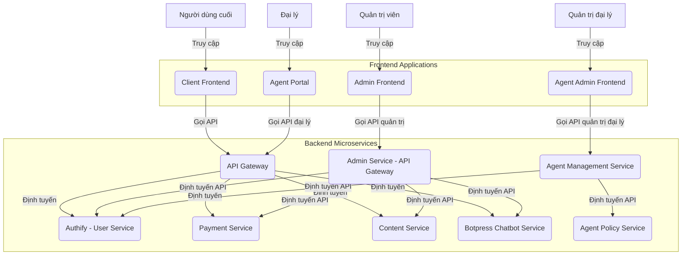

# ĐỀ BÀN DỰ ÁN: XÂY DỰNG HỆ THỐNG GIAO DIỆN QUẢN TRỊ (ADMIN FRONTEND) ĐỘC LẬP

**Tác giả:** Manus AI

**Ngày:** 19 tháng 8 năm 2025

---

## Mục lục

1.  Giới thiệu Dự án
    1.1. Bối cảnh và Động lực
    1.2. Mục tiêu Dự án
    1.3. Phạm vi Dự án

2.  Yêu cầu Kỹ thuật và Công nghệ
    2.1. Yêu cầu Chức năng
    2.2. Yêu cầu Phi chức năng
    2.3. Công nghệ Sử dụng

3.  Kiến trúc và Thiết kế Hệ thống
    3.1. Tổng quan Kiến trúc
    3.2. Thiết kế Giao diện Người dùng (UI/UX)
    3.3. Tích hợp API Backend

4.  Hạ tầng và DevOps
    4.1. Môi trường Phát triển
    4.2. CI/CD Pipeline
    4.3. Triển khai

5.  Phát triển Frontend
    5.1. Cấu trúc Dự án
    5.2. Các Module/Trang Chính
    5.3. Quản lý Trạng thái và Dữ liệu

6.  Kiểm thử và Đảm bảo Chất lượng
    6.1. Unit Testing
    6.2. Integration Testing
    6.3. End-to-End Testing

7.  Quản lý Dự án và Tài liệu hóa
    7.1. Quản lý Phiên bản
    7.2. Quản lý Vấn đề
    7.3. Tài liệu Dự án

---

## 1. Giới thiệu Dự án

### 1.1. Bối cảnh và Động lực

Trong hệ thống dịch vụ tác rời, **Admin Frontend** là bảng điều khiển trung tâm dành cho quản trị viên, cho phép họ quản lý và giám sát toàn bộ hệ thống. Với kiến trúc microservice, các chức năng quản trị được phân tán trên nhiều dịch vụ backend khác nhau (Authify, Payment Service, Content Service, Agent Policy Service, Botpress Chatbot Service). **Admin Service** đóng vai trò là một API Gateway chuyên biệt, tổng hợp các API quản trị từ các dịch vụ này. Việc xây dựng một Admin Frontend độc lập, có khả năng tích hợp linh hoạt và an toàn với Admin Service là rất quan trọng để đảm bảo tính module hóa, khả năng mở rộng và dễ dàng bảo trì cho toàn bộ hệ thống.

Động lực chính của dự án này là tạo ra một giao diện quản trị mạnh mẽ, trực quan và an toàn, cung cấp cho quản trị viên khả năng kiểm soát toàn diện hệ thống dịch vụ. Việc tách rời frontend giúp đội ngũ phát triển có thể làm việc độc lập, triển khai nhanh chóng các cập nhật giao diện mà không ảnh hưởng đến các dịch vụ backend, đồng thời chuẩn bị cho khả năng tích hợp vào một hệ thống lớn hơn hoặc hoạt động như một ứng dụng độc lập.

**Lưu ý về Kiến trúc Frontend Tổng thể:**
Hệ thống Frontend được thiết kế với 4 thành phần chính:
- **Client Frontend:** Giao diện chính cho người dùng cuối
- **Admin Frontend:** Bảng điều khiển quản trị hệ thống (quản lý người dùng)
- **Agent Portal:** Giao diện dành cho đại lý đăng ký
- **Agent Admin Frontend:** Bảng điều khiển quản trị đại lý

### 1.2. Mục tiêu Dự án

Mục tiêu tổng thể của dự án "Admin Frontend độc lập" là phát triển một ứng dụng web hoàn chỉnh, cung cấp giao diện quản trị trực quan và hiệu quả cho tất cả các dịch vụ của hệ thống. Các mục tiêu cụ thể bao gồm:

*   **Cung cấp trải nghiệm quản trị tối ưu:** Thiết kế giao diện thân thiện, dễ sử dụng, đáp ứng nhanh trên mọi thiết bị (responsive design) và hỗ trợ đa ngôn ngữ.
*   **Tích hợp liền mạch với Admin Service:** Đảm bảo Admin Frontend có thể giao tiếp hiệu quả và an toàn với Admin Service (đóng vai trò API Gateway) để quản lý người dùng, nội dung, thanh toán và xem báo cáo.
*   **Quản lý trạng thái xác thực và phân quyền:** Xử lý đăng nhập, quản lý phiên quản trị viên và đảm bảo các quyền hạn được áp dụng đúng đắn.
*   **Hiển thị và tương tác với các công cụ quản trị:** Cung cấp giao diện để quản lý người dùng, nội dung, gói dịch vụ, giá cả, và quản lý cấu hình chatbot.
*   **Quản lý Botpress Chatbot Service:** Cung cấp giao diện để cấu hình, giám sát và quản lý chatbot, bao gồm xem lịch sử cuộc hội thoại và phân tích hiệu suất.
*   **Cung cấp báo cáo và thống kê:** Hiển thị các báo cáo và thống kê tổng quan về hoạt động của hệ thống và chatbot.
*   **Đảm bảo khả năng mở rộng và bảo trì:** Áp dụng các nguyên tắc phát triển frontend hiện đại, mã nguồn sạch, dễ đọc và dễ bảo trì.
*   **Đảm bảo an toàn và bảo mật:** Áp dụng các biện pháp bảo mật cần thiết cho giao diện người dùng và các tương tác API, đặc biệt là với các chức năng quản trị nhạy cảm.

### 1.3. Phạm vi Dự án

Dự án "Admin Frontend độc lập" sẽ tập trung vào việc phát triển các thành phần cốt lõi sau:

*   **Giao diện Người dùng (UI):**
    *   **Trang Đăng nhập:** Tích hợp với Authify (thông qua Admin Service) để xử lý xác thực quản trị viên.
    *   **Dashboard:** Tổng quan về trạng thái hệ thống, các chỉ số quan trọng, thống kê chatbot.
    *   **Quản lý Người dùng:** Danh sách người dùng, tìm kiếm, xem chi tiết, cập nhật thông tin, quản lý trạng thái (kích hoạt/vô hiệu hóa), quản lý vai trò.
    *   **Quản lý Nội dung:** Danh sách các loại nội dung và mục nội dung, thêm, sửa, xóa, xuất bản, quản lý phiên bản.
    *   **Quản lý Gói Dịch vụ & Giá:** Danh sách gói dịch vụ, thêm, sửa, xóa, ẩn/hiện gói, cập nhật giá dịch vụ.
    *   **Quản lý Botpress Chatbot:** Cấu hình chatbot, xem lịch sử cuộc hội thoại, phân tích hiệu suất, quản lý bot flows và intents.
    *   **Báo cáo & Thống kê:** Báo cáo sử dụng dịch vụ, thống kê doanh thu, số lượt tương tác chatbot, lịch sử giao dịch tài chính.
    *   **Hỗ trợ đa ngôn ngữ:** Chuyển đổi ngôn ngữ giao diện.

*   **Tích hợp API Backend:**
    *   **Admin Service:** Là điểm tương tác chính, Admin Frontend sẽ gọi các API của Admin Service để thực hiện tất cả các tác vụ quản trị. Admin Service sẽ chịu trách nhiệm điều phối các yêu cầu đến các microservice backend khác (Authify, Payment Service, Content Service, Agent Policy Service).

*   **Xử lý Trạng thái và Dữ liệu:**
    *   Quản lý trạng thái ứng dụng (loading, error, success).
    *   Xử lý lỗi từ API và hiển thị thông báo thân thiện cho quản trị viên.
    *   Quản lý phiên quản trị viên (JWT).

*   **Infrastructure & DevOps:**
    *   Container hóa ứng dụng frontend bằng Docker.
    *   Thiết lập môi trường phát triển cục bộ bằng Docker Compose.
    *   Xây dựng quy trình CI/CD cơ bản (ví dụ: GitHub Actions) cho việc kiểm thử và đóng gói ứng dụng.

**Các tính năng nằm ngoài phạm vi của dự án này (nhưng có thể là các giai đoạn phát triển tiếp theo):**

*   Client Frontend.
*   Agent Portal (có thể là một phần của Admin Frontend hoặc tách riêng).
*   Hệ thống thông báo đẩy (push notifications) cho quản trị viên.
*   Quản lý cấu hình hệ thống toàn cục phức tạp.

## 2. Yêu cầu Kỹ thuật và Công nghệ

### 2.1. Yêu cầu Chức năng

Các yêu cầu chức năng mô tả những gì Admin Frontend phải làm để đáp ứng mục tiêu của dự án:

*   **Xác thực Quản trị viên:**
    *   Cho phép quản trị viên đăng nhập bằng tài khoản đã có.
    *   Cho phép quản trị viên đăng xuất.
    *   Hiển thị thông tin hồ sơ quản trị viên và cho phép cập nhật (nếu có).
*   **Quản lý Người dùng:**
    *   Hiển thị danh sách người dùng, hỗ trợ tìm kiếm, lọc, phân trang.
    *   Xem chi tiết hồ sơ người dùng.
    *   Cập nhật thông tin người dùng (tên, email, trạng thái).
    *   Quản lý vai trò người dùng (user, admin, agent).
    *   Kích hoạt/vô hiệu hóa tài khoản người dùng.
*   **Quản lý Nội dung:**
    *   Hiển thị danh sách các loại nội dung và mục nội dung.
    *   Tạo, cập nhật, xóa loại nội dung và mục nội dung.
    *   Xuất bản/bỏ xuất bản nội dung.
    *   Xem lịch sử phiên bản và khôi phục nội dung.
    *   Tích hợp trình soạn thảo văn bản phong phú (Rich Text Editor) cho nội dung.
*   **Quản lý Gói Dịch vụ và Giá:**
    *   Hiển thị danh sách các gói dịch vụ và giá dịch vụ.
    *   Tạo, cập nhật, xóa, ẩn/hiện các gói dịch vụ.
    *   Cập nhật giá dịch vụ cho các tính năng khác nhau.
*   **Quản lý Botpress Chatbot:**
    *   Cấu hình chatbot (bot flows, intents, entities).
    *   Xem và quản lý lịch sử cuộc hội thoại.
    *   Phân tích hiệu suất chatbot (tỷ lệ phản hồi thành công, thời gian phản hồi).
    *   Quản lý knowledge base và training data.
    *   Cập nhật cấu hình chatbot và deploy các thay đổi.
*   **Báo cáo và Thống kê:**
    *   Hiển thị báo cáo chi tiết việc sử dụng dịch vụ của một người dùng (số lượt tương tác, giao dịch).
    *   Hiển thị thống kê tổng quan về doanh thu, số lượng người dùng, số lượt tương tác chatbot.
    *   Hiển thị lịch sử giao dịch tài chính và thống kê sử dụng chatbot.
*   **Đa ngôn ngữ:**
    *   Giao diện người dùng phải hỗ trợ ít nhất hai ngôn ngữ (ví dụ: Tiếng Việt và Tiếng Anh).
    *   Quản trị viên có thể dễ dàng chuyển đổi ngôn ngữ.

### 2.2. Yêu cầu Phi chức năng

Các yêu cầu phi chức năng mô tả cách Admin Frontend hoạt động, bao gồm các khía cạnh về chất lượng, hiệu suất, bảo mật, và khả năng bảo trì:

*   **Hiệu suất:**
    *   Thời gian tải trang ban đầu nhanh (dưới 2 giây).
    *   Thời gian phản hồi của giao diện người dùng mượt mà, không giật lag.
    *   Tối ưu hóa hình ảnh và tài nguyên để giảm thiểu thời gian tải.
*   **Khả năng mở rộng:**
    *   Kiến trúc module hóa, dễ dàng thêm các tính năng hoặc trang quản trị mới.
    *   Có khả năng mở rộng để hỗ trợ nhiều quản trị viên đồng thời.
*   **Bảo mật:**
    *   Tất cả các giao tiếp với backend phải được mã hóa bằng HTTPS/SSL.
    *   Xử lý JWT an toàn (ví dụ: lưu trữ trong HttpOnly cookies).
    *   Chống lại các cuộc tấn công phổ biến như XSS, CSRF.
    *   Không lưu trữ thông tin nhạy cảm của quản trị viên ở phía client.
    *   Đảm bảo các quyền hạn được áp dụng đúng đắn trên giao diện.
*   **Khả năng sử dụng (Usability):**
    *   Giao diện trực quan, dễ hiểu và dễ thao tác cho quản trị viên.
    *   Thông báo lỗi rõ ràng, thân thiện và hướng dẫn quản trị viên cách khắc phục.
    *   Thiết kế responsive, tương thích tốt trên các thiết bị desktop, tablet và mobile.
*   **Khả năng bảo trì:**
    *   Mã nguồn phải sạch, dễ đọc, tuân thủ các tiêu chuẩn mã hóa và có tài liệu hóa đầy đủ.
    *   Sử dụng các thư viện và framework phổ biến, có cộng đồng hỗ trợ lớn.
    *   Dễ dàng triển khai và cập nhật.
*   **Khả năng chịu lỗi (Fault Tolerance):**
    *   Xử lý các lỗi từ API backend một cách gracefully, hiển thị thông báo phù hợp thay vì crash.
    *   Có cơ chế retry cho các yêu cầu API thất bại tạm thời.
*   **Khả năng tương thích:**
    *   Hoạt động tốt trên các trình duyệt web phổ biến (Chrome, Firefox, Edge, Safari) và các phiên bản mới nhất.

### 2.3. Công nghệ Sử dụng

Để xây dựng Admin Frontend độc lập, các công nghệ sau đây được đề xuất:

*   **Frontend Framework:** Next.js 14+ (để xây dựng ứng dụng React SSR/SSG, tối ưu SEO và hiệu suất).
*   **Thư viện UI:** React 18+
*   **Ngôn ngữ:** TypeScript (để tăng cường tính an toàn và khả năng bảo trì của mã nguồn).
*   **CSS Framework:** Tailwind CSS (để xây dựng giao diện nhanh chóng và responsive).
*   **Quản lý trạng thái:** React Context API, Zustand hoặc Redux Toolkit (tùy thuộc vào độ phức tạp và quy mô).
*   **HTTP Client:** Axios hoặc Fetch API (để gọi các API backend).
*   **Thư viện đa ngôn ngữ:** `react-i18next` hoặc tương tự.
*   **Thư viện biểu đồ/đồ thị:** `Chart.js` hoặc `Recharts` (cho các báo cáo và thống kê).
*   **Form Management:** `React Hook Form` hoặc `Formik` (để quản lý form hiệu quả).
*   **Validation:** `Zod` hoặc `Yup` (để validate dữ liệu đầu vào).
*   **Trình soạn thảo Rich Text:** `React-Quill` hoặc `TinyMCE React`.
*   **DevOps & Hạ tầng:**
    *   **Containerization:** Docker (để đóng gói ứng dụng và môi trường).
    *   **Môi trường phát triển cục bộ:** Docker Compose (để chạy frontend và các dịch vụ backend phụ thuộc).
    *   **CI/CD:** GitHub Actions (để tự động hóa kiểm thử và triển khai).
*   **Công cụ chất lượng mã nguồn:**
    *   ESLint (linter).
    *   Prettier (code formatter).
    *   Husky/lint-staged (pre-commit hooks).

## 3. Kiến trúc và Thiết kế Hệ thống

### 3.1. Tổng quan Kiến trúc

Admin Frontend sẽ là một ứng dụng web độc lập, tương tác chủ yếu với **Admin Service** (đóng vai trò là một API Gateway chuyên biệt cho các tác vụ quản trị) để truy cập các chức năng quản trị từ các microservice backend khác. Nó sẽ không có database riêng mà chỉ quản lý trạng thái cục bộ và phiên quản trị viên. Sơ đồ kiến trúc tổng quan như sau:

**Mô tả các thành phần chính và mối liên kết:**

*   **Client Frontend:** Giao diện chính cho người dùng cuối, tương tác với chatbot và các dịch vụ thông qua API Gateway.
*   **Admin Frontend:** Ứng dụng web chính mà quản trị viên tương tác để quản lý người dùng và hệ thống. Nó sẽ gửi các yêu cầu API đến Admin Service và hiển thị dữ liệu trả về.
*   **Agent Portal:** Giao diện dành cho đại lý để đăng ký và quản lý hoạt động của họ.
*   **Agent Admin Frontend:** Bảng điều khiển chuyên biệt để quản trị đại lý, tương tác với Agent Management Service.
*   **Admin Service:** Là điểm tương tác chính cho Admin Frontend. Nó đóng vai trò là một API Gateway chuyên biệt, tổng hợp các API quản trị từ các dịch vụ khác và xử lý xác thực/phân quyền cho các yêu cầu từ Admin Frontend.
*   **Authify (User Service):** Cung cấp các API cho việc xác thực quản trị viên (đăng nhập, JWT) và quản lý người dùng cuối.
*   **Payment Service:** Cung cấp các API để quản lý gói dịch vụ, giá cả, và lấy các báo cáo tài chính/sử dụng.
*   **Content Service:** Cung cấp các API để quản lý nội dung tĩnh của website.
*   **Botpress Chatbot Service:** Cung cấp các API để quản lý chatbot, cấu hình bot flows, xem lịch sử cuộc hội thoại và phân tích hiệu suất.
*   **Agent Policy Service:** Cung cấp các API để quản lý chương trình đại lý và chính sách hoa hồng.
*   **Agent Management Service:** Dịch vụ chuyên biệt để quản lý danh sách đại lý và các hoạt động liên quan.

**Luồng tương tác chính (ví dụ: Quản trị viên xem danh sách người dùng):**

1.  Quản trị viên đăng nhập vào Admin Frontend (thông qua Admin Service, sau đó Admin Service gọi Authify để xác thực).
2.  Admin Frontend gửi yêu cầu xem danh sách người dùng đến **Admin Service** (kèm theo JWT).
3.  Admin Service nhận yêu cầu, xác thực và phân quyền.
4.  Admin Service gọi API `GET /api/v1/admin/users` của **Authify**.
5.  Authify trả về danh sách người dùng cho Admin Service.
6.  Admin Service trả về danh sách người dùng cho Admin Frontend.
7.  Admin Frontend hiển thị danh sách người dùng cho quản trị viên.

**Luồng tương tác với Botpress Chatbot (ví dụ: Quản trị viên xem thống kê chatbot):**

1.  Quản trị viên truy cập trang quản lý chatbot trong Admin Frontend.
2.  Admin Frontend gửi yêu cầu lấy thống kê chatbot đến **Admin Service**.
3.  Admin Service gọi API `GET /api/v1/chatbot/analytics` của **Botpress Chatbot Service**.
4.  Botpress Service trả về dữ liệu thống kê (số cuộc hội thoại, tỷ lệ phản hồi thành công, etc.).
5.  Admin Service trả về dữ liệu cho Admin Frontend.
6.  Admin Frontend hiển thị biểu đồ và thống kê chatbot cho quản trị viên.

### 3.2. Thiết kế Giao diện Người dùng (UI/UX)

Thiết kế UI/UX sẽ tập trung vào sự rõ ràng, hiệu quả và an toàn cho các tác vụ quản trị. Sử dụng một hệ thống thiết kế (Design System) nhất quán để đảm bảo tính đồng bộ trên toàn ứng dụng. Chú trọng vào:

*   **Layout:** Responsive layout, sử dụng Flexbox/Grid để đảm bảo hiển thị tốt trên mọi kích thước màn hình. Có sidebar điều hướng rõ ràng.
*   **Typography:** Lựa chọn font chữ dễ đọc, kích thước phù hợp cho các bảng dữ liệu và form.
*   **Color Palette:** Sử dụng bảng màu chuyên nghiệp, có sự phân biệt rõ ràng giữa các trạng thái (thành công, lỗi, cảnh báo).
*   **Components:** Xây dựng các component UI tái sử dụng (tables, forms, modals, charts, navigation, alerts) để tăng tốc độ phát triển và đảm bảo tính nhất quán.
*   **Feedback:** Cung cấp phản hồi rõ ràng cho quản trị viên (loading states, error messages, success notifications, confirmation dialogs).
*   **Accessibility:** Đảm bảo ứng dụng có thể truy cập được bởi người dùng khuyết tật (ví dụ: sử dụng ARIA attributes).

### 3.3. Tích hợp API Backend

Admin Frontend sẽ tương tác với **Admin Service** thông qua các API RESTful. Admin Service sẽ đóng vai trò là cầu nối duy nhất giữa Admin Frontend và các microservice backend khác. Để quản lý việc gọi API hiệu quả, cần:

*   **Tạo các API Client:** Xây dựng một module hoặc class chính để tương tác với Admin Service (ví dụ: `AdminApiClient`). Module này sẽ chứa các phương thức gọi đến các endpoint của Admin Service, bao gồm các API để quản lý người dùng, nội dung, thanh toán, đại lý, và báo cáo.
*   **Xử lý xác thực:** Gửi JWT trong header `Authorization` cho tất cả các yêu cầu API đến Admin Service. Admin Service sẽ chịu trách nhiệm xác thực và phân quyền cho các yêu cầu này.
*   **Xử lý lỗi:** Bắt các lỗi từ API (ví dụ: 4xx, 5xx) trả về từ Admin Service và hiển thị thông báo lỗi phù hợp, có thể kèm theo hướng dẫn khắc phục cho quản trị viên.
*   **Caching (tùy chọn):** Sử dụng caching cho các dữ liệu ít thay đổi (ví dụ: danh sách loại nội dung, cấu hình hệ thống) để cải thiện hiệu suất và giảm tải cho Admin Service.

## 4. Hạ tầng và DevOps

### 4.1. Môi trường Phát triển

*   **Node.js:** Cài đặt Node.js và npm/yarn để chạy Next.js.
*   **Docker:** Admin Frontend sẽ được đóng gói thành Docker image.
*   **Docker Compose:** Sử dụng file `docker-compose.yml` để định nghĩa và khởi chạy toàn bộ môi trường phát triển cục bộ (Admin Frontend và Admin Service, cùng với các dịch vụ backend phụ thuộc như Authify, Payment Service, Content Service, Agent Policy Service) bằng một lệnh duy nhất.

### 4.2. CI/CD Pipeline

*   **Nền tảng:** GitHub Actions.
*   **Quy trình:** Tự động kích hoạt khi có push code hoặc tạo Pull Request.
    1.  **Build:** Cài đặt dependencies, chạy linter, chạy test.
    2.  **Test:** Chạy unit tests, integration tests.
    3.  **Build Docker Image:** Đóng gói ứng dụng thành Docker image.
    4.  **Deploy (staging/production):** Triển khai Docker image lên môi trường staging hoặc production.

### 4.3. Triển khai

*   **Nền tảng:** Có thể triển khai trên các nền tảng hosting Next.js như Vercel, Netlify, hoặc trên các máy chủ/Kubernetes cluster sử dụng Docker image.
*   **Cấu hình môi trường:** Quản lý các biến môi trường (API URLs, keys) một cách an toàn.

## 5. Phát triển Frontend

### 5.1. Cấu trúc Dự án

Cấu trúc dự án sẽ tuân theo các nguyên tắc của Next.js và React, với sự phân chia rõ ràng các thư mục:

*   `pages/`: Chứa các trang (routes) của ứng dụng.
*   `components/`: Chứa các component UI tái sử dụng.
*   `layouts/`: Chứa các layout chung cho các trang.
*   `hooks/`: Chứa các custom React hooks.
*   `styles/`: Chứa các file CSS/SCSS toàn cục.
*   `lib/` hoặc `utils/`: Chứa các hàm tiện ích, API clients.
*   `public/`: Chứa các tài sản tĩnh (hình ảnh, fonts).

### 5.2. Các Module/Trang Chính

*   **Auth Module:** Xử lý đăng nhập, đăng xuất, quản lý JWT.
*   **User Management Module:** Trang quản lý người dùng.
*   **Content Management Module:** Trang quản lý nội dung.
*   **Service Management Module:** Trang quản lý gói dịch vụ và giá.
*   **Chatbot Management Module:** Trang quản lý Botpress Chatbot, cấu hình bot flows và phân tích hiệu suất.
*   **Reporting Module:** Trang báo cáo và thống kê, bao gồm thống kê chatbot.

### 5.3. Quản lý Trạng thái và Dữ liệu

*   **Global State:** Sử dụng React Context API hoặc Zustand để quản lý trạng thái toàn cục (thông tin quản trị viên, ngôn ngữ).
*   **Local State:** Sử dụng `useState` và `useReducer` cho trạng thái cục bộ của các component.
*   **Data Fetching:** Sử dụng `SWR` hoặc `React Query` để quản lý việc lấy dữ liệu từ API, bao gồm caching, revalidation, và error handling.

## 6. Kiểm thử và Đảm bảo Chất lượng

### 6.1. Unit Testing

*   **Framework:** Jest và React Testing Library.
*   **Phạm vi:** Kiểm thử các component UI, hooks, và các hàm tiện ích một cách độc lập.

### 6.2. Integration Testing

*   **Framework:** Jest và React Testing Library.
*   **Phạm vi:** Kiểm thử sự tương tác giữa các component và các module (ví dụ: form submission, navigation).

### 6.3. End-to-End Testing

*   **Framework:** Cypress hoặc Playwright.
*   **Phạm vi:** Kiểm thử các luồng người dùng hoàn chỉnh từ đầu đến cuối (ví dụ: đăng nhập, tạo người dùng, xem báo cáo).

## 7. Quản lý Dự án và Tài liệu hóa

### 7.1. Quản lý Phiên bản

*   **Hệ thống:** Git.
*   **Nền tảng:** GitHub.
*   **Quy trình:** Sử dụng Git Flow hoặc GitHub Flow để quản lý các nhánh và phiên bản.

### 7.2. Quản lý Vấn đề

*   **Công cụ:** GitHub Issues hoặc Jira.
*   **Quy trình:** Theo dõi các bug, yêu cầu tính năng và tiến độ công việc.

### 7.3. Tài liệu Dự án

*   **Tài liệu mã nguồn:** Sử dụng JSDoc hoặc TSDoc để bình luận mã nguồn.
*   **Tài liệu kiến trúc:** Duy trì tài liệu này và các sơ đồ liên quan.
*   **Hướng dẫn sử dụng:** Tạo tài liệu hướng dẫn cho quản trị viên (nếu cần).

