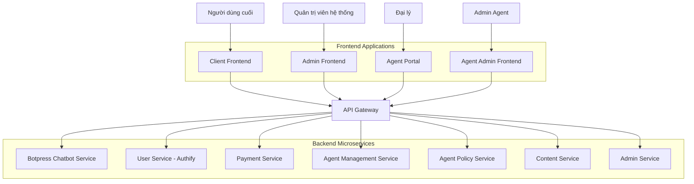

# ĐỀ BÀI DỰ ÁN: XÂY DỰNG HỆ THỐNG DỊCH VỤ TÍCH HỢP "BOTPRESS CHATBOT PLATFORM" (PHIÊN BẢN CẬP NHẬT)

**Tác giả:** Manus AI

**Ngày cập nhật:** 30 tháng 8 năm 2025

---

## 1. Giới thiệu và Mục tiêu Dự án

Xây dựng một hệ thống ứng dụng web hoàn chỉnh mang tên "Botpress Chatbot Platform", cung cấp các dịch vụ tiện ích bao gồm **dịch vụ chatbot thông minh**, quản lý thanh toán, quản lý nội dung, và **hệ thống chính sách đại lý**. Hệ thống được thiết kế theo kiến trúc microservices để đảm bảo khả năng mở rộng, bảo trì và triển khai độc lập từng thành phần.

**Mục tiêu chính:**

*   **Cung cấp giá trị cho người dùng cuối:** Tạo ra một nền tảng đáng tin cậy cho việc tương tác với chatbot thông minh, quản lý tài chính cá nhân liên quan đến dịch vụ và truy cập nội dung hỗ trợ.
*   **Xây dựng nền tảng kỹ thuật vững chắc:** Áp dụng các công nghệ và phương pháp hiện đại (Docker, Kubernetes, CI/CD, Microservices) để tạo ra một hệ thống mạnh mẽ, an toàn và có khả năng mở rộng.
*   **Đảm bảo trải nghiệm người dùng mượt mà:** Phát triển giao diện người dùng (cả cho khách hàng và quản trị viên) thân thiện, đáp ứng nhanh và hỗ trợ đa ngôn ngữ.
*   **Mở rộng mạng lưới thông qua chương trình đại lý:** Xây dựng hệ thống chính sách đại lý để khuyến khích và quản lý các đối tác, tạo động lực phát triển kinh doanh thông qua mô hình hoa hồng minh bạch và tự động.

## 2. Phạm vi và Yêu cầu Tổng thể

Dự án sẽ được chia thành các phân hệ (services) chính, mỗi phân hệ có chức năng riêng biệt và giao tiếp với nhau qua API và Message Broker.

**Backend Services (FastAPI, Python):**

*   **User Service (Authify):** Quản lý toàn bộ vòng đời của người dùng, bao gồm đăng ký, đăng nhập (truyền thống và qua mạng xã hội), quản lý hồ sơ và phân quyền. Hỗ trợ xác thực đa yếu tố (MFA) và quản lý vai trò người dùng bao gồm cả vai trò đại lý.
*   **Payment Service:** Xử lý các giao dịch tài chính, tích hợp với các cổng thanh toán (VNPAY, MoMo), quản lý số dư và lịch sử thanh toán. Hỗ trợ thanh toán hoa hồng cho đại lý và cung cấp webhook/event để thông báo giao dịch thành công cho các dịch vụ khác.
*   **Botpress Chatbot Service:** **[CHÍNH]** Cung cấp chức năng chatbot thông minh sử dụng Botpress v12, hỗ trợ tương tác tự nhiên với người dùng, xử lý các câu hỏi phức tạp và cung cấp hỗ trợ khách hàng 24/7. Đây là service cốt lõi tích hợp với User Service và Payment Service để xử lý xác thực và tính phí theo lượt tương tác.
*   **Agent Management Service:** **[MỚI]** Quản lý toàn bộ thông tin và hoạt động của các đại lý trong hệ thống, bao gồm đăng ký, phê duyệt, theo dõi hiệu suất và quản lý phân cấp đại lý.
*   **Content Service:** Quản lý các nội dung tĩnh của website (trang giới thiệu, FAQ, chính sách) và hỗ trợ đa ngôn ngữ. Cung cấp API công khai và API quản trị.
*   **Agent Policy Service:** Quản lý chương trình đại lý, bao gồm đăng ký đại lý, định nghĩa chính sách hoa hồng, tính toán và thanh toán hoa hồng tự động dựa trên việc giới thiệu khách hàng sử dụng dịch vụ chatbot. Tích hợp chặt chẽ với User Service và Payment Service để theo dõi giao dịch và thực hiện thanh toán.
*   **Admin Service:** Cung cấp các API cho phép quản trị viên quản lý toàn bộ hệ thống (người dùng, nội dung, thanh toán, chatbot, xem báo cáo). Hoạt động như một lớp API Gateway cho các tác vụ quản trị.

**Frontend Applications (Next.js, React):**

*   **Client Frontend:** Giao diện chính cho người dùng cuối, nơi họ tương tác với dịch vụ chatbot và các tính năng khác của nền tảng.
*   **Admin Frontend:** Bảng điều khiển dành riêng cho quản trị viên hệ thống để quản lý người dùng, nội dung và cấu hình hệ thống. **Lưu ý:** Admin Frontend chỉ quản lý người dùng, không quản lý đại lý.
*   **Agent Portal:** Giao diện dành cho đại lý để đăng ký, xem báo cáo hoa hồng từ việc giới thiệu khách hàng sử dụng dịch vụ chatbot, và yêu cầu thanh toán.
*   **Agent Admin Frontend:** **[MỚI]** Giao diện quản trị dành riêng cho quản lý đại lý, cho phép Admin Agent phê duyệt đăng ký đại lý, quản lý phân cấp đại lý, theo dõi hiệu suất và cấu hình chính sách hoa hồng.

**Infrastructure & DevOps:**

*   Toàn bộ hệ thống phải được "container hóa" bằng Docker.
*   Xây dựng quy trình CI/CD tự động hóa (sử dụng GitHub Actions) cho việc kiểm thử, đóng gói và triển khai.
*   Sử dụng API Gateway (Traefik) để quản lý định tuyến, bảo mật và cân bằng tải.
*   Thiết lập hệ thống giám sát (Monitoring) và ghi log tập trung (Prometheus, Grafana, ELK Stack).
*   **Triển khai cơ chế truyền thông bất đồng bộ (Message Broker/Event Bus)** để xử lý các sự kiện quan trọng giữa các dịch vụ, đặc biệt là thông báo tương tác chatbot thành công từ Botpress Service đến Agent Policy Service.
*   Hệ thống phải được thiết kế để sẵn sàng triển khai trên môi trường Production (Kubernetes).

## 3. Các Giai đoạn Phát triển Chính (Phases)

Dự án được đề xuất thực hiện qua các giai đoạn sau:

*   **Phase 1: Infrastructure và DevOps Foundation:** Thiết lập toàn bộ nền tảng hạ tầng, môi trường phát triển, CI/CD, API Gateway và hệ thống giám sát. Đây là giai đoạn nền móng cho toàn bộ dự án.
*   **Phase 2 & 3: Core Services Development (User & Payment):** Tập trung phát triển hai dịch vụ cốt lõi là quản lý người dùng và thanh toán.
*   **Phase 4: Botpress Chatbot Service Development:** **[CHÍNH]** Phát triển dịch vụ chatbot sử dụng Botpress v12, tích hợp với User Service và Payment Service để xử lý xác thực và tính phí.
*   **Phase 5: Content Service Development:** Phát triển dịch vụ quản lý nội dung để hỗ trợ thông tin và FAQ cho chatbot.
*   **Phase 6: Agent Management Service Development:** **[MỚI]** Phát triển dịch vụ quản lý đại lý độc lập.
*   **Phase 7: Agent Policy Service Development:** Phát triển dịch vụ chính sách đại lý, tích hợp với Botpress Service để tính hoa hồng dựa trên tương tác chatbot.
*   **Phase 8: Frontend Development:** Xây dựng 4 giao diện frontend (Client Frontend, Admin Frontend, Agent Portal, Agent Admin Frontend), tích hợp với các API đã hoàn thiện.
*   **Phase 9: Admin System Integration:** Tích hợp hệ thống quản trị với tất cả các dịch vụ backend.
*   **Phase 10: Testing và Quality Assurance:** Thực hiện kiểm thử toàn diện (Unit, Integration, E2E) để đảm bảo chất lượng.
*   **Phase 11 & 12: Deployment và Maintenance:** Triển khai ứng dụng lên môi trường production, thiết lập kế hoạch vận hành và bảo trì.

## 4. Yêu cầu Kỹ thuật Chi tiết

**Công nghệ:**

*   **Backend:** Python 3.11+, FastAPI, SQLAlchemy.
*   **Chatbot:** Botpress v12, Node.js (cho Botpress runtime).
*   **Frontend:** Next.js 14+, React 18+, TypeScript, Tailwind CSS.
*   **Database:** PostgreSQL, Redis.
*   **DevOps:** Docker, Docker Compose, GitHub Actions, Kubernetes, Traefik, Prometheus, Grafana, ELK Stack.
*   **Message Broker:** Apache Kafka hoặc RabbitMQ (để hỗ trợ truyền thông bất đồng bộ giữa các dịch vụ, đặc biệt là Botpress Service và Agent Policy Service).

**Chất lượng Code:** Áp dụng các công cụ (Black, Flake8, MyPy, Pre-commit) để đảm bảo code sạch, nhất quán và dễ bảo trì.

**Bảo mật:**

*   Xác thực người dùng bằng JWT. Hỗ trợ OAuth2 với Google và Facebook.
*   Mật khẩu phải được hash.
*   Triển khai SSL/TLS cho tất cả các kết nối.
*   Thiết lập Rate Limiting và quét lỗ hổng bảo mật.
*   **Cơ chế ủy quyền (Authorization) liên dịch vụ:** Cần có một chiến lược rõ ràng để các dịch vụ backend xác minh quyền của các dịch vụ khác khi gọi API nội bộ (ví dụ: sử dụng token nội bộ hoặc kiểm tra vai trò chi tiết).
*   **Bảo mật Chatbot:** Đảm bảo các cuộc hội thoại được mã hóa và tuân thủ quy định bảo vệ dữ liệu cá nhân.

**Kiểm thử:** Tỷ lệ bao phủ của Unit Test cho backend phải đạt tối thiểu 80%. CI/CD pipeline phải tự động chạy test và từ chối merge nếu có lỗi hoặc tỷ lệ bao phủ giảm.

**Tài liệu:** Toàn bộ dự án phải có tài liệu hóa rõ ràng, bao gồm:

*   Tài liệu thiết kế kiến trúc (ADR).
*   Đặc tả API (OpenAPI/Swagger) chi tiết cho từng dịch vụ.
*   Sơ đồ cơ sở dữ liệu (ERD).
*   Hướng dẫn cài đặt, triển khai và vận hành.
*   **Tài liệu về cấu hình và quản lý Botpress chatbot.**
*   **Tài liệu về cơ chế truyền thông bất đồng bộ và xử lý sự kiện.**

## 5. Kiến trúc Frontend Mới (4 Thành phần)

Hệ thống frontend được thiết kế với 4 thành phần độc lập:

**Phân chia trách nhiệm:**

*   **Client Frontend:** Giao diện chính cho người dùng cuối tương tác với chatbot và các dịch vụ.
*   **Admin Frontend:** Quản lý người dùng, nội dung hệ thống và cấu hình chung. **Không quản lý đại lý.**
*   **Agent Portal:** Giao diện cho đại lý đăng ký, xem báo cáo hoa hồng và quản lý hoạt động cá nhân.
*   **Agent Admin Frontend:** Giao diện quản trị đại lý, cho phép Admin Agent quản lý tất cả đại lý, phê duyệt đăng ký và cấu hình chính sách.

## 6. Tiêu chí Hoàn thành (Definition of Done)

Dự án được xem là hoàn thành khi tất cả các yêu cầu trong đề bài này được đáp ứng, bao gồm:

*   Tất cả các service và 4 ứng dụng frontend đã được phát triển và hoạt động đúng chức năng.
*   Botpress Chatbot Service hoạt động ổn định và tích hợp thành công với các dịch vụ khác.
*   Hệ thống CI/CD hoạt động tự động và ổn định.
*   Hệ thống giám sát và logging đã được thiết lập và cung cấp thông tin hữu ích.
*   Toàn bộ hệ thống đã được triển khai thành công trên môi trường staging/production mô phỏng.
*   Tất cả các loại kiểm thử (Unit, Integration, E2E) đều pass.
*   Tài liệu dự án đầy đủ và được cập nhật.
*   4 thành phần frontend hoạt động độc lập và tích hợp thành công với backend services.
*   Phân quyền rõ ràng giữa Admin Frontend (quản lý người dùng) và Agent Admin Frontend (quản lý đại lý).

