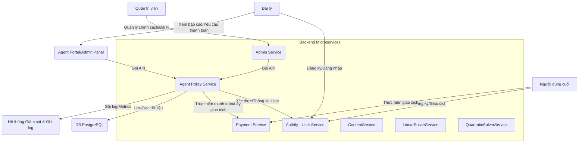

# Báo cáo Phân tích Khả năng Tích hợp Hệ thống

**Tác giả:** Manus AI

**Ngày:** 30 tháng 8 năm 2025

---

## 1. Giới thiệu

Báo cáo này trình bày kết quả phân tích các tài liệu thiết kế hệ thống được cung cấp, bao gồm:

*   Hệ thống Dịch vụ Nội dung (Content Service)
*   Hệ thống Dịch vụ Quản trị (Admin Service)
*   Hệ thống Dịch vụ Thanh toán (Payment Service)
*   Hệ thống Dịch vụ Chatbot Botpress (Botpress Chatbot Service)
*   Hệ thống Quản lý Đại lý (Agent Management Service)
*   Hệ thống Quản lý Người dùng (Authify)

Mục tiêu của báo cáo là đánh giá mức độ khả thi và hiệu quả của việc tích hợp các hệ thống này với nhau dựa trên các giáo trình đã được cung cấp, đồng thời đưa ra nhận xét về tính đầy đủ của giáo trình cho mục đích tích hợp hệ thống.

## 2. Tổng quan về các Hệ thống

### 2.1. Hệ thống Quản lý Người dùng (Authify)

Authify là dịch vụ quản lý người dùng cốt lõi, chịu trách nhiệm về xác thực và phân quyền. Nó cung cấp các API cho phép đăng ký, đăng nhập (bao gồm cả OAuth2 và MFA), quản lý hồ sơ người dùng, và quản lý vai trò. Authify sử dụng JWT để quản lý phiên và RBAC để phân quyền. Đây là nền tảng xác thực cho toàn bộ hệ thống.

### 2.2. Hệ thống Dịch vụ Thanh toán (Payment Service)

Payment Service quản lý tất cả các giao dịch tài chính, bao gồm nạp tiền (qua cổng thanh toán hoặc chuyển khoản thủ công), rút tiền, và quản lý số dư tài khoản người dùng. Nó cũng cung cấp API để xem lịch sử giao dịch và báo cáo sử dụng dịch vụ. Payment Service tương tác với các cổng thanh toán bên thứ ba và lưu trữ dữ liệu giao dịch trong PostgreSQL.

### 2.3. Hệ thống Dịch vụ Nội dung (Content Service)

Content Service chuyên biệt hóa việc lưu trữ, quản lý và phân phối các nội dung tĩnh của website (ví dụ: trang giới thiệu, FAQ, chính sách). Nó hỗ trợ đa ngôn ngữ và quản lý phiên bản nội dung. Content Service cung cấp cả API công khai cho người dùng cuối và API quản trị (yêu cầu xác thực Admin) để quản lý nội dung.

### 2.4. Hệ thống Dịch vụ Chatbot Botpress (Botpress Chatbot Service)

Botpress Chatbot Service là dịch vụ cốt lõi cung cấp chức năng chatbot thông minh sử dụng Botpress v12. Dịch vụ này hỗ trợ tương tác tự nhiên với người dùng, xử lý các câu hỏi phức tạp và cung cấp hỗ trợ khách hàng 24/7. Nó lưu trữ lịch sử tương tác của người dùng và tích hợp với Authify để xác thực người dùng, cũng như Payment Service để xử lý tính phí theo lượt tương tác.

### 2.5. Hệ thống Quản lý Đại lý (Agent Management Service)

Agent Management Service là dịch vụ mới quản lý toàn bộ thông tin và hoạt động của các đại lý trong hệ thống, bao gồm đăng ký, phê duyệt, theo dõi hiệu suất và quản lý phân cấp đại lý. Dịch vụ này tích hợp với Authify để quản lý vai trò đại lý và với Agent Policy Service để theo dõi hiệu suất hoa hồng.

### 2.6. Hệ thống Dịch vụ Quản trị (Admin Service)

Admin Service đóng vai trò là một lớp API Gateway chuyên biệt cho các tác vụ quản trị. Nó tổng hợp các chức năng quản lý từ các microservice khác (Authify, Payment Service, Content Service) và cung cấp một bộ API thống nhất cho Admin Frontend. Admin Service không có database riêng cho dữ liệu nghiệp vụ mà sẽ điều phối các yêu cầu đến các dịch vụ backend chuyên biệt.

## 3. Phân tích Khả năng Tích hợp giữa các Hệ thống

Dựa trên các tài liệu đã phân tích, các hệ thống được thiết kế với kiến trúc microservice và có nhiều điểm tích hợp rõ ràng. Dưới đây là phân tích chi tiết về các điểm tích hợp và mức độ nhất quán:

### 3.1. Tích hợp với Authify (Hệ thống Quản lý Người dùng)

Authify được thiết kế như một dịch vụ quản lý người dùng trung tâm, cung cấp cơ chế xác thực và phân quyền cho toàn bộ hệ thống. Đây là một điểm tích hợp quan trọng và nhất quán trên tất cả các dịch vụ:

*   **Content Service:** Là dịch vụ quản lý nội dung tĩnh (FAQ, Privacy Policy, Terms of Service, v.v.), yêu cầu xác thực Admin thông qua Authify cho các API quản trị nội dung. Cụ thể, khi quản trị viên muốn thêm, sửa, xóa nội dung thông qua Admin Service, Content Service sẽ xác minh quyền Admin thông qua JWT từ Authify.
*   **Admin Service:** Là một trong những người dùng chính của Authify. Admin Service sẽ gọi API của Authify để xác thực JWT và kiểm tra vai trò của người dùng khi xử lý các yêu cầu quản trị liên quan đến người dùng, nội dung, và thanh toán. Nó cũng sẽ sử dụng Authify để quản lý người dùng (xem, tìm kiếm, sửa đổi thông tin, quản lý trạng thái, quản lý vai trò).
*   **Payment Service:** Mặc dù tài liệu không nêu rõ Payment Service sẽ tích hợp trực tiếp với Authify để xác thực người dùng cuối khi thực hiện giao dịch, nhưng nó có bảng `users_balance` liên kết với `user_id` (UUID) từ một User Service khác. Điều này ngụ ý rằng Payment Service sẽ nhận `user_id` từ Authify hoặc một dịch vụ trung gian đã xác thực người dùng. Đối với các API quản trị của Payment Service, Admin Service sẽ là bên gọi, và Admin Service đã được xác thực bởi Authify.
*   **Botpress Chatbot Service và Agent Management Service:** Cả hai dịch vụ này đều tích hợp trực tiếp với Authify để xử lý đăng ký, đăng nhập, và quản lý phiên người dùng. Chỉ người dùng đã đăng nhập mới có thể sử dụng dịch vụ chatbot và các chức năng đại lý. JWT từ Authify sẽ được sử dụng để xác thực người dùng và phân quyền đại lý.

**Đánh giá:** Việc Authify đóng vai trò là dịch vụ xác thực và phân quyền tập trung là một điểm mạnh lớn, đảm bảo tính nhất quán và bảo mật cho toàn bộ hệ thống. Các dịch vụ khác đều nhận thức được sự tồn tại của Authify và có kế hoạch tích hợp rõ ràng. Điều này tạo ra một kiến trúc bảo mật đồng bộ.

### 3.2. Tích hợp với Payment Service (Hệ thống Dịch vụ Thanh toán)

Payment Service được thiết kế để quản lý tất cả các giao dịch tài chính và số dư người dùng, trở thành một thành phần thiết yếu cho các dịch vụ có tính phí:

*   **Authify:** Tài liệu của Authify nêu rõ rằng nó sẽ tích hợp với Payment Service để lấy báo cáo sử dụng dịch vụ của từng người dùng. Cụ thể, Admin Dashboard của Authify sẽ cho phép quản trị viên xem báo cáo chi tiết về việc sử dụng các dịch vụ (ví dụ: số lượt tương tác chatbot) của từng người dùng, thông qua việc gọi API từ Payment Service.
*   **Admin Service:** Admin Service sẽ tích hợp với Payment Service để quản lý gói dịch vụ, giá cả, và lấy các báo cáo tài chính/sử dụng. Các API của Admin Service sẽ cho phép quản trị viên xem danh sách gói dịch vụ, tạo/cập nhật/xóa gói, cập nhật giá theo tương tác chatbot, lấy số dư và lịch sử giao dịch của người dùng, cũng như thống kê tổng quan về doanh thu và số lượt tương tác.
*   **Botpress Chatbot Service và Agent Management Service:** Cả hai dịch vụ này đều tích hợp với Payment Service để xử lý tính phí theo tương tác chatbot và quản lý hoa hồng đại lý. Botpress Service sẽ thông báo về các tương tác thành công để tính phí, trong khi Agent Management Service sẽ tích hợp để xử lý thanh toán hoa hồng cho đại lý. Điều này đảm bảo rằng logic tính phí được tập trung tại một dịch vụ duy nhất, dễ quản lý và mở rộng.

**Đánh giá:** Vai trò của Payment Service là rõ ràng và được tích hợp chặt chẽ với các dịch vụ cần đến chức năng thanh toán hoặc báo cáo tài chính. Sự tập trung hóa logic thanh toán giúp giảm thiểu sự trùng lặp và tăng cường tính nhất quán trong việc quản lý tài chính của hệ thống.

### 3.3. Tích hợp với Content Service (Hệ thống Dịch vụ Nội dung)

Content Service được thiết kế để quản lý nội dung tĩnh, và điểm tích hợp chính của nó là với Admin Service và các Client Frontend:

*   **Admin Service:** Admin Service sẽ tích hợp với Content Service để quản lý nội dung (xem, thêm, sửa, xóa, xuất bản nội dung và loại nội dung). Điều này cho phép quản trị viên quản lý tất cả nội dung tĩnh của hệ thống thông qua một giao diện quản trị tập trung (Admin Frontend) mà không cần tương tác trực tiếp với Content Service.
*   **Client Frontend (từ Content Service):** Tài liệu của Content Service đề cập đến việc cung cấp API công khai để Client Frontend (ứng dụng chính cho người dùng cuối) dễ dàng truy xuất và hiển thị nội dung (ví dụ: trang About Us, FAQ, Policies).

**Đánh giá:** Content Service có vai trò rõ ràng trong việc quản lý nội dung tĩnh. Việc tích hợp với Admin Service là hợp lý, cho phép quản lý tập trung. Tuy nhiên, cần lưu ý rằng các tài liệu khác không đề cập đến việc Client Frontend sẽ là một dịch vụ riêng biệt hay là một phần của các ứng dụng frontend của từng dịch vụ giải toán. Nếu Client Frontend là một ứng dụng riêng, thì việc tích hợp trực tiếp với Content Service là hợp lý. Nếu các ứng dụng frontend của Solver Service cũng cần hiển thị nội dung tĩnh, chúng cũng sẽ cần tích hợp với Content Service.

### 3.4. Tích hợp giữa Botpress Chatbot Service và Agent Management Service với các dịch vụ khác

Botpress Chatbot Service và Agent Management Service đều có mô hình tích hợp rõ ràng với các dịch vụ khác trong hệ thống:

**Botpress Chatbot Service:**
*   **Authify:** Tích hợp để xác thực người dùng và quản lý phiên tương tác chatbot.
*   **Payment Service:** Tích hợp để xử lý tính phí theo lượt tương tác và quản lý số dư.
*   **Agent Policy Service:** Gửi thông báo về tương tác thành công để tính hoa hồng cho đại lý.
*   **PostgreSQL:** Lưu trữ lịch sử tương tác chatbot và thông tin lượt tương tác miễn phí.

**Agent Management Service:**
*   **Authify:** Tích hợp để quản lý vai trò đại lý và xác thực.
*   **Agent Policy Service:** Tích hợp để theo dõi hiệu suất và hoa hồng của đại lý.
*   **PostgreSQL:** Lưu trữ thông tin đại lý, phân cấp và lịch sử hoạt động.

**Đánh giá:** Mô hình tích hợp của Botpress Chatbot Service và Agent Management Service cho thấy sự nhất quán trong thiết kế microservices, với việc tích hợp rõ ràng với các dịch vụ cốt lõi (Authify, Payment Service). Đặc biệt, việc Botpress Service gửi thông báo đến Agent Policy Service thông qua message broker đảm bảo tính bất đồng bộ và khả năng mở rộng của hệ thống.

### 3.5. Tích hợp giữa Admin Service và các dịch vụ khác

Admin Service là một điểm tích hợp quan trọng, hoạt động như một lớp tổng hợp (aggregation layer) cho các API quản trị:

*   **Authify:** Admin Service gọi Authify để xác thực quản trị viên và quản lý người dùng.
*   **Payment Service:** Admin Service gọi Payment Service để quản lý gói dịch vụ, giá cả, và lấy báo cáo tài chính/sử dụng.
*   **Content Service:** Admin Service gọi Content Service để quản lý nội dung tĩnh.

**Đánh giá:** Thiết kế Admin Service như một API Gateway cho các tác vụ quản trị là một cách tiếp cận tốt để tập trung hóa việc quản lý và tăng cường bảo mật. Nó giúp Admin Frontend không cần phải biết chi tiết về từng microservice backend, mà chỉ cần tương tác với Admin Service. Điều này làm cho kiến trúc tổng thể trở nên gọn gàng và dễ quản lý hơn.

## 4. Nhận xét về Tính đầy đủ của Giáo trình cho Mục đích Tích hợp Hệ thống

Giáo trình được cung cấp đã trình bày khá chi tiết về kiến trúc, yêu cầu chức năng, yêu cầu phi chức năng và công nghệ sử dụng cho từng hệ thống. Đặc biệt, các tài liệu đã làm rất tốt trong việc xác định các điểm tích hợp giữa các dịch vụ. Dưới đây là một số nhận xét cụ thể:

### 4.1. Điểm mạnh

*   **Kiến trúc Microservice rõ ràng:** Tất cả các hệ thống đều được thiết kế theo kiến trúc microservice, với các dịch vụ độc lập, chuyên biệt hóa chức năng. Điều này tạo điều kiện thuận lợi cho việc tích hợp thông qua API RESTful.
*   **Xác định rõ ràng các điểm tích hợp:** Các tài liệu đã chỉ ra rất rõ ràng dịch vụ nào sẽ gọi dịch vụ nào, và cho mục đích gì (ví dụ: Solver Service gọi Authify để xác thực, gọi Payment Service để tính phí; Admin Service gọi Authify, Payment Service, Content Service để quản lý).
*   **Sử dụng công nghệ nhất quán:** Hầu hết các backend đều sử dụng Python/FastAPI và PostgreSQL, trong khi frontend sử dụng Next.js/React/TypeScript. Sự nhất quán này giúp giảm thiểu độ phức tạp khi tích hợp và phát triển chung.
*   **Thiết kế API RESTful:** Việc sử dụng API RESTful là tiêu chuẩn cho việc giao tiếp giữa các microservice, giúp việc tích hợp trở nên dễ dàng và linh hoạt.
*   **Cơ chế xác thực tập trung (Authify):** Authify đóng vai trò trung tâm trong việc xác thực và phân quyền, đảm bảo tính bảo mật và nhất quán cho toàn bộ hệ thống. Việc các dịch vụ khác đều tích hợp với Authify là một điểm cộng lớn.
*   **Tập trung hóa logic thanh toán (Payment Service):** Payment Service tập trung tất cả logic liên quan đến giao dịch tài chính, giúp các dịch vụ khác không cần phải tự xử lý các vấn đề phức tạp này.
*   **Lớp tổng hợp API quản trị (Admin Service):** Admin Service là một giải pháp tốt để tập trung hóa các tác vụ quản trị, giúp Admin Frontend có một điểm truy cập duy nhất và đơn giản hóa việc quản lý.
*   **Tài liệu hóa tốt:** Các tài liệu được tổ chức rõ ràng, có mục lục, giới thiệu, mục tiêu, phạm vi, yêu cầu kỹ thuật, kiến trúc, và công nghệ sử dụng. Các sơ đồ Mermaid cũng rất hữu ích trong việc hình dung kiến trúc.

### 4.2. Các điểm cần làm rõ hoặc cải thiện

*   **Chi tiết về cơ chế ủy quyền (Authorization) giữa các dịch vụ:** Mặc dù Authify được dùng để xác thực, nhưng tài liệu chưa đi sâu vào việc các dịch vụ backend sẽ ủy quyền cho nhau như thế nào. Ví dụ, khi Admin Service gọi Payment Service để điều chỉnh số dư, Payment Service sẽ xác minh rằng Admin Service có quyền thực hiện hành động đó như thế nào? Có cần một cơ chế token nội bộ hoặc kiểm tra vai trò chi tiết hơn không? Tài liệu của Admin Service có đề cập đến việc 

phân quyền dựa trên vai trò (ví dụ: chỉ Super Admin mới có quyền thay đổi giá) nhưng chưa mô tả cách thức triển khai chi tiết giữa các service.

*   **Xử lý lỗi và cơ chế retry/circuit breaker giữa các microservice:** Tài liệu của Admin Service có nhắc đến "Có cơ chế retry hoặc circuit breaker khi gọi các dịch vụ khác", nhưng các tài liệu khác (Content Service, Botpress Chatbot Service, Agent Management Service) chưa đề cập rõ ràng về cách xử lý lỗi khi gọi các dịch vụ bên ngoài (Authify, Payment Service). Việc này rất quan trọng để đảm bảo tính ổn định và khả năng chịu lỗi của toàn hệ thống trong môi trường microservice.

*   **Đồng bộ hóa dữ liệu (nếu có):** Mặc dù các dịch vụ có database riêng, nhưng có những trường hợp cần đồng bộ hóa dữ liệu hoặc đảm bảo tính nhất quán cuối cùng (eventual consistency). Ví dụ, khi một người dùng bị khóa trong Authify, các dịch vụ khác có cần nhận được thông báo để ngừng cung cấp dịch vụ cho người dùng đó ngay lập tức không? Tài liệu chưa đề cập đến các cơ chế truyền thông bất đồng bộ (ví dụ: message queue/event bus) để xử lý các sự kiện quan trọng giữa các dịch vụ.

*   **Kiến trúc Frontend 4 thành phần:** Hệ thống hiện tại được thiết kế với 4 ứng dụng frontend độc lập: **Client Frontend** (cho người dùng cuối tương tác với chatbot), **Admin Frontend** (cho quản trị viên hệ thống quản lý người dùng và nội dung), **Agent Portal** (cho đại lý xem báo cáo hoa hồng), và **Agent Admin Frontend** (cho Admin Agent quản lý đại lý). Cần đảm bảo việc quản lý phiên người dùng và trải nghiệm người dùng trên các ứng dụng này được thiết kế để đảm bảo tính liền mạch và phân quyền rõ ràng.

*   **Mô hình tính phí theo tương tác chatbot và trạng thái thuê bao:** Botpress Chatbot Service sẽ tính phí theo lượt tương tác với chatbot. Payment Service cần có phần rõ ràng về quản lý thuê bao (subscription) để hỗ trợ các gói tương tác không giới hạn. Cần làm rõ cách Payment Service sẽ quản lý các gói thuê bao và cách Botpress Service sẽ truy vấn trạng thái thuê bao này.

*   **Quản lý cấu hình tập trung:** Với nhiều microservice, việc quản lý cấu hình (ví dụ: địa chỉ API của các dịch vụ khác, thông tin kết nối database) trở nên phức tạp. Giáo trình chưa đề cập đến một giải pháp quản lý cấu hình tập trung (ví dụ: HashiCorp Consul, Spring Cloud Config) để đơn giản hóa việc triển khai và cập nhật cấu hình.

*   **Tài liệu hóa API chi tiết hơn:** Mặc dù các tài liệu có liệt kê các API endpoint chính, nhưng để tích hợp thực tế, cần có tài liệu OpenAPI/Swagger chi tiết cho từng dịch vụ, mô tả rõ ràng các request/response schemas, mã lỗi, và ví dụ sử dụng. Giáo trình đã đề cập đến FastAPI có tài liệu OpenAPI tự động, nhưng việc tạo ra các tài liệu này một cách đầy đủ và nhất quán là rất quan trọng.

## 5. Kết luận và Đề xuất

Tổng thể, giáo trình đã cung cấp một nền tảng vững chắc cho việc xây dựng và tích hợp các hệ thống microservice. Kiến trúc được thiết kế rõ ràng, các điểm tích hợp chính được xác định, và sự nhất quán trong việc lựa chọn công nghệ là những điểm mạnh đáng kể. Các hệ thống này có khả năng tích hợp tốt với nhau dựa trên các tài liệu được cung cấp.

Tuy nhiên, để đảm bảo quá trình phát triển và tích hợp diễn ra suôn sẻ, và để hệ thống hoạt động ổn định, mạnh mẽ trong môi trường thực tế, cần bổ sung và làm rõ thêm một số khía cạnh quan trọng. Các đề xuất chính bao gồm:

1.  **Làm rõ cơ chế ủy quyền (Authorization) giữa các dịch vụ backend:** Cần có một tài liệu chi tiết hơn về cách các dịch vụ sẽ xác minh quyền của các dịch vụ khác khi gọi API nội bộ. Có thể xem xét sử dụng một cơ chế token nội bộ hoặc kiểm tra vai trò chi tiết hơn.
2.  **Xây dựng chiến lược xử lý lỗi liên dịch vụ:** Cần bổ sung các chi tiết về cách các dịch vụ sẽ xử lý lỗi khi gọi các dịch vụ khác, bao gồm cơ chế retry, circuit breaker, và fallback. Điều này giúp tăng cường khả năng chịu lỗi của toàn hệ thống.
3.  **Triển khai cơ chế truyền thông bất đồng bộ:** Đối với các sự kiện quan trọng (ví dụ: người dùng bị khóa, tương tác chatbot thành công, thay đổi gói dịch vụ), cần xem xét sử dụng message queue hoặc event bus để các dịch vụ có thể phản ứng kịp thời với các thay đổi trạng thái của nhau, đặc biệt là việc Botpress Service thông báo cho Agent Policy Service về các tương tác thành công để tính hoa hồng.
4.  **Triển khai kiến trúc Frontend 4 thành phần:** Cần thiết kế và triển khai 4 ứng dụng frontend độc lập (Client Frontend, Admin Frontend, Agent Portal, Agent Admin Frontend) với phân quyền rõ ràng. Admin Frontend chỉ quản lý người dùng và nội dung hệ thống, trong khi Agent Admin Frontend chuyên quản lý đại lý bởi Admin Agent.
5.  **Bổ sung chi tiết về quản lý thuê bao cho tương tác chatbot:** Payment Service cần có các API và logic rõ ràng để quản lý các gói thuê bao tương tác chatbot và trạng thái thuê bao của người dùng, hỗ trợ mô hình tính phí theo lượt tương tác hoặc gói không giới hạn.
6.  **Xem xét giải pháp quản lý cấu hình tập trung:** Để đơn giản hóa việc quản lý cấu hình cho nhiều microservice, nên nghiên cứu và đề xuất một công cụ quản lý cấu hình tập trung.
7.  **Tạo tài liệu OpenAPI/Swagger chi tiết:** Mặc dù FastAPI tự động sinh tài liệu, nhưng việc bổ sung các mô tả, ví dụ, và mã lỗi chi tiết trong code sẽ giúp tạo ra tài liệu API hoàn chỉnh và hữu ích hơn cho các nhà phát triển tích hợp.

Bằng cách giải quyết các điểm cần làm rõ và triển khai các đề xuất trên, giáo trình sẽ trở nên đầy đủ và mạnh mẽ hơn, tạo điều kiện thuận lợi cho việc phát triển và tích hợp một hệ thống microservice phức tạp và ổn định.

## 7. Kết luận

Việc tích hợp Botpress Chatbot Service và Agent Management Service vào hệ thống hiện tại là hoàn toàn khả thi với kiến trúc microservices đã có. Các dịch vụ này có thể được tích hợp một cách liền mạch thông qua:

*   **Tích hợp với Authify:** Sử dụng hệ thống xác thực hiện có để bảo mật các API và quản lý vai trò đại lý.
*   **Tích hợp với Payment Service:** Sử dụng hệ thống thanh toán hiện có để xử lý hoa hồng cho đại lý dựa trên tương tác chatbot.
*   **Kiến trúc Frontend 4 thành phần:** Phân tách rõ ràng trách nhiệm quản lý giữa Admin Frontend (quản lý người dùng), Agent Admin Frontend (quản lý đại lý), Agent Portal (giao diện đại lý), và Client Frontend (người dùng cuối).
*   **Sử dụng Message Broker:** Đảm bảo giao tiếp bất đồng bộ giữa Botpress Service và Agent Policy Service để tính toán hoa hồng theo thời gian thực.

Việc triển khai theo từng giai đoạn sẽ giúp giảm thiểu rủi ro và đảm bảo tính ổn định của hệ thống. Đồng thời, việc sử dụng các công nghệ và pattern đã được thiết lập sẽ giúp đội ngũ phát triển dễ dàng thích ứng và bảo trì hệ thống chatbot thông minh cùng chương trình đại lý trong tương lai.

## 6. Đề xuất Hệ thống Chính sách Đại lý Độc lập (Agent Policy Service)

Để đáp ứng yêu cầu bổ sung về một hệ thống chính sách đại lý độc lập, nơi các đại lý khi đăng ký sẽ được hưởng phần trăm hoa hồng, chúng tôi đề xuất xây dựng một microservice mới có tên **Agent Policy Service**. Dịch vụ này sẽ chuyên biệt hóa việc quản lý thông tin đại lý, chính sách hoa hồng, tính toán và thanh toán hoa hồng. Nó sẽ tích hợp chặt chẽ với các hệ thống hiện có như Authify (để quản lý người dùng đại lý), Payment Service (để thanh toán hoa hồng), và Admin Service (để quản trị chính sách).

### 6.1. Giới thiệu Dự án

#### 6.1.1. Bối cảnh và Động lực

Trong mô hình kinh doanh hiện đại, việc mở rộng mạng lưới khách hàng thông qua các đối tác, đại lý là một chiến lược hiệu quả. Để khuyến khích và quản lý các đối tác này một cách minh bạch và tự động, một hệ thống chuyên biệt là cần thiết. Hệ thống hiện tại đã có các dịch vụ cốt lõi như quản lý người dùng, thanh toán, và các dịch vụ giải toán. Việc bổ sung một hệ thống đại lý sẽ giúp mở rộng kênh phân phối và tạo động lực cho các đối tác.

Động lực chính là xây dựng một **Agent Policy Service** độc lập để:

*   **Tự động hóa quản lý đại lý:** Đăng ký, quản lý thông tin, và theo dõi hiệu suất của đại lý.
*   **Minh bạch hóa chính sách hoa hồng:** Áp dụng các quy tắc tính toán hoa hồng linh hoạt và rõ ràng.
*   **Tự động hóa quy trình thanh toán hoa hồng:** Đảm bảo đại lý nhận được hoa hồng đúng hạn và chính xác.
*   **Tích hợp liền mạch:** Hoạt động hài hòa với các microservice hiện có để tận dụng dữ liệu người dùng và thanh toán.

#### 6.1.2. Mục tiêu Dự án

Mục tiêu tổng thể là phát triển một Agent Policy Service mạnh mẽ, an toàn và dễ bảo trì, hỗ trợ việc quản lý và vận hành chương trình đại lý. Các mục tiêu cụ thể bao gồm:

*   **Quản lý thông tin đại lý:** Cho phép đăng ký đại lý, quản lý hồ sơ và trạng thái của họ.
*   **Định nghĩa chính sách hoa hồng:** Cho phép cấu hình các chính sách hoa hồng dựa trên các tiêu chí khác nhau (ví dụ: phần trăm doanh thu, số lượng giao dịch).
*   **Tính toán hoa hồng tự động:** Tự động tính toán hoa hồng dựa trên các giao dịch được thực hiện bởi khách hàng do đại lý giới thiệu.
*   **Thanh toán hoa hồng:** Tích hợp với Payment Service để thực hiện thanh toán hoa hồng cho đại lý.
*   **Cung cấp báo cáo:** Cung cấp các báo cáo về hiệu suất đại lý và lịch sử hoa hồng.

#### 6.1.3. Phạm vi Dự án

Dự án Agent Policy Service sẽ tập trung vào các thành phần cốt lõi sau:

*   **Backend Service (Agent Policy Service):**
    *   API để đăng ký và quản lý thông tin đại lý.
    *   API để định nghĩa và quản lý các chính sách hoa hồng.
    *   Logic để theo dõi các giao dịch của khách hàng được giới thiệu bởi đại lý.
    *   Logic để tính toán hoa hồng dựa trên chính sách và giao dịch.
    *   API để yêu cầu thanh toán hoa hồng cho đại lý (tích hợp Payment Service).
    *   API để cung cấp báo cáo về hoa hồng và hiệu suất đại lý.
    *   Tích hợp với Authify để xác thực người dùng đại lý và quản trị viên.
    *   Tích hợp với Payment Service để thực hiện thanh toán hoa hồng và lấy thông tin giao dịch.
*   **Frontend Application (một phần của Admin Panel hoặc một portal riêng cho đại lý):**
    *   Giao diện đăng ký đại lý.
    *   Giao diện quản lý hồ sơ đại lý.
    *   Giao diện xem báo cáo hoa hồng và lịch sử thanh toán.
    *   Giao diện quản trị chính sách hoa hồng (dành cho Admin).
*   **Infrastructure & DevOps:** Tương tự các dịch vụ khác (Docker, Docker Compose, CI/CD, giám sát, ghi log).

### 6.2. Yêu cầu Kỹ thuật và Công nghệ

#### 6.2.1. Yêu cầu Chức năng

*   **Quản lý Đại lý:**
    *   Cho phép người dùng đăng ký làm đại lý (có thể cần phê duyệt thủ công hoặc tự động).
    *   Quản lý thông tin hồ sơ đại lý (mã đại lý, tên, thông tin liên hệ, thông tin ngân hàng).
    *   Quản lý trạng thái đại lý (active, inactive, suspended).
*   **Quản lý Chính sách Hoa hồng:**
    *   Định nghĩa các loại chính sách hoa hồng (ví dụ: phần trăm trên tổng doanh thu, phần trăm trên từng giao dịch, hoa hồng cố định).
    *   Áp dụng chính sách hoa hồng cho từng đại lý hoặc nhóm đại lý.
    *   Hỗ trợ các quy tắc phức tạp (ví dụ: hoa hồng theo tầng, hoa hồng cho lần giao dịch đầu tiên).
*   **Theo dõi và Gán Khách hàng:**
    *   Cơ chế để gán khách hàng cho đại lý (ví dụ: thông qua mã giới thiệu, link giới thiệu, cookie).
    *   Theo dõi các giao dịch được thực hiện bởi khách hàng do đại lý giới thiệu.
*   **Tính toán Hoa hồng:**
    *   Tự động tính toán hoa hồng dựa trên các giao dịch đủ điều kiện và chính sách hoa hồng áp dụng.
    *   Hỗ trợ tính toán hoa hồng định kỳ (ví dụ: hàng tháng, hàng quý).
*   **Thanh toán Hoa hồng:**
    *   Tạo yêu cầu thanh toán hoa hồng cho đại lý.
    *   Tích hợp với Payment Service để thực hiện chuyển tiền hoa hồng.
    *   Quản lý trạng thái thanh toán hoa hồng.
*   **Báo cáo và Thống kê:**
    *   Báo cáo tổng quan về hiệu suất đại lý (doanh thu mang lại, tổng hoa hồng).
    *   Báo cáo chi tiết về các giao dịch đã phát sinh hoa hồng.
    *   Lịch sử thanh toán hoa hồng cho từng đại lý.

#### 6.2.2. Yêu cầu Phi chức năng

*   **Bảo mật:** Bảo vệ thông tin đại lý và dữ liệu hoa hồng. Xác thực và phân quyền chặt chẽ cho các API. Ghi log đầy đủ các hoạt động liên quan đến hoa hồng và thanh toán.
*   **Hiệu suất:** Tính toán hoa hồng phải hiệu quả, đặc biệt khi số lượng giao dịch và đại lý lớn. API phản hồi nhanh.
*   **Khả năng mở rộng:** Thiết kế stateless để mở rộng theo chiều ngang. Dễ dàng thêm các loại chính sách hoa hồng mới.
*   **Khả năng bảo trì:** Mã nguồn sạch, tài liệu hóa tốt, dễ triển khai và cập nhật.
*   **Tính chính xác:** Đảm bảo tính toán hoa hồng chính xác tuyệt đối.

#### 6.2.3. Công nghệ Sử dụng

*   **Backend (Agent Policy Service):**
    *   **Ngôn ngữ lập trình:** Python 3.11+
    *   **Framework:** FastAPI.
    *   **ORM/Database Driver:** SQLAlchemy.
    *   **Xác thực:** Tích hợp với Authify (User Service) để xác thực JWT.
    *   **Thanh toán:** Tích hợp với Payment Service để xử lý giao dịch thanh toán hoa hồng.
    *   **HTTP Client:** `httpx` hoặc `requests` (để gọi API của Authify và Payment Service).
*   **Frontend:** Next.js 14+, React 18+, TypeScript, Tailwind CSS (tương tự các frontend khác).
*   **Database:** PostgreSQL (để lưu trữ thông tin đại lý, chính sách, lịch sử hoa hồng).
*   **DevOps & Hạ tầng:** Tương tự các dịch vụ khác (Docker, Docker Compose, GitHub Actions, Prometheus, Grafana, ELK Stack/Loki).

### 6.3. Kiến trúc và Thiết kế Hệ thống

#### 6.3.1. Tổng quan Kiến trúc

Agent Policy Service sẽ là một microservice độc lập, tương tác với Authify để quản lý người dùng đại lý, với Payment Service để xử lý thanh toán hoa hồng, và với Admin Service để quản trị. Nó cũng sẽ cần một cơ chế để nhận biết các giao dịch của khách hàng được giới thiệu.

**Mô tả các thành phần chính và mối liên kết:**

*   **Agent Policy Service (Backend):** Dịch vụ cốt lõi quản lý toàn bộ logic về đại lý và hoa hồng dựa trên việc giới thiệu khách hàng sử dụng dịch vụ chatbot. Nó sẽ có database riêng để lưu trữ thông tin đại lý, chính sách, và lịch sử hoa hồng.
*   **Authify:** Cung cấp dịch vụ xác thực và quản lý hồ sơ cho cả người dùng cuối và đại lý. Agent Policy Service sẽ sử dụng Authify để xác định vai trò `AGENT`.
*   **Botpress Chatbot Service:** Gửi thông báo về các tương tác chatbot thành công đến Agent Policy Service thông qua message broker để tính toán hoa hồng cho đại lý giới thiệu.
*   **Payment Service:** Cung cấp API để Agent Policy Service thực hiện thanh toán hoa hồng cho đại lý dựa trên số lượt tương tác chatbot được giới thiệu.
*   **Agent Management Service:** Tích hợp để quản lý thông tin đại lý và theo dõi hiệu suất.
*   **Admin Service:** Sẽ mở rộng để tích hợp các API quản trị của Agent Policy Service, cho phép quản trị viên xem báo cáo tổng thể từ Admin Frontend.
*   **Agent Portal:** Giao diện riêng cho đại lý để đăng ký, xem báo cáo hoa hồng từ việc giới thiệu khách hàng sử dụng chatbot, và yêu cầu thanh toán.
*   **Agent Admin Frontend:** Giao diện quản trị riêng cho Admin Agent để quản lý đại lý, phê duyệt đăng ký, và cấu hình chính sách hoa hồng.

#### 6.3.2. Thiết kế Backend (Agent Policy Service)

Agent Policy Service sẽ là một ứng dụng FastAPI với cấu trúc lớp tương tự các dịch vụ khác:

*   **API Layer (Controllers/Routers):** Xử lý các yêu cầu API.
*   **Business Logic Layer (Services):** Chứa logic nghiệp vụ chính (quản lý đại lý, tính toán hoa hồng, quản lý chính sách).
*   **Data Access Layer (Repositories):** Tương tác với PostgreSQL.
*   **Integration Layer (Clients):** Chứa các client HTTP để gọi API của Authify và Payment Service.

**Các API Endpoints chính:**

*   **Public/Agent APIs:**
    *   `POST /api/v1/agents/register`: Đăng ký làm đại lý.
    *   `GET /api/v1/agents/me`: Lấy thông tin hồ sơ đại lý của người dùng hiện tại.
    *   `GET /api/v1/agents/me/commissions`: Lấy báo cáo hoa hồng của đại lý.
    *   `POST /api/v1/agents/me/withdraw-commission`: Yêu cầu rút hoa hồng (tạo giao dịch với Payment Service).
*   **Admin APIs (yêu cầu xác thực Admin, thông qua Admin Service):**
    *   `GET /api/v1/admin/agents`: Lấy danh sách đại lý.
    *   `PUT /api/v1/admin/agents/{agent_id}/status`: Cập nhật trạng thái đại lý.
    *   `GET /api/v1/admin/commission-policies`: Lấy danh sách chính sách hoa hồng.
    *   `POST /api/v1/admin/commission-policies`: Tạo chính sách hoa hồng mới.
    *   `PUT /api/v1/admin/commission-policies/{policy_id}`: Cập nhật chính sách hoa hồng.
    *   `GET /api/v1/admin/commissions`: Lấy báo cáo tổng quan hoa hồng.
    *   `POST /api/v1/admin/commissions/calculate`: Kích hoạt tính toán hoa hồng thủ công (hoặc chạy định kỳ).

#### 6.3.3. Thiết kế Database

Sử dụng PostgreSQL. Dưới đây là thiết kế cơ bản cho các bảng chính:

*   **Bảng `agents`:** (Lưu thông tin đại lý)
    | Tên cột | Kiểu dữ liệu | Ràng buộc | Mô tả |
    | :--- | :--- | :--- | :--- |
    | `id` | UUID | PRIMARY KEY | ID duy nhất của đại lý (liên kết với user_id từ Authify) |
    | `user_id` | UUID | UNIQUE, NOT NULL, FOREIGN KEY | ID người dùng từ Authify |
    | `agent_code` | VARCHAR(50) | UNIQUE, NOT NULL | Mã đại lý (dùng để giới thiệu) |
    | `status` | VARCHAR(50) | NOT NULL, DEFAULT 'pending' | Trạng thái đại lý (pending, active, inactive) |
    | `bank_account_info` | JSONB | | Thông tin tài khoản ngân hàng để thanh toán |
    | `created_at` | TIMESTAMP | NOT NULL | Thời gian đăng ký |
    | `updated_at` | TIMESTAMP | NOT NULL | Thời gian cập nhật cuối cùng |

*   **Bảng `commission_policies`:** (Lưu các chính sách hoa hồng)
    | Tên cột | Kiểu dữ liệu | Ràng buộc | Mô tả |
    | :--- | :--- | :--- | :--- |
    | `id` | UUID | PRIMARY KEY | ID chính sách |
    | `name` | VARCHAR(255) | NOT NULL | Tên chính sách |
    | `type` | VARCHAR(50) | NOT NULL | Loại hoa hồng (percentage, fixed) |
    | `value` | DECIMAL(10, 2) | NOT NULL | Giá trị hoa hồng (ví dụ: 0.1 cho 10%) |
    | `min_amount` | DECIMAL(18, 2) | | Số tiền tối thiểu để áp dụng chính sách |
    | `max_amount` | DECIMAL(18, 2) | | Số tiền tối đa để áp dụng chính sách |
    | `is_active` | BOOLEAN | NOT NULL, DEFAULT true | Trạng thái kích hoạt |
    | `created_at` | TIMESTAMP | NOT NULL | Thời gian tạo |
    | `updated_at` | TIMESTAMP | NOT NULL | Thời gian cập nhật |

*   **Bảng `agent_commission_transactions`:** (Lưu các giao dịch phát sinh hoa hồng)
    | Tên cột | Kiểu dữ liệu | Ràng buộc | Mô tả |
    | :--- | :--- | :--- | :--- |
    | `id` | UUID | PRIMARY KEY | ID giao dịch hoa hồng |
    | `agent_id` | UUID | NOT NULL, FOREIGN KEY | ID đại lý |
    | `customer_user_id` | UUID | NOT NULL, FOREIGN KEY | ID khách hàng được giới thiệu |
    | `source_transaction_id` | UUID | NOT NULL, UNIQUE | ID giao dịch gốc từ Payment Service |
    | `commission_amount` | DECIMAL(18, 2) | NOT NULL | Số tiền hoa hồng |
    | `policy_id` | UUID | NOT NULL, FOREIGN KEY | Chính sách áp dụng |
    | `status` | VARCHAR(50) | NOT NULL, DEFAULT 'calculated' | Trạng thái (calculated, paid, cancelled) |
    | `created_at` | TIMESTAMP | NOT NULL | Thời gian tính toán |
    | `paid_at` | TIMESTAMP | | Thời gian thanh toán |

### 6.4. Tích hợp với các Hệ thống Hiện có

#### 6.4.1. Tích hợp với Authify

*   **Đăng ký Đại lý:** Khi một người dùng muốn trở thành đại lý, họ sẽ đăng ký thông qua Agent Policy Service. Agent Policy Service sẽ sử dụng `user_id` từ Authify để liên kết với thông tin đại lý. Có thể cần một vai trò `AGENT` mới trong Authify để phân biệt người dùng thông thường với đại lý.
*   **Xác thực và Phân quyền:** Agent Policy Service sẽ sử dụng JWT từ Authify để xác thực các yêu cầu từ đại lý và quản trị viên. Các API dành cho đại lý sẽ yêu cầu vai trò `AGENT`, trong khi các API quản trị sẽ yêu cầu vai trò `ADMIN`.

#### 6.4.2. Tích hợp với Payment Service

*   **Nhận thông tin giao dịch:** Đây là điểm tích hợp quan trọng nhất. Agent Policy Service cần biết khi nào một khách hàng được giới thiệu bởi đại lý thực hiện một giao dịch thành công. Có hai cách tiếp cận:
    1.  **Webhook/Event-driven:** Payment Service sẽ gửi một webhook hoặc phát ra một sự kiện (event) đến Agent Policy Service mỗi khi có một giao dịch thành công. Đây là cách tiếp cận tốt nhất cho kiến trúc microservice, đảm bảo tính bất đồng bộ và khả năng mở rộng.
    2.  **Polling/Truy vấn định kỳ:** Agent Policy Service sẽ định kỳ truy vấn Payment Service để lấy danh sách các giao dịch mới và kiểm tra xem giao dịch đó có liên quan đến đại lý nào không. Cách này đơn giản hơn nhưng kém hiệu quả và có độ trễ.
    *Chúng tôi đề xuất sử dụng cơ chế Webhook/Event-driven để đảm bảo tính kịp thời và hiệu quả.*
*   **Thanh toán Hoa hồng:** Khi đại lý yêu cầu rút hoa hồng, Agent Policy Service sẽ tạo một yêu cầu thanh toán đến Payment Service (sử dụng API `POST /api/v1/withdraw` hoặc một API chuyên biệt cho hoa hồng nếu Payment Service có). Payment Service sẽ xử lý việc chuyển tiền và cập nhật trạng thái giao dịch.

#### 6.4.3. Tích hợp với Admin Service

*   **Quản lý tập trung:** Admin Service sẽ mở rộng các API của nó để bao gồm các chức năng quản lý đại lý và chính sách hoa hồng từ Agent Policy Service. Điều này cho phép quản trị viên quản lý toàn bộ hệ thống từ một điểm duy nhất.
*   **Báo cáo tổng hợp:** Admin Service có thể tổng hợp các báo cáo từ Agent Policy Service (ví dụ: tổng hoa hồng đã trả, đại lý hoạt động hiệu quả nhất) cùng với các báo cáo từ các dịch vụ khác để cung cấp cái nhìn toàn diện cho quản trị viên.

### 6.5. Luồng Nghiệp vụ Chính

#### 6.5.1. Đăng ký Đại lý

1.  Người dùng (đã đăng nhập qua Authify) truy cập trang đăng ký đại lý trên Agent Portal (hoặc Admin Panel).
2.  Người dùng điền thông tin cần thiết (thông tin ngân hàng, v.v.) và gửi yêu cầu.
3.  Agent Policy Service nhận yêu cầu, kiểm tra `user_id` từ JWT, tạo một bản ghi `agent` mới với trạng thái `pending`.
4.  (Tùy chọn) Quản trị viên phê duyệt yêu cầu đăng ký đại lý thông qua Admin Panel. Agent Policy Service cập nhật trạng thái đại lý thành `active`.
5.  Authify có thể được cập nhật để gán vai trò `AGENT` cho người dùng này.

#### 6.5.2. Gán Khách hàng và Theo dõi Giao dịch

1.  Đại lý chia sẻ mã giới thiệu hoặc link giới thiệu chứa `agent_code` của họ.
2.  Khi một khách hàng mới đăng ký hoặc thực hiện giao dịch thông qua link/mã giới thiệu đó, hệ thống cần lưu lại mối liên kết giữa `customer_user_id` và `agent_id`.
    *   Cách đơn giản: Lưu `agent_id` vào thông tin `user` trong Authify khi khách hàng đăng ký (nếu có mã giới thiệu).
    *   Cách phức tạp hơn: Sử dụng cookie hoặc session để theo dõi nguồn giới thiệu.
3.  Khi khách hàng được gán thực hiện một giao dịch thành công (ví dụ: nạp tiền, mua gói dịch vụ) thông qua Payment Service:
    *   Payment Service gửi webhook/event về Agent Policy Service với `source_transaction_id`, `customer_user_id`, `amount`, và `service_type`.

#### 6.5.3. Tính toán Hoa hồng

1.  Agent Policy Service nhận webhook/event từ Payment Service.
2.  Nó kiểm tra `customer_user_id` để tìm `agent_id` liên quan.
3.  Dựa trên `agent_id` và `service_type`/`amount` của giao dịch, Agent Policy Service tra cứu `commission_policies` để tìm chính sách hoa hồng phù hợp.
4.  Tính toán `commission_amount`.
5.  Tạo một bản ghi mới trong `agent_commission_transactions` với trạng thái `calculated`.

#### 6.5.4. Thanh toán Hoa hồng

1.  Đại lý truy cập Agent Portal, xem tổng số hoa hồng đã tính và có thể yêu cầu rút tiền.
2.  Agent Policy Service nhận yêu cầu rút tiền, kiểm tra số dư hoa hồng khả dụng.
3.  Agent Policy Service tạo một yêu cầu thanh toán đến Payment Service (ví dụ: `POST /api/v1/withdraw` hoặc một API chuyên biệt).
4.  Payment Service xử lý việc chuyển tiền đến tài khoản ngân hàng của đại lý.
5.  Payment Service gửi callback/webhook về Agent Policy Service khi giao dịch thanh toán thành công hoặc thất bại.
6.  Agent Policy Service cập nhật trạng thái của các bản ghi `agent_commission_transactions` liên quan thành `paid` hoặc `cancelled`.

### 6.6. Kết luận về Hệ thống Đại lý

Hệ thống Chính sách Đại lý Độc lập này sẽ là một bổ sung giá trị cho kiến trúc microservice hiện có. Nó tận dụng các dịch vụ Authify và Payment Service đã có, đồng thời cung cấp các chức năng chuyên biệt để quản lý chương trình đại lý. Việc thiết kế theo mô hình microservice đảm bảo khả năng mở rộng và bảo trì, cho phép hệ thống phát triển cùng với nhu cầu kinh doanh.

